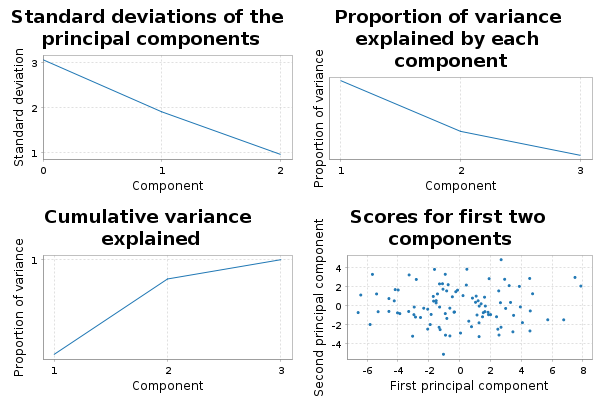
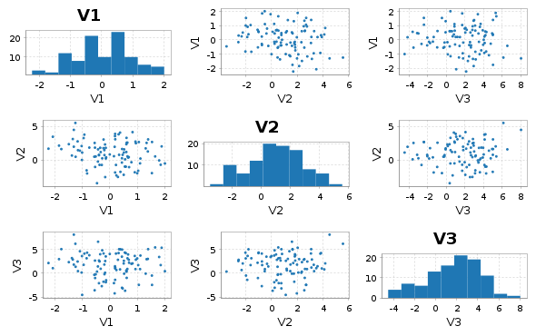
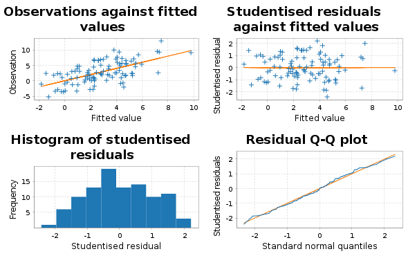
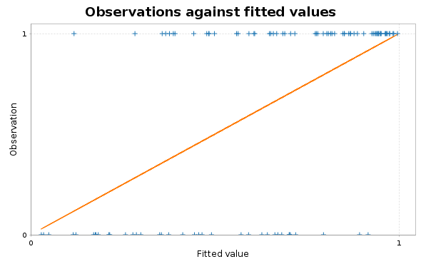
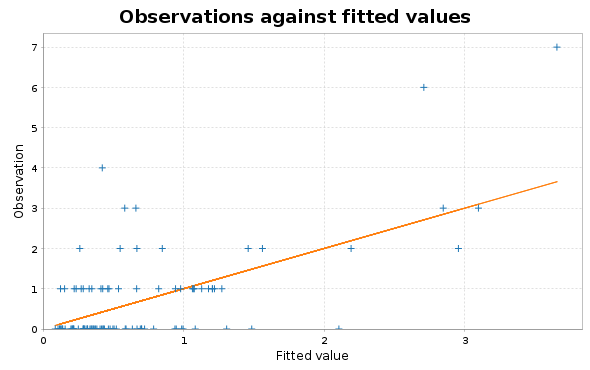

# scala-glm - Quickstart Guide

## PCA

This library contains code for principal components analysis based on a thin SVD of the centred data matrix. This is more numerically stable than a construction from the spectral decomposition of the covariance matrix. It is analogous to the R function `prcomp` rather than the R function `princomp`. First create some synthetic data.

```scala
import breeze.linalg._
import breeze.numerics._
import breeze.stats.distributions._
val X = DenseMatrix.tabulate(100, 3)((i, j) => 
	Gaussian(j, j+1).sample())
```
Now we can do PCA.
```scala
import scalaglm.Pca
val pca = Pca(X, List("V1", "V2", "V3"))
```
```scala
pca.sdev
// res0: DenseVector[Double] = DenseVector(2.5606142093454904, 1.854381773806659, 0.9122748897495127)
pca.loadings
// res1: DenseMatrix[Double] = -0.03310857043823924  -0.13444134156188767  0.9903682891947702   
// 0.09669439428711119   0.9858322692227849    0.13705813026779382  
// 0.9947632968083336    -0.10030086060495547  0.01963977303637844  
pca.scores
// res2: DenseMatrix[Double] = -3.2236630286926897    -0.2526025870708652    -0.3312800598911345    
// -1.3814835980661915    -3.1868449605289446    -0.29083539295071564   
// -0.44670647775937494   2.9260165036329706     0.5236910136373898     
// 2.258921097339149      -0.39382566745108283   -0.03400419898706642   
// 1.2327777934770963     -0.032719311171658855  1.380730106200283      
// 2.1206124322858417     0.7492293047879004     -0.6354426370188437    
// 1.3737385060379523     1.2731992714826124     -1.702502727611457     
// 0.47007011432588963    -3.568701644569304     -0.6921621382478916    
// 0.282624903327305      2.3873615937384147     -0.6826329071907968    
// -1.9393177778263826    -0.03403620226287832   -0.3203032848806097    
// 3.394250233079086      0.5424692149292558     -1.6491414043324846    
// -3.390705228621149     1.1524518772013526     -0.24495369091303654   
// -3.3669466322038497    -2.5428836939158947    -0.31646651713673      
// 0.9027697416579125     -0.3154041311326094    -0.46524433961255124   
// 2.962617697838302      -1.0029647731503857    -0.37025273168932193   
// 3.227790379610788      0.262348932141133      0.5412955550033923     
// 1.849538469788187      0.6537983657753798     -0.051874517553047686  
// 2.0871210640751245     -0.9317738677091685    0.5615933057961853     
// -3.9964282673894314    1.9454839651818516     1.1439447446996198     
// -3.808774073016807     -0.061723415387941516  -0.03776983244714566   
// 1.559520018681692      -3.1097510672798263    0.4924647014764322     
// 2.30728172633943       0.6471070444813359     -0.24345458556888866   
// -4.020658756912623     1.892981341567529      1.6197806136431487     
// 1.297092138973901      1.2478172116146584     1.510240585583065      
// 1.027093988570135      -3.21574831981725      0.5511625981130309     
// 1.772881710012366      -1.0203298273890518    -1.157975087246433     
// -0.7195861173481297    1.7060714421651693     1.0960547623093082     
// 3.527991129455671      -1.0411430754491455    1.5892262954655252     
// -6.155867995827729     0.8794251666047561     -1.1569910372644647    
// -4.546109188618348     -1.2329991096602326    -0.6689826858036089    
// 3.2224773718679005     -0.5884460433510864    0.3148681224818566     
// 0.7118521124848987     -3.638181953053865     -0.2258154275698389    
// 0.7638448481493223     1.5011849052271389     -1.3312680035472615    
// 1.20060522611117       1.2597864006023778     1.1147145832382777     
// -1.771331927791521     0.7435743492182233     1.305372924970414      
// -1.1932527906643338    0.7498226011797272     -1.162771723738347     
// -1.7698730260654518    0.7020764438546754     0.5086169069633875     
// -3.790624750878288     0.21011111533854396    -0.550759488174473     
// 2.5843307062881387     1.8400717545893988     0.0525167660787037     
// -0.31597243386754115   -2.709540937288684     0.611228735215337      
// -2.8880800264633426    -1.6659037530890983    -0.9169491673294978    
// 2.960773934583126      -3.114857822990185     0.012092835467671342   
// 2.7253602494355866     2.5285261613469614     0.703503507542581      
// 0.13469272750333638    0.49898386437212844    -0.1830508785657667    
// 6.657358936539637      3.0176034700105467     -0.7449492485614743    
// -0.3420636446944491    2.111761949952482      0.42061418770316045    
// 0.8479206158698432     -0.024972360671855334  0.48742798094096534    
// 2.9096368655020948     0.25686854093992373    -1.0211359269291242    
// 1.159761456422952      -2.53995406448278      -1.2127324868612626    
// ...
pca.plots
// res3: breeze.plot.Figure = breeze.plot.Figure@3e5501b7
pca.summary
// Standard deviations:
// V1	V2	V3
//  2.561	 1.854	 0.912
// Cumulative proportion of variance explained:
// V1	V2	V3
//  0.606	 0.923	 1.000
// Loadings:
// PC01	PC02	PC03	
// -0.033	-0.134	 0.990	V1
//  0.097	 0.986	 0.137	V2
//  0.995	-0.100	 0.020	V3
```
The final line prints a readable summary of the PCA to the console. `plots` produces some diagnostic plots, including a "scree plot".



Note that there is also a utility function `pairs` for producing a "scatterplot matrix":
```scala
import scalaglm.Utils.pairs
pairs(X, List("V1", "V2", "V3"))
// res6: breeze.plot.Figure = breeze.plot.Figure@77ce24c7
```




## Linear regression

This code computes regression coefficients and associated diagnostics via the QR decomposition of the covariate matrix. The diagnostics are analogous to those produced by the R function `lm`. We start by creating a synthetic response variable.

```scala
val y = DenseVector.tabulate(100)(i => 
	Gaussian(2.0 + 1.5*X(i,0) + 0.5*X(i,1), 3.0).sample())
```
So we can now do linear regression and generate all of the usual diagnostics.
```scala
import scalaglm.Lm
val lm = Lm(y,X,List("V1", "V2", "V3"))
```
```scala
lm.coefficients
// res8: DenseVector[Double] = DenseVector(2.380742895043149, 1.2557635456948217, 0.6940191096346627, -0.01171382558507807)
lm.se
// res9: DenseVector[Double] = DenseVector(0.390187589431913, 0.32173365592055236, 0.16373033063903056, 0.11615191285037844)
lm.fitted
// res10: DenseVector[Double] = DenseVector(2.502346975178621, 1.0664133741518047, 5.327184499505472, 2.9034130548362262, 4.969401242029909, 2.6868601680087605, 1.5188200181100475, 0.35766868816369524, 3.44433658796523, 2.6477622754115684, 1.2408419591193964, 3.3413411375938984, 1.3371772806534243, 2.347858338259567, 2.148449326222694, 4.0258695917581795, 3.414945135026932, 3.4204022971356376, 5.601686057465028, 2.9857029523583916, 2.195546096846506, 3.1614004518024035, 6.211164863607745, 5.805092983252025, 2.2119760407747653, 1.0685545533214345, 5.459396008602375, 4.759454447032079, 1.9411202987059772, 1.5255491749785606, 3.2832440920041153, 0.949368045716091, 2.1250376707431125, 5.280501360925534, 5.2278206293040075, 1.9353131068070024, 4.1399005876016135, 2.4396997643101073, 4.177628540584351, 2.535211791836564, 0.9930323719260366, 1.5693496873204265, 5.406580871562639, 3.135590824385097, 3.7749375968628356, 4.770071549179125, 3.772323613088488, 1.9272160204761686, 0.2018103829880685, 5.084187709705834, 3.5415023212977284, 4.186524658866794, 2.8727262322754266, 4.771055322564247, 1.6508407979786157, 3.7757383220803025, 6.10214711211118, 3.1898135805163013, 5.441026948400998, 2.0122060357238563, 3.1094882538741753, -0.6286496844910407, 6.295946706601803, 2.0925150966886155, 2.4897243522931483, 3.4004821732396078, 2.7740808977063445, 2.954314724399168, 4.01977553139104, 4.981608557483325, 2.1019519502293713, 1.4458053796529184, 2.6235211314095817, 2.0949369775355873, 3.5118506757255448, 4.53100893094125, 2.9395480325432444, 6.215707436614896, 2.375034324487515, 2.3655626539184316, 4.591236550124134, 3.147199688269077, 4.550324537214896, 5.689711977073808, 1.073632686982487, 2.325524207520554, 0.726257793852875, 3.527166383026365, 2.540068343275121, 2.8148588221854514, 3.50067672830623, 1.3700972149889703, 2.1811855258813884, 3.9587338560507246, 3.8063747733805626, 1.1317611618277987, 2.8358297920764075, -0.10995090266490332, 4.959941664110593, 3.8853498743319785)
lm.residuals
// res11: DenseVector[Double] = DenseVector(-0.09007853138655886, -3.099418155650916, -1.7783508725172674, 1.5511053534168124, 1.685787111280951, -3.557173526355621, 5.641036104609876, 1.1494976743841547, 1.0323062260214488, -1.5767205150111265, -2.2157352151595218, -1.4763518592560554, -0.7092690803296529, 2.013843317225272, -5.270080434384122, 0.06935265382419242, -5.900769547534871, 2.1395660055290944, 2.934576959014705, -0.4900492442048332, 0.7429166188549625, 1.6141411555235003, -2.3869100302560673, 2.8186910156884055, -0.7540863595970286, -1.2400015674201788, 4.036761596464914, -0.5653510657127709, 0.9591564700342141, 2.9278388635279295, 1.7905447524365625, -3.0489582411250304, 2.804454535474112, 2.88624776057123, -6.972647155846215, -0.47214356457475914, -3.5627266022171233, 0.2191118850901761, -2.7099765179961857, 0.4665817795287346, 3.0017454123209157, -4.951727408622145, 2.362915874888154, 0.18468699387261145, -3.0931826412860737, 3.2763136078317228, -0.883736913700838, 2.54607126176363, 0.26723975786630605, -5.591028242913454, -1.7571855020531633, 0.8570035247280483, -3.3064244647496577, 0.8637872452866393, 7.818219444457304, 1.9552171656287758, 1.1128679835597133, -1.2821286268375498, -1.7093009474073129, -5.382854550887098, -0.6230144117159635, -4.1124834105639465, 0.43747954160150204, 0.8320629061402358, 1.962136761234584, -1.9298861390182882, -3.042652144236691, 0.710225015432715, 1.231373702912129, -5.359568970525323, 3.3697827560181777, 3.609400481659262, 1.4326981408825268, -1.868874245642807, 1.2906771323841912, 4.516881942667202, -6.17359231515702, -0.43323879031074686, 0.9160307117847832, -5.227042005435802, -1.6439356020506195, 0.9893496879827985, 3.194371200541731, 0.5356807610694876, 3.7287965958379443, 5.160558099689379, -1.5699094054739993, 5.708034112586311, -2.373299211130433, 4.043783922264106, -1.2802588807350843, -2.1651102629127883, 0.4385722164172212, -0.5302381428287299, -1.3922981747790213, 1.0649854218513362, 0.3527070158228023, 2.321444213745919, 1.5036296147018895, 2.47952143157701)
lm.studentised
// res12: DenseVector[Double] = DenseVector(-0.031048227822411085, -1.0773566458657513, -0.6165397201643491, 0.5321236478020615, 0.583447240351116, -1.2235390024861503, 1.9701668498488574, 0.40162117081157217, 0.3567315861786743, -0.5405566792075928, -0.7774684565199635, -0.5101320556040614, -0.2470427206776969, 0.6894132276219315, -1.817060281368463, 0.023932512663595293, -2.0224984542616182, 0.735786897675885, 1.0296903213669348, -0.16933256916662967, 0.2584129510673499, 0.5542627963518958, -0.844604750972841, 0.9803138460848574, -0.26237944581020783, -0.4288711777394964, 1.3959899740432862, -0.1985204541549983, 0.3411800211458634, 1.02196608956149, 0.6173829819170231, -1.0634269154850513, 0.9724047560255105, 0.9971068672204312, -2.415293089394087, -0.16296679938497996, -1.2229068784665518, 0.07585241505516474, -0.9353918572588688, 0.16154751445766974, 1.041993992166339, -1.7286533431519995, 0.8223945792378912, 0.06312894034017444, -1.1155643229339494, 1.128059923191535, -0.30250801502681934, 0.8813765936560655, 0.09313987089741553, -1.931532498922803, -0.612135117155693, 0.29887375051239057, -1.1517451677362052, 0.29723738242201636, 2.6834116812086695, 0.6713425280026433, 0.39444967465671865, -0.44878466402419037, -0.5918915543594627, -1.8511740371513177, -0.21388630827155006, -1.459993185719388, 0.15294169043263614, 0.28743702449503156, 0.6756533586964236, -0.6649002579523744, -1.0409212681603695, 0.24336719680075175, 0.4337559778519119, -1.845523165626788, 1.1578700507212216, 1.2530810731609332, 0.49238184992882816, -0.644606006015188, 0.4425230522526925, 1.5804899909048014, -2.1611485168678843, -0.15264442092077363, 0.3165595631952897, -1.807870666100278, -0.5900135803408899, 0.344356552954514, 1.1146515168560576, 0.18636414215909283, 1.292531716981083, 1.7854275574307126, -0.5532870084271135, 1.9574828794157235, -0.8189480653495324, 1.3973701314726705, -0.45030462350554146, -0.7450525026987561, 0.15472503539516663, -0.18166489058401245, -0.4842746854026586, 0.3681394264680692, 0.12241703027683047, 0.8160219687602128, 0.5203707719785036, 0.8559416155792512)
val pred = lm.predict()
// pred: scalaglm.PredictLm = PredictLm(
//   mod = Lm(
//     y = DenseVector(2.4122684437920623, -2.0330047814991117, 3.548833626988204, 4.454518408253039, 6.6551883533108604, -0.8703133583468605, 7.1598561227199236, 1.50716636254785, 4.476642813986679, 1.0710417604004419, -0.9748932560401251, 1.864989278337843, 0.6279082003237715, 4.361701655484839, -3.121631108161428, 4.095222245582372, -2.485824412507939, 5.559968302664732, 8.536263016479733, 2.4956537081535584, 2.9384627157014687, 4.775541607325904, 3.8242548333516773, 8.62378399894043, 1.4578896811777367, -0.1714470140987443, 9.496157605067289, 4.194103381319308, 2.9002767687401914, 4.45338803850649, 5.073788844440678, -2.0995901954089393, 4.929492206217224, 8.166749121496764, -1.7448265265422078, 1.4631695422322433, 0.5771739853844902, 2.6588116494002834, 1.467652022588165, 3.001793571365299, 3.9947777842469523, -3.3823777213017188, 7.769496746450793, 3.3202778182577086, 0.6817549555767619, 8.046385157010848, 2.88858669938765, 4.473287282239799, 0.4690501408543746, -0.5068405332076207, 1.784316819244565, 5.043528183594843, -0.4336982324742311, 5.634842567850886, 9.46906024243592, 5.730955487709078, 7.215015095670894, 1.9076849536787515, 3.731726000993685, -3.370648515163242, 2.4864738421582118, -4.7411330950549875, 6.733426248203305, 2.9245780028288513, 4.451861113527732, 1.4705960342213196, -0.2685712465303465, 3.664539739831883, 5.251149234303169, -0.3779604130419978, 5.471734706247549, 5.055205861312181, 4.056219272292108, 0.22606273189278037, 4.802527808109736, 9.047890873608452, -3.2340442826137754, 5.7824686463041495, 3.291065036272298, -2.86147935151737, 2.9473009480735146, 4.1365493762518755, 7.7446957377566275, 6.225392738143295, 4.802429282820431, 7.486082307209934, -0.8436516116211242, 9.235200495612677, 0.16676913214468803, 6.858642744449558, 2.2204178475711456, -0.795013047923818, 2.6197577422986096, 3.4284957132219946, 2.4140765986015413, 2.196746583679135, 3.18853680789921, 2.2114933110810155, 6.463571278812482, 6.364871305908989),
//     Xmat = -0.12917077128296048  0.38443154685916525   -1.4520607201875508   
// 0.2443758980385433    -2.324567575973901    0.6755731228955781    
// 0.19828659167954363   3.903713686467582     1.0083269410162061    
// 0.002707512165025262  0.8160885019253432    4.021815966989686     
// 1.389242020529486     1.2667573340430274    2.992612053397987     
// -0.7420326865321398   1.847143278674281     3.757770071511457     
// -1.844530460185275    2.145221997138133     2.9412958457508767    
// -0.1630503557296831   -2.576984445946382    2.5478493858983713    
// -0.9481479966842001   3.277876049360971     1.7641746531498559    
// -0.19020691459415384  0.7255947843176015    -0.1961480193213334   
// -1.7603390234537126   1.6275304880903225    5.025567610402543     
// -0.2270427516275116   1.7652592641367266    -1.7574609113640554   
// 0.19815247154921742   -1.8852258786401666   -1.3645858893335028   
// -0.3900219120038623   0.7031617817603297    2.656431167372362     
// -0.27170728180831216  0.23753743643116643   4.776320848918726     
// 0.4521712749531793    1.6355003334657878    4.931095447948591     
// -0.1422805915795099   1.8068358022406632    3.509148593627261     
// 0.6705789252620019    0.350781187183387     3.916569666769933     
// 1.0619165420008885    2.678845687374512     -2.4122761092277294   
// 0.15522258883983325   0.5562573987930359    -2.047488582578879    
// 0.9123944406436054    -1.8568297185504918   3.608826828850585     
// -0.346271050424739    1.8182428827976616    3.9614033408362097    
// ...
pred.fitted
// res13: DenseVector[Double] = DenseVector(2.502346975178618, 1.066413374151808, 5.3271844995054725, 2.903413054836226, 4.969401242029909, 2.6868601680087596, 1.5188200181100466, 0.3576686881636958, 3.4443365879652297, 2.6477622754115675, 1.2408419591193955, 3.341341137593898, 1.337177280653425, 2.347858338259567, 2.148449326222693, 4.0258695917581795, 3.4149451350269318, 3.4204022971356376, 5.601686057465027, 2.9857029523583916, 2.195546096846507, 3.1614004518024026, 6.211164863607744, 5.805092983252025, 2.211976040774765, 1.068554553321434, 5.459396008602375, 4.759454447032079, 1.9411202987059768, 1.5255491749785604, 3.2832440920041153, 0.949368045716091, 2.125037670743112, 5.280501360925534, 5.227820629304008, 1.9353131068070017, 4.1399005876016135, 2.439699764310107, 4.177628540584352, 2.5352117918365646, 0.993032371926036, 1.5693496873204265, 5.406580871562639, 3.1355908243850967, 3.774937596862835, 4.770071549179124, 3.772323613088488, 1.9272160204761681, 0.20181038298806817, 5.084187709705834, 3.541502321297729, 4.186524658866796, 2.872726232275426, 4.771055322564248, 1.6508407979786155, 3.775738322080302, 6.102147112111182, 3.1898135805163013, 5.441026948400998, 2.012206035723856, 3.1094882538741757, -0.6286496844910419, 6.295946706601803, 2.0925150966886146, 2.4897243522931483, 3.4004821732396078, 2.774080897706344, 2.9543147243991674, 4.01977553139104, 4.981608557483325, 2.101951950229371, 1.445805379652919, 2.6235211314095817, 2.0949369775355873, 3.5118506757255448, 4.531008930941251, 2.939548032543244, 6.215707436614895, 2.375034324487515, 2.3655626539184316, 4.591236550124133, 3.147199688269077, 4.550324537214897, 5.689711977073808, 1.0736326869824864, 2.3255242075205547, 0.7262577938528744, 3.527166383026365, 2.5400683432751205, 2.8148588221854505, 3.5006767283062294, 1.37009721498897, 2.181185525881387, 3.9587338560507246, 3.8063747733805626, 1.1317611618277983, 2.8358297920764066, -0.10995090266490332, 4.959941664110592, 3.8853498743319785)
pred.se
// res14: DenseVector[Double] = DenseVector(0.48813529437243675, 0.615714029028495, 0.5793992816178984, 0.39832257873541704, 0.554184275747462, 0.4507882256463667, 0.6763351552776404, 0.6809056847085658, 0.5305488908437092, 0.3840725669585016, 0.7303199817697473, 0.5290828569347722, 0.6423716810253807, 0.3502719169210193, 0.4935264082353296, 0.5079468720646325, 0.37857541582312454, 0.4470414891936437, 0.7302229079362188, 0.529375643192863, 0.6247681605765086, 0.417628589067789, 0.8178288775366244, 0.6230433743583131, 0.6288512990870152, 0.5438754323268428, 0.5419098891448987, 0.7385168417962931, 0.867261223199252, 0.669181202226477, 0.49420810130955267, 0.659698229950802, 0.5812167451861278, 0.5259879811987604, 0.5669737668696768, 0.5117328111839452, 0.40991733083996684, 0.5578004161891468, 0.5118459339151695, 0.5601726738305267, 0.5972132370951512, 0.6709259270324562, 0.6325670408981539, 0.31088163206336944, 0.9835398839244458, 0.4691309806415611, 0.3480183229436279, 0.5573689988553686, 0.6503982697151651, 0.5260699640938681, 0.6443965346931956, 0.6582329607254928, 0.6434567841654075, 0.45865475348672746, 0.408415478255473, 0.41645508175202084, 0.8340659750788298, 0.7026225310760084, 0.5619220343168245, 0.4474004158149394, 0.4134297046810037, 0.8492569056789145, 0.6880563071463125, 0.5251968584120738, 0.47111228602729277, 0.48050033118093205, 0.33369439842717086, 0.3726528731975806, 0.7722432484942924, 0.4709049612359396, 0.4306817950867802, 0.5988981228726703, 0.4347114476815276, 0.4998484133777054, 0.3856892382331356, 0.6985059677202556, 0.7036983462676958, 0.7745941238590317, 0.5309988078652145, 0.5441139749748588, 0.94457161737688, 0.6333643696398084, 0.6653398188769508, 0.6272636792522654, 0.5770435093444732, 0.5488391714489192, 0.777515921378389, 0.39038919458317556, 0.5071335797734133, 0.5302033861295223, 0.7565128161242364, 0.45908775721616873, 0.7880107480144384, 0.3691607913050525, 0.6243205592566357, 0.535454645637051, 0.5951738938498904, 0.7499605126362858, 0.5532525668396878, 0.513663184896262)
val predNew = lm.predict(DenseMatrix((1.1, 1.6, 1.0), (1.4, 2.2, 3.0)))
// predNew: scalaglm.PredictLm = PredictLm(
//   mod = Lm(
//     y = DenseVector(2.4122684437920623, -2.0330047814991117, 3.548833626988204, 4.454518408253039, 6.6551883533108604, -0.8703133583468605, 7.1598561227199236, 1.50716636254785, 4.476642813986679, 1.0710417604004419, -0.9748932560401251, 1.864989278337843, 0.6279082003237715, 4.361701655484839, -3.121631108161428, 4.095222245582372, -2.485824412507939, 5.559968302664732, 8.536263016479733, 2.4956537081535584, 2.9384627157014687, 4.775541607325904, 3.8242548333516773, 8.62378399894043, 1.4578896811777367, -0.1714470140987443, 9.496157605067289, 4.194103381319308, 2.9002767687401914, 4.45338803850649, 5.073788844440678, -2.0995901954089393, 4.929492206217224, 8.166749121496764, -1.7448265265422078, 1.4631695422322433, 0.5771739853844902, 2.6588116494002834, 1.467652022588165, 3.001793571365299, 3.9947777842469523, -3.3823777213017188, 7.769496746450793, 3.3202778182577086, 0.6817549555767619, 8.046385157010848, 2.88858669938765, 4.473287282239799, 0.4690501408543746, -0.5068405332076207, 1.784316819244565, 5.043528183594843, -0.4336982324742311, 5.634842567850886, 9.46906024243592, 5.730955487709078, 7.215015095670894, 1.9076849536787515, 3.731726000993685, -3.370648515163242, 2.4864738421582118, -4.7411330950549875, 6.733426248203305, 2.9245780028288513, 4.451861113527732, 1.4705960342213196, -0.2685712465303465, 3.664539739831883, 5.251149234303169, -0.3779604130419978, 5.471734706247549, 5.055205861312181, 4.056219272292108, 0.22606273189278037, 4.802527808109736, 9.047890873608452, -3.2340442826137754, 5.7824686463041495, 3.291065036272298, -2.86147935151737, 2.9473009480735146, 4.1365493762518755, 7.7446957377566275, 6.225392738143295, 4.802429282820431, 7.486082307209934, -0.8436516116211242, 9.235200495612677, 0.16676913214468803, 6.858642744449558, 2.2204178475711456, -0.795013047923818, 2.6197577422986096, 3.4284957132219946, 2.4140765986015413, 2.196746583679135, 3.18853680789921, 2.2114933110810155, 6.463571278812482, 6.364871305908989),
//     Xmat = -0.12917077128296048  0.38443154685916525   -1.4520607201875508   
// 0.2443758980385433    -2.324567575973901    0.6755731228955781    
// 0.19828659167954363   3.903713686467582     1.0083269410162061    
// 0.002707512165025262  0.8160885019253432    4.021815966989686     
// 1.389242020529486     1.2667573340430274    2.992612053397987     
// -0.7420326865321398   1.847143278674281     3.757770071511457     
// -1.844530460185275    2.145221997138133     2.9412958457508767    
// -0.1630503557296831   -2.576984445946382    2.5478493858983713    
// -0.9481479966842001   3.277876049360971     1.7641746531498559    
// -0.19020691459415384  0.7255947843176015    -0.1961480193213334   
// -1.7603390234537126   1.6275304880903225    5.025567610402543     
// -0.2270427516275116   1.7652592641367266    -1.7574609113640554   
// 0.19815247154921742   -1.8852258786401666   -1.3645858893335028   
// -0.3900219120038623   0.7031617817603297    2.656431167372362     
// -0.27170728180831216  0.23753743643116643   4.776320848918726     
// 0.4521712749531793    1.6355003334657878    4.931095447948591     
// -0.1422805915795099   1.8068358022406632    3.509148593627261     
// 0.6705789252620019    0.350781187183387     3.916569666769933     
// 1.0619165420008885    2.678845687374512     -2.4122761092277294   
// 0.15522258883983325   0.5562573987930359    -2.047488582578879    
// 0.9123944406436054    -1.8568297185504918   3.608826828850585     
// -0.346271050424739    1.8182428827976616    3.9614033408362097    
// ...
predNew.fitted
// res15: DenseVector[Double] = DenseVector(4.860799545137835, 5.630512423456923)
predNew.se
// res16: DenseVector[Double] = DenseVector(0.4772815885528993, 0.6104050257394816)
lm.plots
// res17: breeze.plot.Figure = breeze.plot.Figure@3e72c9de
lm.summary
// Estimate	 S.E.	 t-stat	p-value		Variable
// ---------------------------------------------------------
//   2.3807	 0.390	 6.102	0.0000 *	(Intercept)
//   1.2558	 0.322	 3.903	0.0002 *	V1
//   0.6940	 0.164	 4.239	0.0001 *	V2
//  -0.0117	 0.116	-0.101	0.9199  	V3
// 
// Residual standard error:   2.9420 on 96 degrees of freedom
// Multiple R-squared: 0.2231, Adjusted R-squared: 0.1988
// F-statistic: 9.1880 on 3 and 96 DF, p-value: 0.00002
//
```
The plots include a plot of studentised residuals against fitted values and a normal Q-Q plot for the studentised residuals.




## Generalised linear models

The current implementation supports only simple one-parameter exponential family observation models. This includes the most commonly used cases of **logistic regression** (`LogisticGlm`) and **Poisson regression** (`PoissonGlm`).

### Logistic regression

Again, we start by creating an appropriate response variable.
```scala
val ylb = (0 until 100) map (i => Bernoulli(sigmoid(1.0 + X(i,0))).sample())
val yl = DenseVector(ylb.toArray map {b => if (b) 1.0 else 0.0})
```

Then we can do logistic regression in a typical way.
```scala
import scalaglm.{Glm, LogisticGlm}
val glm = Glm(yl, X, List("V1","V2","V3"), LogisticGlm)
```
```scala
glm.coefficients
// res20: DenseVector[Double] = DenseVector(0.9174696434736876, 0.4963757861327109, 0.047796138547967666, -0.002919103043306953)
glm.fitted
// res21: DenseVector[Double] = DenseVector(0.7059854679278823, 0.7162009771905349, 0.7684417562123859, 0.7203260247111489, 0.840085733038303, 0.6516862506759278, 0.5239408707865596, 0.6695007852015639, 0.6452791670991956, 0.7023071809747643, 0.5266745253464459, 0.7097713684746857, 0.7170153477107669, 0.6791190435578607, 0.6856825983438455, 0.7695359419294445, 0.7156450884371501, 0.7782784242452588, 0.8291562843649959, 0.7363498215268205, 0.7809269410441896, 0.6944337861225564, 0.8603306316438082, 0.8452321663068496, 0.787546043614164, 0.6000084829135973, 0.819388239218454, 0.8517537317190664, 0.6191560296005885, 0.678342360755791, 0.7520226132148187, 0.718289797591038, 0.5708487567322619, 0.8178527650384557, 0.8389643227127057, 0.601701585525206, 0.7780722808107676, 0.6826655073358845, 0.7193466228346276, 0.7941458535249736, 0.6471692150596353, 0.7332717110363254, 0.7773161897192473, 0.7080333425353548, 0.6133277131557827, 0.7617657654728088, 0.7719644188351805, 0.6064112500667815, 0.6026720262366294, 0.764861626508729, 0.7680472610169411, 0.8580645050045194, 0.6822999187360576, 0.7908547895557876, 0.665626353617293, 0.7199178360407064, 0.8741057581360436, 0.7705174737648653, 0.7987077644249306, 0.6599302037944494, 0.783761152323177, 0.6272537671272745, 0.8211120529462871, 0.5886368280533445, 0.770270274291573, 0.808313099741166, 0.6917737710412135, 0.6752570655834258, 0.7527149070691617, 0.7955233966581364, 0.6659574313549738, 0.7422629627029719, 0.7519670071634613, 0.7276958910383626, 0.7815512525066454, 0.8686065896834588, 0.8301527464343034, 0.8512438124636222, 0.7034269431259528, 0.7592222088769787, 0.632958596799229, 0.7613098954142234, 0.857897906424345, 0.785548888252558, 0.5638891201965566, 0.7558961322749043, 0.47139097210722875, 0.7781956207444466, 0.6246316840417141, 0.6139214262790591, 0.6851569265902206, 0.6662379011991987, 0.5132856467835221, 0.7812737756648492, 0.6523321051356519, 0.5793390221378771, 0.5968300986540015, 0.5986908496157012, 0.7942912200448567, 0.813342752720953)
glm.predict(response=true).fitted
// res22: DenseVector[Double] = DenseVector(0.7059854679278823, 0.7162009771905349, 0.7684417562123859, 0.7203260247111489, 0.840085733038303, 0.6516862506759278, 0.5239408707865596, 0.6695007852015639, 0.6452791670991956, 0.7023071809747643, 0.5266745253464459, 0.7097713684746857, 0.7170153477107669, 0.6791190435578607, 0.6856825983438455, 0.7695359419294445, 0.7156450884371501, 0.7782784242452588, 0.8291562843649959, 0.7363498215268205, 0.7809269410441896, 0.6944337861225564, 0.8603306316438082, 0.8452321663068496, 0.787546043614164, 0.6000084829135973, 0.819388239218454, 0.8517537317190664, 0.6191560296005885, 0.678342360755791, 0.7520226132148187, 0.718289797591038, 0.5708487567322619, 0.8178527650384557, 0.8389643227127057, 0.601701585525206, 0.7780722808107676, 0.6826655073358845, 0.7193466228346276, 0.7941458535249736, 0.6471692150596353, 0.7332717110363254, 0.7773161897192473, 0.7080333425353548, 0.6133277131557827, 0.7617657654728088, 0.7719644188351805, 0.6064112500667815, 0.6026720262366294, 0.764861626508729, 0.7680472610169411, 0.8580645050045194, 0.6822999187360576, 0.7908547895557876, 0.665626353617293, 0.7199178360407064, 0.8741057581360436, 0.7705174737648653, 0.7987077644249306, 0.6599302037944494, 0.783761152323177, 0.6272537671272745, 0.8211120529462871, 0.5886368280533445, 0.770270274291573, 0.808313099741166, 0.6917737710412135, 0.6752570655834258, 0.7527149070691617, 0.7955233966581364, 0.6659574313549738, 0.7422629627029719, 0.7519670071634613, 0.7276958910383626, 0.7815512525066454, 0.8686065896834588, 0.8301527464343034, 0.8512438124636222, 0.7034269431259528, 0.7592222088769787, 0.632958596799229, 0.7613098954142234, 0.857897906424345, 0.785548888252558, 0.5638891201965566, 0.7558961322749043, 0.47139097210722875, 0.7781956207444466, 0.6246316840417141, 0.6139214262790591, 0.6851569265902206, 0.6662379011991987, 0.5132856467835221, 0.7812737756648492, 0.6523321051356519, 0.5793390221378771, 0.5968300986540015, 0.5986908496157012, 0.7942912200448567, 0.813342752720953)
glm.summary
// Estimate	 S.E.	 z-stat	p-value		Variable
// ---------------------------------------------------------
//   0.9175	 0.296	 3.095	0.0020 *	(Intercept)
//   0.4964	 0.257	 1.932	0.0534  	V1
//   0.0478	 0.127	 0.377	0.7064  	V2
//  -0.0029	 0.090	-0.033	0.9740  	V3
glm.plots
// res24: breeze.plot.Figure = breeze.plot.Figure@bb3b9e5
```




### Poisson regression

We first create an appropriate response, and then do Poisson regression.
```scala
val yp = DenseVector.tabulate(100)(i => Poisson(math.exp(-0.5 + X(i,0))).sample().toDouble)

import scalaglm.PoissonGlm
val pglm = Glm(yp, X, List("V1","V2","V3"), PoissonGlm)
```
```scala
pglm.coefficients
// res26: DenseVector[Double] = DenseVector(-0.5823942991504423, 0.8989824841527867, 0.01041044583881609, 0.033375158732079885)
pglm.summary
// Estimate	 S.E.	 z-stat	p-value		Variable
// ---------------------------------------------------------
//  -0.5824	 0.176	-3.315	0.0009 *	(Intercept)
//   0.8990	 0.131	 6.870	0.0000 *	V1
//   0.0104	 0.060	 0.173	0.8629  	V2
//   0.0334	 0.044	 0.751	0.4526  	V3
pglm.plots
// res28: breeze.plot.Figure = breeze.plot.Figure@2103697b
```



## Non-linear response

The above covers the main functionality of the library based on a linear reponse to variation in covariate values. For flexible modelling of a nonlinear response, see the documentation on [flexible regression modelling](FlexibleRegression.md).

