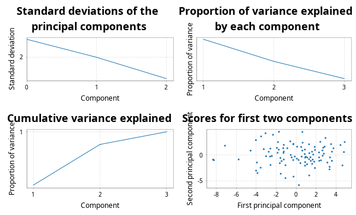

# scala-glm - Quickstart Guide

## PCA

This library contains code for principal components analysis based on a thin SVD of the centred data matrix. This is more numerically stable than a construction from the spectral decomposition of the covariance matrix. It is analogous to the R function `prcomp` rather than the R function `princomp`. First create some synthetic data.

```scala
import breeze.linalg._
import breeze.numerics._
import breeze.stats.distributions._
val X = DenseMatrix.tabulate(100, 3)((i, j) => 
	Gaussian(j, j+1).sample())
```
Now we can do PCA.
```scala
import scalaglm.Pca
val pca = Pca(X, List("V1", "V2", "V3"))
```
```scala
pca.sdev
// res0: DenseVector[Double] = DenseVector(3.175050603351698, 1.827190202356391, 0.9888344685102847)
pca.loadings
// res1: DenseMatrix[Double] = 0.005625943447134214  0.02220574010238489    -0.9997375925045706   
// 0.030665373739280466  0.9992793911756326     0.022368129673442958  
// 0.999513873647465     -0.030783168747921974  0.004940942023243848  
pca.scores
// res2: DenseMatrix[Double] = 1.1942594773981277    -0.49506991354076596   -2.274253261912566    
// 2.2320904522486487    -0.11934758663465415   1.4621311926239366    
// -1.1205483755752486   2.1806310008057888     0.12615278151219972   
// -4.686480096873805    0.153701153219998      0.29953808352771477   
// -0.7722633819332876   0.8570581408470935     -0.9806737026153804   
// -2.8120076210607814   0.14731718018589526    1.442892493453288     
// 1.2856514948573452    -0.013430126151401954  -0.4633616123287435   
// -3.9143280951124972   2.550358930850803      -0.367174171080143    
// 3.8433779158439534    -0.9749055681486763    0.5942908184780892    
// -5.4560674902709785   -0.9827369222490385    -1.7425140123271714   
// -2.1588191953740323   -1.2761691463002325    -0.3557663878337472   
// -0.7200236158005382   -2.6402180850176826    0.6228522703604623    
// -1.039589699623109    2.113838785415458      0.08229420527791545   
// -1.650817772329189    -3.5606471683127707    0.454245250351992     
// 0.602221374240204     0.7445778512178468     -0.6064022622655779   
// -2.9364734198449107   -1.179755900745835     -2.3545884459440356   
// 0.9993919821951063    -1.3014881525610682    0.04918382806433528   
// 5.573569740772654     -0.23594405340652977   1.3381855001779914    
// 4.515767517676949     1.4818359353223147     1.052542719451172     
// -0.9737327286917223   1.8490584548051292     -1.271764666354539    
// 3.652726849935071     2.2520445984286184     -0.3836165474808582   
// -0.8736416146279617   -2.99845335472618      0.2359827794917469    
// 2.2053461711353504    -2.007024371815822     -0.5044949915720511   
// 0.9788092148920494    0.49810871093092296    -0.36263071898837895  
// 0.5631880635637775    -1.6461313090566465    0.17217656659755426   
// -0.22068457698043842  -3.5705191150548483    -0.8823802386292677   
// 1.7880030505710791    -0.4394912242943269    0.25646840403933746   
// -6.676072328823218    -3.5526999728033113    0.8398668790034564    
// -2.9772849584628873   1.1433845908536608     0.3863288191693328    
// 0.4490157973488666    -2.8725920499087443    0.2380730116498439    
// 2.54420101566205      0.49861542419102745    -0.2359009824074046   
// 3.178999558642128     -2.793968443630174     0.8709068024683504    
// 0.5718006581807252    2.1221288752983583     0.21124916051195936   
// -6.59810204233048     1.9871253501764683     1.2147696730908375    
// -4.50359300135199     -1.4166521309871323    1.2417889889089677    
// 3.316893093425975     0.6729706309255763     1.0537633330556047    
// -1.8501390151317487   1.0694339525303485     0.49745962764351515   
// 4.392264047671712     1.3575618475041817     -2.170374460404998    
// -0.40078925838694435  -1.0543450386768722    -1.4651281448795905   
// -0.43669660642829233  -2.835588196647248     -1.076922937561873    
// 1.4035463447487166    -0.585844561251003     2.2000549304388373    
// 1.7572189492939656    0.30674928329445394    -0.03637751808775187  
// 5.3536345826985405    2.432753784755028      -1.1622619834896204   
// -2.6763470240887806   -0.6047957883330983    1.2681826203380233    
// 0.508707366478444     -3.2778185609947417    -0.6668243945819868   
// -0.3506937305410316   1.5393489618322842     0.44062244513853527   
// -2.4349786962814854   -0.40694759189932506   -0.7905316630656003   
// -3.8007818146216468   1.6183446593476045     0.2057677088081413    
// -7.694657636588133    3.8300335314164466     -0.3823802091413638   
// ...
pca.plots
// res3: breeze.plot.Figure = breeze.plot.Figure@41196cbf
pca.summary
// Standard deviations:
// V1	V2	V3
//  3.175	 1.827	 0.989
// Cumulative proportion of variance explained:
// V1	V2	V3
//  0.700	 0.932	 1.000
// Loadings:
// PC01	PC02	PC03	
//  0.006	 0.022	-1.000	V1
//  0.031	 0.999	 0.022	V2
//  1.000	-0.031	 0.005	V3
```
The final line prints a readable summary of the PCA to the console. `plots` produces some diagnostic plots, including a "scree plot".



Note that there is also a utility function `pairs` for producing a "scatterplot matrix":
```scala
import scalaglm.Utils.pairs
pairs(X, List("V1", "V2", "V3"))
// res6: breeze.plot.Figure = breeze.plot.Figure@1e7f95ff
```


## Linear regression

This code computes regression coefficients and associated diagnostics via the QR decomposition of the covariate matrix. The diagnostics are analogous to those produced by the R function `lm`. We start by creating a synthetic response variable.

```scala
val y = DenseVector.tabulate(100)(i => 
	Gaussian(2.0 + 1.5*X(i,0) + 0.5*X(i,1), 3.0).sample())
```
So we can now do linear regression and generate all of the usual diagnostics.
```scala
import scalaglm.Lm
val lm = Lm(y,X,List("V1", "V2", "V3"))
```
```scala
lm.coefficients
// res8: DenseVector[Double] = DenseVector(2.0060435263989618, 2.04795193552595, 0.4103502765240704, -0.04555205708171163)
lm.se
// res9: DenseVector[Double] = DenseVector(0.38635586836608127, 0.3028765588444559, 0.16398840818319946, 0.09444630039591365)
lm.fitted
// res10: DenseVector[Double] = DenseVector(6.811800005053304, -0.6552286434883019, 3.1908766782767386, 1.987665233200672, 4.834852969013477, -0.38609502858563866, 3.3384874066300227, 4.425301192230262, 0.6883758524994296, 5.647520474599457, 2.6159682746919133, -0.0330124195850728, 3.248026578515177, -0.08994613424373041, 3.9910713944380434, 6.751204181981011, 1.7112602775892798, -0.5274372017491438, 0.8624080578130364, 5.885824699210445, 4.160386707583827, 0.595207555931523, 2.491692802786759, 3.3734644574525174, 1.3124110718066968, 2.5995615786538258, 1.6656979542877943, -0.7647247816532421, 2.226345833657216, 0.6201193485941743, 3.0818243261561014, -0.692450925037229, 2.954421402949376, 1.0007096194172047, -0.654541034324546, 0.5160080869656347, 1.9418707669398971, 7.378059599258478, 4.941052274584732, 3.3365715089200876, -2.3548638796303667, 2.6042944270421104, 5.793755496113214, -0.3765275924048254, 2.2782769948306583, 2.2403256840628742, 3.9053129979802534, 2.8290807411099523, 5.122016238534847, 3.4131703979008186, 0.7133224666275193, 3.673345127366132, -4.052477768539274, 1.3285317120703055, 4.956933367417946, 2.0173857493683007, 1.865899675010358, 1.5168074588647857, 3.781156566431622, 3.6431321935696483, 5.466657968035954, 2.5843611451089914, 3.5235412404538056, 1.0157820487565936, 1.4364960028106455, 2.02125179165688, 2.833750797852327, 3.3905499904454515, 2.7873973043854736, -1.543855305744027, 2.4621903055545613, 2.03459914248289, -0.5939171693136129, 2.1303032525093295, 3.253369816576946, -0.04999326795037065, 3.2005334486669073, -0.7889213782886131, 1.926406941295472, 2.5677408962514985, 2.120614526959433, 5.504534699123395, -0.6054213025993092, 5.504953608417812, -0.11038102190686408, 0.4210295525057477, 2.7632924123700473, 2.560436036690445, 5.619346510109174, 2.8871374252947684, 1.9613581284339965, 8.022427598905491, 4.56089575141587, 3.4946605428743873, 3.1980654699338698, 4.870301930856025, 0.5850656539457646, 1.2282485570099146, 4.655090810295899, 2.5810361513309945)
lm.residuals
// res11: DenseVector[Double] = DenseVector(2.713262391805677, 3.110454705468371, 0.8147200084800459, 6.206663286701802, -0.1578756600507516, -0.5453198696415851, 0.5303145925223052, -2.676437788127635, 6.273527756791353, 0.3704506617425327, -1.0130773744401453, 0.31878217214328647, 0.3155451185674347, -0.7455222164661013, 2.685713287613503, -0.1534013497173774, 1.1913103714921962, -4.241728420136324, 2.1443538419009918, 1.6743877434436634, -6.244890936188315, -4.112730677088614, 1.1375743726263114, 2.8002151094153294, 2.0844229776348486, 0.8632680422467942, -1.9754004985635398, 1.491704778921317, -4.061771176824731, 5.922995758388378, -5.242955536522516, -3.7868766966672425, 2.379006326555663, 0.019830315808639254, 3.343234795661191, -3.951514677590536, -2.213631208337658, -2.4643227488497423, 2.5910552301087746, 5.515281962087736, 2.5703410696483733, -5.388474528208109, -1.2469019243281663, -0.8566766664284988, -1.0928340866126924, -4.371567256179243, -2.5863081408738724, -1.7594084699817794, -2.9504734463989757, -3.394164767776803, -0.1405212531879776, 1.3303741017934785, -0.47650038347124646, 3.770374458008158, 4.910970790499174, 1.5465752320499893, -5.399141310029357, -1.060341618052433, -2.029887806234938, -0.765449184265671, 5.689840955760242, 2.4927153486230487, -4.180609429903108, 0.5590849229043897, 1.6790863944172036, 3.1958542547566333, 1.4994838580821432, 0.6047802218157821, -0.013626902118448747, -1.987880485568594, 3.600518865051478, -6.628013864709747, 2.356670317801515, 5.04750302404363, -2.6361868642411945, 4.400552703413733, 1.0258355033007582, -2.496693070400493, 1.7851920989726613, -0.9626392811972861, -3.742285013552665, 0.214384843482196, -2.34865363343743, 0.992552583451384, -0.5893114305112995, -2.1726451325477654, -1.8613789603718958, 3.167348764981606, -1.5583878160624538, -1.970953951224426, -2.900399016679372, -1.2955425107957232, 1.985045580179916, 1.960317731126874, 3.425816243479598, -1.172432998333575, -2.348580820309852, 3.221390823818566, 0.256828048088928, -1.8151854884717693)
lm.studentised
// res12: DenseVector[Double] = DenseVector(0.9417530198427482, 1.0635281211891756, 0.2769475883001756, 2.117665268179093, -0.05358270592610952, -0.18668651813708037, 0.1791755463731437, -0.9195825279528117, 2.1386218047221313, 0.1291705316793008, -0.34351153771726567, 0.10891319155967366, 0.10720061351797472, -0.25706756648954443, 0.9083179147830263, -0.05366308954767771, 0.4029691607863715, -1.4677178009034264, 0.7375780745281517, 0.5727700228729857, -2.138716928000641, -1.4072660253171394, 0.387467849618807, 0.945712714519798, 0.7060301488754637, 0.29821083531080433, -0.6676222827463706, 0.527599983845859, -1.3797045339481595, 2.0237578730732033, -1.7749669534232888, -1.3046435780830816, 0.8081164888545767, 0.006939669505730217, 1.1522540975503586, -1.3488258781828644, -0.7500337835732891, -0.8636915321869505, 0.8852820946336005, 1.8950395036798202, 0.8909132104079455, -1.8201400051206778, -0.4339475961188535, -0.2925779154990257, -0.375665067568592, -1.4810845688427035, -0.8778523788130828, -0.6002439929100494, -1.052409306454604, -1.147680644486795, -0.04765390619826869, 0.45061120257141246, -0.1746952140972504, 1.2893172911433708, 1.6718948683974806, 0.5265997304014047, -1.861667265430744, -0.3624670235916098, -0.6953571719773931, -0.2600419500571733, 1.9511943490408155, 0.8491844110745854, -1.434074936529907, 0.19042014629896264, 0.5670104125115356, 1.0824445418746682, 0.5058517882665052, 0.20614162082033932, -0.004595889038092144, -0.694859544124172, 1.2381878908984525, -2.308370664874307, 0.8072245034683388, 1.7329479021579457, -0.8926368024289372, 1.5229841863344176, 0.34649590266881836, -0.8627692552514035, 0.6124480370476417, -0.3248770277121799, -1.2971336124830206, 0.07556597246019271, -0.8012496137510341, 0.3394685291836885, -0.2004871232239702, -0.7370851485988343, -0.6285815154689071, 1.081870380980697, -0.5319589147220268, -0.6822177179766808, -0.9830233522614178, -0.45949975582678865, 0.675221304440974, 0.6624745378798129, 1.1788753245155525, -0.39873273159596967, -0.8100578123239415, 1.0889417696681127, 0.0881872749529608, -0.6147292966326283)
val pred = lm.predict()
// pred: scalaglm.PredictLm = PredictLm(
//   mod = Lm(
//     y = DenseVector(9.525062396858981, 2.455226061980069, 4.0055966867567845, 8.194328519902474, 4.676977308962726, -0.9314148982272238, 3.868801999152328, 1.748863404102627, 6.961903609290783, 6.017971136341989, 1.602890900251768, 0.2857697525582137, 3.5635716970826117, -0.8354683507098317, 6.676784682051546, 6.597802832263634, 2.902570649081476, -4.769165621885468, 3.006761899714028, 7.560212442654108, -2.084504228604488, -3.5175231211570908, 3.6292671754130703, 6.173679566867847, 3.3968340494415457, 3.46282962090062, -0.3097025442757455, 0.7269799972680748, -1.8354253431675156, 6.543115106982553, -2.1611312103664138, -4.4793276217044715, 5.333427729505039, 1.020539935225844, 2.688693761336645, -3.435506590624901, -0.271760441397761, 4.9137368504087355, 7.532107504693506, 8.851853471007823, 0.21547719001800658, -2.784180101165999, 4.546853571785047, -1.2332042588333243, 1.1854429082179658, -2.1312415721163687, 1.319004857106381, 1.069672271128173, 2.1715427921358716, 0.01900563012401557, 0.5728012134395417, 5.003719229159611, -4.52897815201052, 5.098906170078464, 9.86790415791712, 3.56396098141829, -3.5332416350189995, 0.45646584081235264, 1.7512687601966839, 2.8776830093039774, 11.156498923796196, 5.07707649373204, -0.6570681894493027, 1.5748669716609833, 3.115582397227849, 5.217106046413513, 4.33323465593447, 3.9953302122612335, 2.773770402267025, -3.531735791312621, 6.062709170606039, -4.593414722226857, 1.7627531484879024, 7.1778062765529596, 0.6171829523357513, 4.350559435463362, 4.2263689519676655, -3.285614448689106, 3.7115990402681334, 1.6051016150542123, -1.6216704865932319, 5.718919542605591, -2.9540749360367395, 6.497506191869196, -0.6996924524181636, -1.7516155800420177, 0.9019134519981515, 5.727784801672051, 4.06095869404672, 0.9161834740703423, -0.9390408882453753, 6.726885088109768, 6.545941331595786, 5.454978274001261, 6.623881713413468, 3.6978689325224496, -1.7635151663640878, 4.44963938082848, 4.911918858384827, 0.7658506628592252),
//     Xmat = 2.2848554337705758     0.635839909750894     2.951232518067718     
// -1.4363665947651172    1.126692894543627     3.995454311106788     
// -0.0685277840924386    3.292320836109392     0.5670436685202356    
// -0.30693879610673175   1.1613792880147238    -2.9339025491338804   
// 1.010576777212469      1.9556244056081247    0.9504343528590076    
// -1.4395892659690908    1.2380560140666426    -1.0544955370177984   
// 0.48564830999249564    1.1604414528739182    3.0367012192588874    
// 0.4171621514271519     3.5650752364535796    -2.2391968182048236   
// -0.5786872344710396    0.30175020190866586   5.628007322149021     
// 1.7050123462729452     -0.04351643127235283  -3.6782223217838785   
// 0.33066286748376117    -0.20460690351031396  -0.3666922928913965   
// -0.6698941274967978    -1.5016618232962702   1.1182288969489202    
// -0.025708418320655662  3.2270783455138803    0.6498023616815407    
// -0.5270067555260398    -2.4537422116434224   0.21538787026953843   
// 0.6416386139229714     1.8937460111259665    2.329562688995561     
// 2.326726308488882      -0.17682010261472758  -1.156812448261939    
// -0.056975396235961644  -0.12400195962358662  2.792763829778762     
// -1.2962435639288823    1.1098757261181549    7.338286018723833     
// -0.97848229751134      2.787590672155747     6.226707965480773     
// 1.322486002502933      2.9342205821471055    0.7170877690213731    
// 0.4695477458726683     3.498654654759856     5.333281401629226     
// -0.2919452795507588    -1.873003245793789    0.9738016929129003    
// ...
pred.fitted
// res13: DenseVector[Double] = DenseVector(6.811800005053292, -0.6552286434883021, 3.190876678276739, 1.9876652332006712, 4.834852969013476, -0.38609502858563904, 3.3384874066300223, 4.425301192230263, 0.6883758524994288, 5.647520474599455, 2.6159682746919124, -0.03301241958507354, 3.248026578515176, -0.08994613424373141, 3.9910713944380434, 6.75120418198101, 1.711260277589279, -0.5274372017491443, 0.8624080578130362, 5.885824699210445, 4.160386707583826, 0.5952075559315223, 2.4916928027867584, 3.373464457452517, 1.3124110718066957, 2.599561578653825, 1.6656979542877934, -0.7647247816532428, 2.2263458336572155, 0.6201193485941732, 3.081824326156101, -0.6924509250372299, 2.9544214029493756, 1.000709619417204, -0.6545410343245464, 0.5160080869656337, 1.9418707669398965, 7.378059599258478, 4.941052274584732, 3.3365715089200867, -2.3548638796303667, 2.6042944270421096, 5.793755496113213, -0.37652759240482614, 2.2782769948306574, 2.2403256840628734, 3.905312997980252, 2.8290807411099514, 5.122016238534846, 3.4131703979008177, 0.7133224666275183, 3.673345127366132, -4.052477768539274, 1.3285317120703046, 4.956933367417946, 2.0173857493683003, 1.865899675010357, 1.5168074588647849, 3.7811565664316213, 3.643132193569648, 5.466657968035954, 2.5843611451089905, 3.5235412404538047, 1.0157820487565927, 1.4364960028106446, 2.0212517916568795, 2.8337507978523266, 3.3905499904454515, 2.7873973043854727, -1.543855305744028, 2.4621903055545604, 2.0345991424828895, -0.5939171693136134, 2.1303032525093286, 3.253369816576945, -0.04999326795037151, 3.200533448666907, -0.7889213782886144, 1.9264069412954714, 2.5677408962514985, 2.120614526959433, 5.504534699123395, -0.6054213025993098, 5.504953608417812, -0.11038102190686491, 0.4210295525057469, 2.763292412370046, 2.560436036690445, 5.619346510109174, 2.8871374252947675, 1.961358128433996, 8.022427598905491, 4.5608957514158694, 3.494660542874387, 3.198065469933869, 4.870301930856023, 0.5850656539457638, 1.2282485570099138, 4.655090810295898, 2.581036151330994)
pred.se
// res14: DenseVector[Double] = DenseVector(0.7633907580664941, 0.5742381713944702, 0.47882460338875193, 0.5414766164982628, 0.44960023014748157, 0.5923327259143539, 0.3510757550419004, 0.6421850910575914, 0.5275146166717646, 0.8114218803962112, 0.4309334591260472, 0.5624943228930641, 0.46815401701508597, 0.687585500646108, 0.37511023912569263, 0.8436635547132905, 0.37877624992590564, 0.7288156169004371, 0.6565269839374236, 0.5810253685755402, 0.5978380399980087, 0.5851308879448249, 0.5135600820776748, 0.34073096341946857, 0.40890865229811596, 0.7094769488845591, 0.35849322482882195, 0.9431397389427159, 0.4653682775220274, 0.5635688092203205, 0.39779220968248014, 0.6769037367954377, 0.4656997714171379, 0.8472822838641011, 0.6817754880011082, 0.5484841411685435, 0.4156323622818258, 0.8616059752594696, 0.5631444841689099, 0.6427008833069042, 0.7481817757501746, 0.34491866133162913, 0.7918207455977109, 0.5567871174092481, 0.6486198048219004, 0.4140433097339697, 0.4510100166182862, 0.5400871831456668, 1.0116917432172983, 0.3702425637896447, 0.4336099986701132, 0.408457229577448, 1.2014621213423275, 0.5759580713415378, 0.5052076635443391, 0.507873013397615, 0.6873227093287038, 0.5707142995442827, 0.601355408550211, 0.4677807650506661, 0.6163097137420867, 0.5163904954422028, 0.6204830891234787, 0.5127571514592322, 0.3377647387975505, 0.40798950991511607, 0.31054754598502937, 0.5254798887607239, 0.3033546599632202, 0.8360462945733417, 0.6538504355315929, 0.7993934337359834, 0.6000356305488327, 0.6322404334078068, 0.402036360683705, 0.7311457820762477, 0.3438296226708619, 0.7135907168119848, 0.6221219532101544, 0.3216753815692043, 0.7482639936315897, 0.9135008401731686, 0.53963699015563, 0.5783687782776828, 0.49326114992331277, 0.4414943927304474, 0.33829118769409966, 0.5587243212111851, 0.5488535714474447, 0.7326781353553005, 0.42188234070249775, 0.9664344869841889, 0.49059294935744957, 0.35663590156588, 0.6621995070775527, 0.48726293090216094, 0.6910628250564764, 0.3632724835774461, 0.6339234980996261, 0.40523525043580677)
val predNew = lm.predict(DenseMatrix((1.1, 1.6, 1.0), (1.4, 2.2, 3.0)))
// predNew: scalaglm.PredictLm = PredictLm(
//   mod = Lm(
//     y = DenseVector(9.525062396858981, 2.455226061980069, 4.0055966867567845, 8.194328519902474, 4.676977308962726, -0.9314148982272238, 3.868801999152328, 1.748863404102627, 6.961903609290783, 6.017971136341989, 1.602890900251768, 0.2857697525582137, 3.5635716970826117, -0.8354683507098317, 6.676784682051546, 6.597802832263634, 2.902570649081476, -4.769165621885468, 3.006761899714028, 7.560212442654108, -2.084504228604488, -3.5175231211570908, 3.6292671754130703, 6.173679566867847, 3.3968340494415457, 3.46282962090062, -0.3097025442757455, 0.7269799972680748, -1.8354253431675156, 6.543115106982553, -2.1611312103664138, -4.4793276217044715, 5.333427729505039, 1.020539935225844, 2.688693761336645, -3.435506590624901, -0.271760441397761, 4.9137368504087355, 7.532107504693506, 8.851853471007823, 0.21547719001800658, -2.784180101165999, 4.546853571785047, -1.2332042588333243, 1.1854429082179658, -2.1312415721163687, 1.319004857106381, 1.069672271128173, 2.1715427921358716, 0.01900563012401557, 0.5728012134395417, 5.003719229159611, -4.52897815201052, 5.098906170078464, 9.86790415791712, 3.56396098141829, -3.5332416350189995, 0.45646584081235264, 1.7512687601966839, 2.8776830093039774, 11.156498923796196, 5.07707649373204, -0.6570681894493027, 1.5748669716609833, 3.115582397227849, 5.217106046413513, 4.33323465593447, 3.9953302122612335, 2.773770402267025, -3.531735791312621, 6.062709170606039, -4.593414722226857, 1.7627531484879024, 7.1778062765529596, 0.6171829523357513, 4.350559435463362, 4.2263689519676655, -3.285614448689106, 3.7115990402681334, 1.6051016150542123, -1.6216704865932319, 5.718919542605591, -2.9540749360367395, 6.497506191869196, -0.6996924524181636, -1.7516155800420177, 0.9019134519981515, 5.727784801672051, 4.06095869404672, 0.9161834740703423, -0.9390408882453753, 6.726885088109768, 6.545941331595786, 5.454978274001261, 6.623881713413468, 3.6978689325224496, -1.7635151663640878, 4.44963938082848, 4.911918858384827, 0.7658506628592252),
//     Xmat = 2.2848554337705758     0.635839909750894     2.951232518067718     
// -1.4363665947651172    1.126692894543627     3.995454311106788     
// -0.0685277840924386    3.292320836109392     0.5670436685202356    
// -0.30693879610673175   1.1613792880147238    -2.9339025491338804   
// 1.010576777212469      1.9556244056081247    0.9504343528590076    
// -1.4395892659690908    1.2380560140666426    -1.0544955370177984   
// 0.48564830999249564    1.1604414528739182    3.0367012192588874    
// 0.4171621514271519     3.5650752364535796    -2.2391968182048236   
// -0.5786872344710396    0.30175020190866586   5.628007322149021     
// 1.7050123462729452     -0.04351643127235283  -3.6782223217838785   
// 0.33066286748376117    -0.20460690351031396  -0.3666922928913965   
// -0.6698941274967978    -1.5016618232962702   1.1182288969489202    
// -0.025708418320655662  3.2270783455138803    0.6498023616815407    
// -0.5270067555260398    -2.4537422116434224   0.21538787026953843   
// 0.6416386139229714     1.8937460111259665    2.329562688995561     
// 2.326726308488882      -0.17682010261472758  -1.156812448261939    
// -0.056975396235961644  -0.12400195962358662  2.792763829778762     
// -1.2962435639288823    1.1098757261181549    7.338286018723833     
// -0.97848229751134      2.787590672155747     6.226707965480773     
// 1.322486002502933      2.9342205821471055    0.7170877690213731    
// 0.4695477458726683     3.498654654759856     5.333281401629226     
// -0.2919452795507588    -1.873003245793789    0.9738016929129003    
// ...
predNew.fitted
// res15: DenseVector[Double] = DenseVector(4.869799040834308, 5.639290673243112)
predNew.se
// res16: DenseVector[Double] = DenseVector(0.4549670181249472, 0.5489507841377133)
lm.plots
// res17: breeze.plot.Figure = breeze.plot.Figure@675a75ce
lm.summary
// Estimate	 S.E.	 t-stat	p-value		Variable
// ---------------------------------------------------------
//   2.0060	 0.386	 5.192	0.0000 *	(Intercept)
//   2.0480	 0.303	 6.762	0.0000 *	V1
//   0.4104	 0.164	 2.502	0.0140 *	V2
//  -0.0456	 0.094	-0.482	0.6307  	V3
// 
// Residual standard error:   2.9805 on 96 degrees of freedom
// Multiple R-squared: 0.3561, Adjusted R-squared: 0.3360
// F-statistic: 17.7001 on 3 and 96 DF, p-value: 0.00000
//
```
The plots include a plot of studentised residuals against fitted values and a normal Q-Q plot for the studentised residuals.


## Generalised linear models

The current implementation supports only simple one-parameter exponential family observation models. This includes the most commonly used cases of **logistic regression** (`LogisticGlm`) and **Poisson regression** (`PoissonGlm`).

### Logistic regression

Again, we start by creating an appropriate response variable.
```scala
val ylb = (0 until 100) map (i => Bernoulli(sigmoid(1.0 + X(i,0))).sample())
val yl = DenseVector(ylb.toArray map {b => if (b) 1.0 else 0.0})
```

Then we can do logistic regression in a typical way.
```scala
import scalaglm.{Glm, LogisticGlm}
val glm = Glm(yl, X, List("V1","V2","V3"), LogisticGlm)
```
```scala
glm.coefficients
// res20: DenseVector[Double] = DenseVector(1.3312449850934782, 0.9164211439613773, -0.2141567329536293, 0.16992520628704194)
glm.fitted
// res21: DenseVector[Double] = DenseVector(0.9779134903670849, 0.6112495766887382, 0.6591990630546449, 0.5751020772812933, 0.8808024883181884, 0.3935656807339714, 0.8853195507482493, 0.6386617230561021, 0.8445713235896082, 0.9070428450685105, 0.8342121947139026, 0.7736340653820083, 0.674147145701221, 0.8038243107944079, 0.8709684875370569, 0.9645931735663498, 0.8557151833766252, 0.759987755544573, 0.7100519655755952, 0.8845934769972298, 0.8719763131351115, 0.8362093438506604, 0.9329582757310445, 0.857868122785852, 0.8405133167222149, 0.9470038283210639, 0.8250305546867566, 0.5517039225428096, 0.577834421072901, 0.8612978491563097, 0.8748617761063048, 0.8439607835629934, 0.7064296968894321, 0.22687368019178894, 0.44493058951818876, 0.7012914982410442, 0.6025709149693832, 0.979468662150631, 0.9472763876651087, 0.9468256865632841, 0.43212336591844647, 0.8411307928068358, 0.9471274220154916, 0.4752302564772823, 0.9398784825485272, 0.6519408686657483, 0.8577141285620967, 0.56140484182737, 0.42368127593329524, 0.8435492662578543, 0.5782693480313275, 0.9102757753720615, 0.05596599444668495, 0.6540387881891098, 0.91435514583651, 0.9208898960689413, 0.3958861353357291, 0.7544685183109515, 0.8258380487753244, 0.8800677782393114, 0.793725522954621, 0.9080086428369859, 0.9263800967298759, 0.5507840338568847, 0.7375947938550657, 0.6155176950836482, 0.8088584189692011, 0.6917471751295274, 0.8070315869147303, 0.8546472549580831, 0.5798797458929108, 0.9644681072834612, 0.6590128630921672, 0.8662631154065121, 0.9100661852697457, 0.5090850777374163, 0.8408910434118302, 0.7720398350525365, 0.8412702927769821, 0.7638518409587433, 0.9630226039740021, 0.9706391535348455, 0.6738106813493744, 0.8974719182215374, 0.731141514458522, 0.7485360613646912, 0.8514078218316841, 0.8645768109607855, 0.929884237976984, 0.6215484283043597, 0.5992881283819288, 0.9009172466342462, 0.9349862340148299, 0.8847126277283012, 0.7857429879542414, 0.8538577766644182, 0.3161684667068267, 0.7709150871958123, 0.6748748291949552, 0.8794967237995815)
glm.predict(response=true).fitted
// res22: DenseVector[Double] = DenseVector(0.9779134903670849, 0.6112495766887382, 0.6591990630546449, 0.5751020772812933, 0.8808024883181884, 0.3935656807339714, 0.8853195507482493, 0.6386617230561021, 0.8445713235896082, 0.9070428450685105, 0.8342121947139026, 0.7736340653820083, 0.674147145701221, 0.8038243107944079, 0.8709684875370569, 0.9645931735663498, 0.8557151833766252, 0.759987755544573, 0.7100519655755952, 0.8845934769972298, 0.8719763131351115, 0.8362093438506604, 0.9329582757310445, 0.857868122785852, 0.8405133167222149, 0.9470038283210639, 0.8250305546867566, 0.5517039225428096, 0.577834421072901, 0.8612978491563097, 0.8748617761063048, 0.8439607835629934, 0.7064296968894321, 0.22687368019178894, 0.44493058951818876, 0.7012914982410442, 0.6025709149693832, 0.979468662150631, 0.9472763876651087, 0.9468256865632841, 0.43212336591844647, 0.8411307928068358, 0.9471274220154916, 0.4752302564772823, 0.9398784825485272, 0.6519408686657483, 0.8577141285620967, 0.56140484182737, 0.42368127593329524, 0.8435492662578543, 0.5782693480313275, 0.9102757753720615, 0.05596599444668495, 0.6540387881891098, 0.91435514583651, 0.9208898960689413, 0.3958861353357291, 0.7544685183109515, 0.8258380487753244, 0.8800677782393114, 0.793725522954621, 0.9080086428369859, 0.9263800967298759, 0.5507840338568847, 0.7375947938550657, 0.6155176950836482, 0.8088584189692011, 0.6917471751295274, 0.8070315869147303, 0.8546472549580831, 0.5798797458929108, 0.9644681072834612, 0.6590128630921672, 0.8662631154065121, 0.9100661852697457, 0.5090850777374163, 0.8408910434118302, 0.7720398350525365, 0.8412702927769821, 0.7638518409587433, 0.9630226039740021, 0.9706391535348455, 0.6738106813493744, 0.8974719182215374, 0.731141514458522, 0.7485360613646912, 0.8514078218316841, 0.8645768109607855, 0.929884237976984, 0.6215484283043597, 0.5992881283819288, 0.9009172466342462, 0.9349862340148299, 0.8847126277283012, 0.7857429879542414, 0.8538577766644182, 0.3161684667068267, 0.7709150871958123, 0.6748748291949552, 0.8794967237995815)
glm.summary
// Estimate	 S.E.	 z-stat	p-value		Variable
// ---------------------------------------------------------
//   1.3312	 0.351	 3.788	0.0002 *	(Intercept)
//   0.9164	 0.312	 2.935	0.0033 *	V1
//  -0.2142	 0.142	-1.506	0.1322  	V2
//   0.1699	 0.085	 2.009	0.0445 *	V3
glm.plots
// res24: breeze.plot.Figure = breeze.plot.Figure@bea146a
```


### Poisson regression

We first create an appropriate response, and then do Poisson regression.
```scala
val yp = DenseVector.tabulate(100)(i => Poisson(math.exp(-0.5 + X(i,0))).sample().toDouble)

import scalaglm.PoissonGlm
val pglm = Glm(yp, X, List("V1","V2","V3"), PoissonGlm)
```
```scala
pglm.coefficients
// res26: DenseVector[Double] = DenseVector(-0.6781454420081588, 1.0625568463832844, -0.010271609376388024, 0.027460397022740786)
pglm.summary
// Estimate	 S.E.	 z-stat	p-value		Variable
// ---------------------------------------------------------
//  -0.6781	 0.178	-3.808	0.0001 *	(Intercept)
//   1.0626	 0.110	 9.692	0.0000 *	V1
//  -0.0103	 0.064	-0.160	0.8726  	V2
//   0.0275	 0.031	 0.875	0.3813  	V3
pglm.plots
// res28: breeze.plot.Figure = breeze.plot.Figure@1f7c6ff4
```


## Non-linear response

The above covers the main functionality of the library based on a linear reponse to variation in covariate values. For flexible modelling of a nonlinear response, see the documentation on [flexible regression modelling](FlexibleRegression.md).

