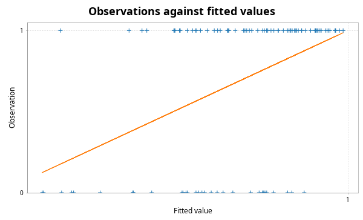

# scala-glm - Quickstart Guide

## PCA

This library contains code for principal components analysis based on a thin SVD of the centred data matrix. This is more numerically stable than a construction from the spectral decomposition of the covariance matrix. It is analogous to the R function `prcomp` rather than the R function `princomp`. First create some synthetic data.

```scala
import breeze.linalg.*
import breeze.numerics.*
import breeze.stats.distributions.*
import breeze.stats.distributions.Rand.VariableSeed.randBasis

val X = DenseMatrix.tabulate(100, 3)((i, j) => 
	Gaussian(j, j+1).sample())
```
Now we can do PCA.
```scala
import scalaglm.Pca
val pca = Pca(X, List("V1", "V2", "V3"))
```
```scala
pca.sdev
// res0: DenseVector[Double] = DenseVector(2.989796576787867, 1.9528909435971202, 1.0718262971794608)
pca.loadings
// res1: DenseMatrix[Double] = -0.06878191422315272  -0.036819427284175456  -0.9969520440072652   
// 0.05623413643984365   0.9975867846287074     -0.04072258627618966  
// 0.9960455663144454    -0.058863714702879544  -0.06654541995294726  
pca.scores
// res2: DenseMatrix[Double] = 3.59237892252607       5.155320215261234     -0.6990380592954794     
// -3.5268808588886724    -2.1572482572806173   -0.9359437977788904     
// -3.6963914848597894    1.294437257109212     0.055775304663719015    
// -2.00729279980233      0.32347309594905255   1.2164758201380588      
// -3.8306677043250494    0.7924203296833593    0.07389326867603371     
// -2.520726201066298     0.3271921792778458    -0.07836725791509536    
// 6.402559939663238      -0.9458682677253262   0.6382267138057435      
// -3.5994089355458683    1.1053243308666378    1.2138381551940187      
// 2.8363740350823403     5.200011508562083     1.43415170391562        
// 1.221854671748781      0.04763983725487897   -0.817804012866135      
// 8.104083918189252      2.59556039807337      0.763182834577201       
// -1.4168476064082514    0.49593870587689903   -1.2332581791799972     
// -1.1832580149346899    0.22430744610399078   1.4699804249759498      
// 5.168861070245997      0.6747712654655275    -0.9510364986615656     
// 1.81592090924723       2.0509490024073047    0.9183781377783923      
// 1.1943707305447844     -0.4786513891858723   -1.2241144598954925     
// 2.707921614609977      0.06152194334606891   -0.006390996435147107   
// -1.3007021843728162    -0.5546943038428173   1.9969336021720159      
// -2.412659200162963     5.026169476884896     -0.8579619252799692     
// -0.4370172506227553    -2.708658740995525    -0.6163383705661039     
// -4.357034637302296     1.3808449396714866    -0.5228176212404099     
// -2.372639316771145     0.5026378544764287    -0.5544353218915092     
// -4.295434610716539     2.1386023896139226    -0.6044640072907097     
// 5.942311892942863      -1.919754670478769    0.16262835058161687     
// -0.6653626717199599    1.9499233664298488    0.9681525064471888      
// 0.737768933756507      1.357269219785889     0.44222868785948605     
// 3.98682739418412       0.875336048013352     0.967762339850577       
// -0.40118357561728296   -0.5891564465069734   -0.5306486858576905     
// -1.8652364497072473    -0.05090709176136179  -1.1815862824775352     
// 4.620117743362897      0.07301606205770426   -1.5803045659605974     
// -2.363178551399581     -2.467519700832663    0.06697875877013801     
// 4.179587680990089      -2.221794795402762    1.733726213691982       
// -0.015921045096963037  0.35190891965771237   -1.8883495628050826     
// -1.9569199252444667    -0.3182696902413385   -1.096472983504138      
// -1.4616590645598173    -0.18042638261419036  0.19514857474503208     
// 0.6916203424890127     0.3321443787200878    0.843869701275812       
// 2.140351698102789      3.378720768045395     0.0730308067805973      
// -0.1519261175908774    -1.7679109403017654   0.993378749433317       
// -1.2918910735114875    2.8962630216915057    0.2830405935358278      
// 0.8058766993782391     -0.5788810502251972   -1.6038731108526767     
// -1.5400920874708528    0.9716857684021875    0.924517675006312       
// 1.7237971842034634     -0.26631416132868996  -1.7919248927806437     
// -3.2893135073530915    -3.6686465678080866   2.516927683250908       
// -3.151753197068591     -1.1909169702016822   0.1942770988377756      
// 1.9086413683226524     -0.46486308468735976  1.0205982587931663      
// 0.36480015593393805    0.3578427366156243    -0.589376979928116      
// 5.0065182432132005     -2.341467194138217    -1.276953234021789      
// 1.2679220926272396     -1.1817900352179582   0.2095815065162462      
// -0.9844972572158139    -0.8006801600861475   -0.3592172780116465     
// ...
pca.plots
// res3: Figure = breeze.plot.Figure@6761557b
pca.summary
// Standard deviations:
// V1	V2	V3
//  2.990	 1.953	 1.072
// Cumulative proportion of variance explained:
// V1	V2	V3
//  0.643	 0.917	 1.000
// Loadings:
// PC01	PC02	PC03	
// -0.069	-0.037	-0.997	V1
//  0.056	 0.998	-0.041	V2
//  0.996	-0.059	-0.067	V3
```
The final line prints a readable summary of the PCA to the console. `plots` produces some diagnostic plots, including a "scree plot".


Note that there is also a utility function `pairs` for producing a "scatterplot matrix":
```scala
import scalaglm.Utils.pairs
pairs(X, List("V1", "V2", "V3"))
// res6: Figure = breeze.plot.Figure@38fa479a
```


## Linear regression

This code computes regression coefficients and associated diagnostics via the QR decomposition of the covariate matrix. The diagnostics are analogous to those produced by the R function `lm`. We start by creating a synthetic response variable.

```scala
val y = DenseVector.tabulate(100)(i => 
	Gaussian(2.0 + 1.5*X(i,0) + 0.5*X(i,1), 3.0).sample())
```
So we can now do linear regression and generate all of the usual diagnostics.
```scala
import scalaglm.Lm
val lm = Lm(y,X,List("V1", "V2", "V3"))
```
```scala
lm.coefficients
// res8: DenseVector[Double] = DenseVector(2.4663907318621225, 1.0489175110311015, 0.30375803744647717, -0.010622846107833987)
lm.se
// res9: DenseVector[Double] = DenseVector(0.41512967573923953, 0.29961942374689726, 0.1650294172172069, 0.10953691147853889)
lm.fitted
// res10: DenseVector[Double] = DenseVector(4.596558271092286, 3.37635983772068, 3.253659608231842, 1.658137515835007, 3.1102672204296793, 3.061973475910813, 1.3810835667701806, 1.9726561582517026, 2.4024319804087235, 3.5240671131837358, 2.075843099124322, 4.255393761547975, 1.3097096735460358, 3.572048940968213, 2.1801955684893253, 3.816014389423554, 2.5722175703251935, 0.5537692190350914, 5.124578598664145, 2.68943754866822, 3.931723215195289, 3.602136968960615, 4.2148392380960065, 1.6560778456010015, 2.2636760792307333, 2.5705984624735754, 1.6738941720949045, 3.1582095589651327, 4.085261200020296, 4.1139661976444515, 2.1572628457598992, 0.030490953663969478, 4.817939339139513, 3.9304234045842366, 2.568705024123092, 1.877250804606065, 3.4046532854932092, 1.21796056315103, 3.2800391666470063, 4.2165040375529825, 2.1079750780533466, 4.437928747361586, -0.690809875980912, 2.4127640470629865, 1.399257923137309, 3.421007216701039, 3.1279320433512865, 2.1088671124604876, 2.9591728663032364, 2.447732241862547, 2.3182131406193225, 1.8961174846834197, 3.0893301505120925, 3.589057483645691, 2.924541873446656, 0.966325209930881, 1.506781724648636, 2.178139873146687, 0.8472207507545461, 2.455607942315316, 2.5170781045654596, 2.398357109308778, 0.25286177719279346, 3.2934735652577127, 0.6446393066348093, 2.831845683919608, 1.7021419839212415, 2.9542489066298816, 0.6354069232601549, 3.7508516980459854, 4.697052505883172, 2.7358063484012067, 0.654328048612171, 2.2725593473904286, 2.1472753293037377, 3.365821972821938, 5.469682790061629, 2.554854638721236, 2.0568515491086803, 3.1007639826125786, 4.550380725742508, 2.8093686347802755, 1.3597116108985736, 4.769651500825845, 1.7993161132450761, 3.5124788115135974, 2.953005953081312, 2.928197222519535, 6.290349189494345, 0.8282655418020073, 4.1882774051282725, 2.5728068058357447, 2.37006293278601, 1.727346265296553, 2.6889794829299696, 3.325200726699605, 3.827618817227985, 1.3515198278176763, 4.59172599206214, 3.4504995142433836)
lm.residuals
// res11: DenseVector[Double] = DenseVector(-5.037137728935947, 0.633414569407234, -3.8770925636036955, -1.1326234156804573, 1.4158364204305114, 2.010501105413269, -0.6149587957007026, 2.805557026639311, 2.3685218049891943, 8.14191718872133, -0.41250775521148975, 2.045891304194657, 2.091908980315379, -0.877711068353173, -4.553535186554856, -1.0430318880813285, -0.9016016734945063, -6.30203953088952, -0.22581527426546444, -0.8730811432239709, 1.5239382592665995, -1.4207963532457093, -0.4422678182130295, 1.8500782561663995, 3.415060258573501, -1.3380514626071383, 3.0614921585940227, -6.575490279523623, -3.2985492135742436, -0.9047366245116315, 1.7603493212962458, 4.581449494505036, 1.5506940272645755, -2.4193650790102406, -1.6922190153748806, 1.6540279809661178, -0.4291534837785509, 1.207678201182674, 2.427310879948203, 4.336983452297706, -3.7440931952362897, -1.6313440787361602, 1.9300404324673521, -6.17822996793267, -0.41196115862693317, -1.933055694801658, -5.308266743423122, 2.626742436815087, 2.9518832644201995, -4.414946351408419, -0.6570455349759592, 0.8391309826009696, -1.815431337348055, -0.32726127263032945, 9.81942194997826, -1.845234737656952, 3.912792707070991, 3.3671280780503046, 4.143632728221698, -2.5678321925251133, -5.155612896407689, 4.183520030182169, -1.2419626899813327, 3.491729832844197, 0.15181236297106482, 0.46645487994942547, -2.444392026401718, -1.5178037886101485, -2.6816670489690804, -2.657594486572934, 0.7183330246477251, 1.9716560085433938, -0.10343406322836701, -0.2309471294390426, -0.750271572227355, 0.7865745283583054, 1.199499223520922, -0.23708040285109533, -8.760910643901777, -2.791135072355971, 0.10926547978601686, 7.5086142525775905, 2.1108743690515226, 1.3381472553174838, -1.2393588343125261, -1.2394182449466178, 8.125574653159205, -1.9641682353783745, -1.0052104892962141, -4.203974451591751, -0.7744148262555499, -1.3434607013318733, 2.1736322211790755, 0.7245804975912558, 2.5801741645564693, -1.2973845271323405, 1.9474011016531305, -2.053601583539783, 1.5891796229430684, -0.7501354447615309)
lm.studentised
// res12: DenseVector[Double] = DenseVector(-1.656803437479784, 0.20223783019831795, -1.228805763019028, -0.3585925390036004, 0.4483628542026422, 0.6331785353997822, -0.19824037188804014, 0.8942434383271711, 0.7831992161631555, 2.5642531304912346, -0.13628063499583282, 0.6472209814614533, 0.6632865973422326, -0.2810122725652253, -1.4449697023224652, -0.3298126440001612, -0.2840591549902665, -2.0160384841399717, -0.07389362898875701, -0.27715510832875023, 0.48525330675646255, -0.4479648507295433, -0.1413628726136476, 0.595643308089586, 1.081760122286813, -0.4213349758459888, 0.9744975269872027, -2.0667160084030454, -1.0434591332790826, -0.29069783212084854, 0.5586660436514188, 1.4824122877799757, 0.49448758946332577, -0.76492780062328, -0.5316747012999371, 0.5208001607015273, -0.1371196033064664, 0.38218596684921197, 0.7712632419634553, 1.3776448920988213, -1.1822684664441514, -0.5202317635849061, 0.6399252323716801, -1.9535106311757946, -0.13016123232160434, -0.6075607311880704, -1.715688603637925, 0.826575503028647, 0.9279595688698773, -1.3873763929886802, -0.2092927958769859, 0.2699029092993551, -0.5850886407047377, -0.10314294057033363, 3.0825037469328276, -0.5899352077419402, 1.2483825286016992, 1.0596853385447706, 1.3306394253019467, -0.8266914861348759, -1.618386884728069, 1.314586552375657, -0.3982520346404073, 1.0983582872360151, 0.04859496826046267, 0.14690710179990374, -0.7698350885144333, -0.4802578979767854, -0.8658096846551091, -0.8387000610421779, 0.2311368180616285, 0.6186114297318578, -0.03411470042836302, -0.07438319986774417, -0.23850138110484784, 0.2479435042351178, 0.3990571959357417, -0.07620265675532882, -2.76551783821722, -0.880496950709339, 0.03496614602436937, 2.3908623937100693, 0.6707679533596639, 0.4317557675414495, -0.3901076838674997, -0.39098359475289607, 2.58075813854508, -0.6265407290807083, -0.3294207102468568, -1.3460643666061405, -0.24717623771392766, -0.43746107873240475, 0.6862946731092912, 0.23252949146670568, 0.8103213604845014, -0.4079889973140662, 0.62567569261185, -0.6508759288347281, 0.5055936858450873, -0.23755390933867707)
val pred = lm.predict()
// pred: PredictLm = PredictLm(
//   mod = Lm(
//     y = DenseVector(-0.44057945784366037, 4.009774407127914, -0.6234329553718534, 0.5255141001545496, 4.526103640860191, 5.072474581324082, 0.7661247710694781, 4.778213184891014, 4.770953785397918, 11.665984301905064, 1.6633353439128322, 6.301285065742632, 3.401618653861415, 2.6943378726150398, -2.373339618065531, 2.7729825013422253, 1.6706158968306872, -5.748270311854428, 4.89876332439868, 1.8163564054442491, 5.4556614744618885, 2.181340615714906, 3.772571419882977, 3.506156101767401, 5.678736337804234, 1.2325469998664371, 4.735386330688927, -3.4172807205584905, 0.7867119864460528, 3.20922957313282, 3.917612167056145, 4.611940448169006, 6.368633366404088, 1.511058325573996, 0.8764860087482114, 3.5312787855721828, 2.9754998017146583, 2.425638764333704, 5.707350046595209, 8.553487489850689, -1.636118117182943, 2.806584668625426, 1.23923055648644, -3.7654659208696835, 0.9872967645103758, 1.4879515218993808, -2.180334700071835, 4.7356095492755745, 5.911056130723436, -1.9672141095458726, 1.6611676056433633, 2.7352484672843893, 1.2738988131640374, 3.2617962110153615, 12.743963823424917, -0.8789095277260711, 5.419574431719627, 5.545267951196991, 4.990853478976244, -0.1122242502097972, -2.6385347918422295, 6.581877139490947, -0.9891009127885393, 6.78520339810191, 0.7964516696058741, 3.2983005638690335, -0.7422500424804764, 1.436445118019733, -2.0462601257089252, 1.0932572114730514, 5.415385530530897, 4.707462356944601, 0.550893985383804, 2.041612217951386, 1.3970037570763827, 4.1523965011802435, 6.669182013582551, 2.3177742358701408, -6.704059094793097, 0.30962891025660744, 4.659646205528525, 10.317982887357866, 3.4705859799500964, 6.107798756143329, 0.55995727893255, 2.2730605665669796, 11.078580606240518, 0.9640289871411607, 5.2851387001981305, -3.3757089097897435, 3.4138625788727226, 1.2293461045038714, 4.543695153965086, 2.4519267628878088, 5.269153647486439, 2.0278161995672646, 5.7750199188811155, -0.7020817557221068, 6.180905615005209, 2.7003640694818527),
//     Xmat = 0.31528981398800165   6.115149812469791     5.466649224616224     
// 1.3103943729590073    -1.5704698689545489   -1.1782479799330599   
// 0.20626816822833755   1.8229683345152603    -1.616261682885285    
// -1.031323679696777    0.9020655980274467    0.046072827561166374  
// 0.21592517813726048   1.3138741644566443    -1.7216620022770028   
// 0.29475077128382526   0.9296325814278793    -0.37938327802336236  
// -0.9865463989100626   0.1322560339551524    8.535867339573429     
// -0.9479725734484916   1.5926061940596372    -1.5855945340147581   
// -1.7610441252041658   6.030350969889136     4.569049204195071     
// 0.7848048361084204    0.8913274399020754    3.414059425609566     
// -1.3585491105064695   3.755733664816452     10.013885850205378    
// 1.3639816025681877    1.2070776910009133    0.7870497558917959    
// -1.3370830811112686   0.839154777634397     0.855816709649319     
// 0.6230579595920505    1.74432753264997      7.317408375294695     
// -1.0607072168701124   2.8525071630166945    3.772319278078353     
// 1.211145006404486     0.3813067440732473    3.4447017237611535    
// -0.12686068934607106  0.955700900137824     4.8394368430268075    
// -1.825669695138295    0.033969659014697506  0.7496255816808515    
// 0.8915225603046797    5.655094400366657     -0.4964644254174715   
// 0.7995389735672902    -1.9598090282705418   1.910586759621015     
// 0.825356387615121     1.8955785999012011    -2.2408759337300292   
// 0.7527222920982322    1.1323691292912694    -0.21052922841910116  
// ...
pred.fitted
// res13: DenseVector[Double] = DenseVector(4.5965582710922845, 3.3763598377206807, 3.2536596082318425, 1.6581375158350071, 3.1102672204296793, 3.0619734759108126, 1.3810835667701804, 1.9726561582517028, 2.4024319804087244, 3.5240671131837353, 2.075843099124322, 4.255393761547975, 1.309709673546036, 3.5720489409682123, 2.1801955684893253, 3.816014389423554, 2.5722175703251935, 0.5537692190350914, 5.124578598664145, 2.6894375486682196, 3.931723215195289, 3.6021369689606155, 4.2148392380960065, 1.6560778456010015, 2.2636760792307333, 2.5705984624735754, 1.673894172094904, 3.1582095589651322, 4.0852612000202955, 4.1139661976444515, 2.157262845759899, 0.030490953663969922, 4.817939339139513, 3.9304234045842366, 2.568705024123092, 1.8772508046060652, 3.4046532854932092, 1.2179605631510304, 3.280039166647007, 4.2165040375529825, 2.107975078053346, 4.437928747361586, -0.6908098759809123, 2.4127640470629865, 1.3992579231373095, 3.421007216701039, 3.1279320433512865, 2.1088671124604876, 2.9591728663032364, 2.447732241862547, 2.3182131406193225, 1.8961174846834197, 3.089330150512092, 3.5890574836456905, 2.924541873446656, 0.966325209930881, 1.5067817246486366, 2.178139873146687, 0.8472207507545461, 2.455607942315316, 2.5170781045654596, 2.3983571093087783, 0.25286177719279435, 3.2934735652577123, 0.6446393066348093, 2.831845683919608, 1.7021419839212417, 2.9542489066298816, 0.6354069232601547, 3.750851698045985, 4.697052505883172, 2.7358063484012067, 0.6543280486121712, 2.2725593473904286, 2.147275329303737, 3.365821972821938, 5.469682790061629, 2.554854638721236, 2.05685154910868, 3.1007639826125786, 4.550380725742508, 2.8093686347802755, 1.3597116108985734, 4.769651500825844, 1.7993161132450761, 3.5124788115135974, 2.9530059530813118, 2.928197222519535, 6.290349189494344, 0.8282655418020074, 4.1882774051282725, 2.5728068058357447, 2.37006293278601, 1.7273462652965534, 2.6889794829299696, 3.325200726699605, 3.827618817227985, 1.3515198278176763, 4.59172599206214, 3.4504995142433836)
pred.se
// res14: DenseVector[Double] = DenseVector(1.0093154083054614, 0.6725981878796311, 0.5539702725015707, 0.5345182043388367, 0.538833098960886, 0.4239884601593445, 0.7994043486958269, 0.6473072871026319, 1.0566119313317375, 0.4246638870147911, 1.0487464877188692, 0.5194377519152097, 0.5614217545656094, 0.711631975673956, 0.5755756135373582, 0.5104837345030131, 0.43331166160893386, 0.7002945879569978, 0.9608094534844742, 0.5818256983342154, 0.631858319527617, 0.4500026949276979, 0.6883700554641994, 0.7839940370991367, 0.5437544327665425, 0.4202938093656659, 0.6263135676474262, 0.3732664887706439, 0.5186595811129171, 0.7586995808576215, 0.5772960150259437, 0.8429541364635829, 0.6540138236104256, 0.5081921460381916, 0.3629261513238797, 0.41883041460101417, 0.6830065138125313, 0.5261895797468058, 0.5976557141386041, 0.5927608078785422, 0.4826060333260703, 0.6547754786482448, 1.079577685139137, 0.5096707753610273, 0.4946935130028257, 0.37280821777109174, 0.830312335352761, 0.40396155767131164, 0.3780563494585624, 0.3679958595324825, 0.6374983177907272, 0.7720375909592683, 0.7965089121546388, 0.4413086029401756, 0.33816938569562077, 0.6917226666470194, 0.6619784408134473, 0.4069577494820292, 0.751592651205864, 0.7834457735621185, 0.33708684675196743, 0.3666285912832342, 0.7326194752816043, 0.3945436708049871, 0.7087990808594484, 0.42460575108025356, 0.42426082181104774, 0.5233577359263398, 0.8177768357886034, 0.47041086876129573, 0.776791894471959, 0.3218114373571089, 1.0340542044893164, 0.788685094402736, 0.6050545124644319, 0.44486359460705455, 1.1076810768737018, 0.7632361095617631, 0.47574874722835536, 0.46192890506287065, 0.7050031919270485, 0.6316302753076962, 0.5989016979572592, 0.8100821551066756, 0.41094485232387007, 0.46161062274914866, 0.5905891034204419, 0.6588878389954195, 0.9750115664274376, 0.712642778495246, 0.6678349233245593, 0.911426629965507, 0.48045295609513505, 0.7429898064451647, 0.3510846916543897, 0.3871792022982722, 0.7579421772401822, 0.5541750593954466, 0.6183143550662609, 0.5390865578719074)
val predNew = lm.predict(DenseMatrix((1.1, 1.6, 1.0), (1.4, 2.2, 3.0)))
// predNew: PredictLm = PredictLm(
//   mod = Lm(
//     y = DenseVector(-0.44057945784366037, 4.009774407127914, -0.6234329553718534, 0.5255141001545496, 4.526103640860191, 5.072474581324082, 0.7661247710694781, 4.778213184891014, 4.770953785397918, 11.665984301905064, 1.6633353439128322, 6.301285065742632, 3.401618653861415, 2.6943378726150398, -2.373339618065531, 2.7729825013422253, 1.6706158968306872, -5.748270311854428, 4.89876332439868, 1.8163564054442491, 5.4556614744618885, 2.181340615714906, 3.772571419882977, 3.506156101767401, 5.678736337804234, 1.2325469998664371, 4.735386330688927, -3.4172807205584905, 0.7867119864460528, 3.20922957313282, 3.917612167056145, 4.611940448169006, 6.368633366404088, 1.511058325573996, 0.8764860087482114, 3.5312787855721828, 2.9754998017146583, 2.425638764333704, 5.707350046595209, 8.553487489850689, -1.636118117182943, 2.806584668625426, 1.23923055648644, -3.7654659208696835, 0.9872967645103758, 1.4879515218993808, -2.180334700071835, 4.7356095492755745, 5.911056130723436, -1.9672141095458726, 1.6611676056433633, 2.7352484672843893, 1.2738988131640374, 3.2617962110153615, 12.743963823424917, -0.8789095277260711, 5.419574431719627, 5.545267951196991, 4.990853478976244, -0.1122242502097972, -2.6385347918422295, 6.581877139490947, -0.9891009127885393, 6.78520339810191, 0.7964516696058741, 3.2983005638690335, -0.7422500424804764, 1.436445118019733, -2.0462601257089252, 1.0932572114730514, 5.415385530530897, 4.707462356944601, 0.550893985383804, 2.041612217951386, 1.3970037570763827, 4.1523965011802435, 6.669182013582551, 2.3177742358701408, -6.704059094793097, 0.30962891025660744, 4.659646205528525, 10.317982887357866, 3.4705859799500964, 6.107798756143329, 0.55995727893255, 2.2730605665669796, 11.078580606240518, 0.9640289871411607, 5.2851387001981305, -3.3757089097897435, 3.4138625788727226, 1.2293461045038714, 4.543695153965086, 2.4519267628878088, 5.269153647486439, 2.0278161995672646, 5.7750199188811155, -0.7020817557221068, 6.180905615005209, 2.7003640694818527),
//     Xmat = 0.31528981398800165   6.115149812469791     5.466649224616224     
// 1.3103943729590073    -1.5704698689545489   -1.1782479799330599   
// 0.20626816822833755   1.8229683345152603    -1.616261682885285    
// -1.031323679696777    0.9020655980274467    0.046072827561166374  
// 0.21592517813726048   1.3138741644566443    -1.7216620022770028   
// 0.29475077128382526   0.9296325814278793    -0.37938327802336236  
// -0.9865463989100626   0.1322560339551524    8.535867339573429     
// -0.9479725734484916   1.5926061940596372    -1.5855945340147581   
// -1.7610441252041658   6.030350969889136     4.569049204195071     
// 0.7848048361084204    0.8913274399020754    3.414059425609566     
// -1.3585491105064695   3.755733664816452     10.013885850205378    
// 1.3639816025681877    1.2070776910009133    0.7870497558917959    
// -1.3370830811112686   0.839154777634397     0.855816709649319     
// 0.6230579595920505    1.74432753264997      7.317408375294695     
// -1.0607072168701124   2.8525071630166945    3.772319278078353     
// 1.211145006404486     0.3813067440732473    3.4447017237611535    
// -0.12686068934607106  0.955700900137824     4.8394368430268075    
// -1.825669695138295    0.033969659014697506  0.7496255816808515    
// 0.8915225603046797    5.655094400366657     -0.4964644254174715   
// 0.7995389735672902    -1.9598090282705418   1.910586759621015     
// 0.825356387615121     1.8955785999012011    -2.2408759337300292   
// 0.7527222920982322    1.1323691292912694    -0.21052922841910116  
// ...
predNew.fitted
// res15: DenseVector[Double] = DenseVector(4.095590007802864, 4.571274391364413)
predNew.se
// res16: DenseVector[Double] = DenseVector(0.4794911769801342, 0.5934779216696866)
lm.plots
// res17: Figure = breeze.plot.Figure@4275101c
lm.summary
// Estimate	 S.E.	 t-stat	p-value		Variable
// ---------------------------------------------------------
//   2.4664	 0.415	 5.941	0.0000 *	(Intercept)
//   1.0489	 0.300	 3.501	0.0007 *	V1
//   0.3038	 0.165	 1.841	0.0688  	V2
//  -0.0106	 0.110	-0.097	0.9229  	V3
// 
// Residual standard error:   3.2034 on 96 degrees of freedom
// Multiple R-squared: 0.1378, Adjusted R-squared: 0.1109
// F-statistic: 5.1158 on 3 and 96 DF, p-value: 0.00251
//
```
The plots include a plot of studentised residuals against fitted values and a normal Q-Q plot for the studentised residuals.


## Generalised linear models

The current implementation supports only simple one-parameter exponential family observation models. This includes the most commonly used cases of **logistic regression** (`LogisticGlm`) and **Poisson regression** (`PoissonGlm`).

### Logistic regression

Again, we start by creating an appropriate response variable.
```scala
val ylb = (0 until 100) map (i => Bernoulli(sigmoid(1.0 + X(i,0))).sample())
val yl = DenseVector(ylb.toArray map {b => if (b) 1.0 else 0.0})
```

Then we can do logistic regression in a typical way.
```scala
import scalaglm.{Glm, LogisticGlm}
val glm = Glm(yl, X, List("V1","V2","V3"), LogisticGlm)
```
```scala
glm.coefficients
// res20: DenseVector[Double] = DenseVector(0.8694026112252737, 0.9828511432273197, 0.09466377615525219, 0.07471030199908119)
glm.fitted
// res21: DenseVector[Double] = DenseVector(0.8972083285626584, 0.8722088206668744, 0.7547208848035449, 0.48615354231147306, 0.7459969659500901, 0.7718448071603708, 0.634138244609661, 0.4924977014526163, 0.5126895794216781, 0.878701497213662, 0.6542612788097265, 0.9155264467937511, 0.42522135354807555, 0.8996720745418433, 0.5935705026339202, 0.9131905046604484, 0.7679449604983377, 0.29614180744994, 0.9041211682532577, 0.8337509811419381, 0.8445698737529306, 0.8456238147343006, 0.8599537641394983, 0.7235616908322194, 0.5729706882606552, 0.6897749329703406, 0.5727205613206282, 0.8378472951039185, 0.9086353056776195, 0.9414019386643845, 0.716359454292204, 0.347788366589298, 0.9543481005467466, 0.9000180071096358, 0.7178566937948576, 0.5856980782715708, 0.784140832200132, 0.5187582643716441, 0.7339382191678427, 0.9381139739919826, 0.5680328303255892, 0.9494284871049098, 0.17197905251969164, 0.7026170434114632, 0.5357718078901365, 0.8532913386684277, 0.9130471031813941, 0.7107003592936092, 0.810664964884346, 0.755916326169245, 0.5619555082632353, 0.7897117336568303, 0.8977587908795044, 0.8634253915076406, 0.8050779286362544, 0.3499481516690244, 0.44980638366057557, 0.7160289683888414, 0.4386008082961638, 0.5295123699496238, 0.7422026925857479, 0.6740004467837052, 0.2938727381145508, 0.8458089188380551, 0.46234543584635346, 0.8250513768766069, 0.6140247059624729, 0.8214631513471612, 0.5296510476129446, 0.8529758543671176, 0.9142579312879152, 0.7679355856583979, 0.22931318408474902, 0.807703286316086, 0.7858222483642745, 0.8782110098575872, 0.9823213261616349, 0.7920165239334472, 0.7052178874174807, 0.7451740483180344, 0.8891901219741437, 0.7707778473987883, 0.4206056534131984, 0.9543364463004623, 0.6069280116628708, 0.8736510276144057, 0.8440099779521402, 0.8761206171070112, 0.9791149199996304, 0.4408796298900545, 0.9290587484426482, 0.6031647687557712, 0.7827097368008955, 0.5276554067678793, 0.7409633125073546, 0.843199874585104, 0.7794095291794882, 0.5430841408255915, 0.9199801832757285, 0.7888739911797267)
glm.predict(response=true).fitted
// res22: DenseVector[Double] = DenseVector(0.8972083285626584, 0.8722088206668744, 0.7547208848035449, 0.48615354231147306, 0.7459969659500901, 0.7718448071603708, 0.634138244609661, 0.4924977014526163, 0.5126895794216781, 0.878701497213662, 0.6542612788097265, 0.9155264467937511, 0.42522135354807555, 0.8996720745418433, 0.5935705026339202, 0.9131905046604484, 0.7679449604983377, 0.29614180744994, 0.9041211682532577, 0.8337509811419381, 0.8445698737529306, 0.8456238147343006, 0.8599537641394983, 0.7235616908322194, 0.5729706882606552, 0.6897749329703406, 0.5727205613206282, 0.8378472951039185, 0.9086353056776195, 0.9414019386643845, 0.716359454292204, 0.347788366589298, 0.9543481005467466, 0.9000180071096358, 0.7178566937948576, 0.5856980782715708, 0.784140832200132, 0.5187582643716441, 0.7339382191678427, 0.9381139739919826, 0.5680328303255892, 0.9494284871049098, 0.17197905251969164, 0.7026170434114632, 0.5357718078901365, 0.8532913386684277, 0.9130471031813941, 0.7107003592936092, 0.810664964884346, 0.755916326169245, 0.5619555082632353, 0.7897117336568303, 0.8977587908795044, 0.8634253915076406, 0.8050779286362544, 0.3499481516690244, 0.44980638366057557, 0.7160289683888414, 0.4386008082961638, 0.5295123699496238, 0.7422026925857479, 0.6740004467837052, 0.2938727381145508, 0.8458089188380551, 0.46234543584635346, 0.8250513768766069, 0.6140247059624729, 0.8214631513471612, 0.5296510476129446, 0.8529758543671176, 0.9142579312879152, 0.7679355856583979, 0.22931318408474902, 0.807703286316086, 0.7858222483642745, 0.8782110098575872, 0.9823213261616349, 0.7920165239334472, 0.7052178874174807, 0.7451740483180344, 0.8891901219741437, 0.7707778473987883, 0.4206056534131984, 0.9543364463004623, 0.6069280116628708, 0.8736510276144057, 0.8440099779521402, 0.8761206171070112, 0.9791149199996304, 0.4408796298900545, 0.9290587484426482, 0.6031647687557712, 0.7827097368008955, 0.5276554067678793, 0.7409633125073546, 0.843199874585104, 0.7794095291794882, 0.5430841408255915, 0.9199801832757285, 0.7888739911797267)
glm.summary
// Estimate	 S.E.	 z-stat	p-value		Variable
// ---------------------------------------------------------
//   0.8694	 0.315	 2.758	0.0058 *	(Intercept)
//   0.9829	 0.270	 3.638	0.0003 *	V1
//   0.0947	 0.129	 0.732	0.4639  	V2
//   0.0747	 0.081	 0.920	0.3575  	V3
glm.plots
// res24: Figure = breeze.plot.Figure@682ce13b
```




### Poisson regression

We first create an appropriate response, and then do Poisson regression.
```scala
val yp = DenseVector.tabulate(100)(i => Poisson(math.exp(-0.5 + X(i,0))).sample().toDouble)

import scalaglm.PoissonGlm
val pglm = Glm(yp, X, List("V1","V2","V3"), PoissonGlm)
```
```scala
pglm.coefficients
// res26: DenseVector[Double] = DenseVector(-0.22119911418582708, 0.9325487238695152, -0.05969543616623999, -0.011421601324040541)
pglm.summary
// Estimate	 S.E.	 z-stat	p-value		Variable
// ---------------------------------------------------------
//  -0.2212	 0.153	-1.443	0.1490  	(Intercept)
//   0.9325	 0.075	12.443	0.0000 *	V1
//  -0.0597	 0.045	-1.320	0.1870  	V2
//  -0.0114	 0.036	-0.315	0.7526  	V3
pglm.plots
// res28: Figure = breeze.plot.Figure@64c1ff9b
```


## Non-linear response

The above covers the main functionality of the library based on a linear reponse to variation in covariate values. For flexible modelling of a nonlinear response, see the documentation on [flexible regression modelling](FlexibleRegression.md).

