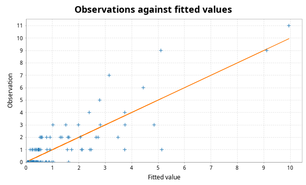

# scala-glm - Quickstart Guide

## PCA

This library contains code for principal components analysis based on a thin SVD of the centred data matrix. This is more numerically stable than a construction from the spectral decomposition of the covariance matrix. It is analogous to the R function `prcomp` rather than the R function `princomp`. First create some synthetic data.

```scala
import breeze.linalg.*
import breeze.numerics.*
import breeze.stats.distributions.*
import breeze.stats.distributions.Rand.VariableSeed.randBasis

val X = DenseMatrix.tabulate(100, 3)((i, j) => 
	Gaussian(j, j+1).sample())
```
Now we can do PCA.
```scala
import scalaglm.Pca
val pca = Pca(X, List("V1", "V2", "V3"))
```
```scala
pca.sdev
// res0: DenseVector[Double] = DenseVector(3.124321955395859, 2.196074940672344, 1.0549883178598856)
pca.loadings
// res1: DenseMatrix[Double] = -0.07141909029889236  -0.03165225818137614  -0.9969440546454441  
// -0.08587134550643194  -0.9955903896564747   0.03776093278223443  
// -0.9937431386237563   0.08830577883518653   0.06838613794123345  
pca.scores
// res2: DenseMatrix[Double] = 2.133641698086643     -0.9856490152445581   -0.8899070373040321   
// 1.09367052737611      0.9620238296531316    -0.639026714071532    
// 1.1840431428414029    2.292272870961637     0.7605379719962739    
// 3.198816858038779     -1.7813603036520975   1.2474428978157914    
// 2.63535717963253      3.2613724338267125    -0.080221398325971    
// -0.8371442508918006   -3.1452495321484824   -0.45546346302798557  
// 2.0910625987605345    -1.2061467411686226   0.5825127445825358    
// 4.789433838751504     1.5915116206102078    -0.6060491266739488   
// 6.10616339144943      -0.13780972130065644  -0.8147573975466396   
// -3.103958596833791    -1.0293228126974452   -1.585577433278114    
// -0.47710859716724185  1.9585068694639332    0.12841395313842374   
// 1.5465006983692893    3.200652986872125     -1.920883868824395    
// 2.942019967847089     0.8812598888393548    0.9255241681923411    
// -0.3552320365758493   0.12795467556791487   0.47055643826987803   
// 6.680421013419949     2.9065855079873173    -0.0917769838795342   
// -1.4705921727060696   -2.2133394003398963   0.8309438414653885    
// -0.08024398126539324  0.008978990465056302  -0.3819224959745154   
// 0.05076475295144013   -0.09295165388689584  -0.6442832460780926   
// -7.7560202363911035   -5.013967648896656    0.3850982705340863    
// -0.9752771842818905   0.6023989417046272    -1.1744914219564289   
// -3.5375904088384864   3.5302791547208145    -0.978000332906517    
// 1.6884658095767926    -1.797763705799158    -0.4695152660167643   
// 1.5707738094800066    -0.29767675740692934  0.35885596935209574   
// 3.3746658364275564    -2.023740278042601    0.6747259362758415    
// -1.718168200173924    1.6620370992781854    0.31794487671391447   
// -3.655186757853895    -0.6218658930331569   0.9817844620426037    
// -1.2310454891975475   -0.2754832275694826   1.3149125477029022    
// -3.69550740992105     1.340260417901976     -0.06434533696579009  
// -4.971242763550832    1.2985321727990344    1.5764316874523088    
// -1.7906402528501415   -3.9568958160908587   1.5523518883724392    
// 2.5868536456435445    -4.78376197075132     -0.9741460934818765   
// -2.2193200645132776   2.432896787626073     1.318909201962087     
// 0.5746905721742485    2.5216618799430153    0.21128322922356      
// 0.888900190577626     3.366163013159765     0.33867415990915123   
// 4.564130496433617     -0.4144561226490324   0.8465731586407221    
// 2.2341646410009837    -1.9159505537456056   -0.3703297493192872   
// -0.0464050704745379   -3.1984716258389616   -0.8251927102586201   
// 1.7303113189851889    2.4404174200365105    0.9501320207230951    
// 1.310773438346438     -2.0966297796705287   0.03912595842820153   
// 1.5666439099576155    -1.2891790376364163   -1.5033039319188002   
// -3.9433946528385064   -2.501491778141783    0.48791175130233877   
// 1.906463602858298     -1.963664441900789    0.8001718830936858    
// -0.34266124105644846  0.5085013505493632    1.8290018048991388    
// 4.009957317257518     -2.3471275700196688   0.30085182621432277   
// 0.6429074251338318    -2.3393328119010577   -1.4164318919020553   
// -2.5563526548903015   -1.1844672255974527   -0.548768836556301    
// -1.601292248368611    -0.09192591181297982  -0.9776739390174728   
// -0.2082309023326334   -0.9164037286247234   -1.1863778889868244   
// 0.9065139691341868    -1.670427981113552    0.5729753434383096    
// ...
pca.plots
// res3: Figure = breeze.plot.Figure@732df82a
pca.summary
// Standard deviations:
// V1	V2	V3
//  3.124	 2.196	 1.055
// Cumulative proportion of variance explained:
// V1	V2	V3
//  0.622	 0.929	 1.000
// Loadings:
// PC01	PC02	PC03	
// -0.071	-0.032	-0.997	V1
// -0.086	-0.996	 0.038	V2
// -0.994	 0.088	 0.068	V3
```
The final line prints a readable summary of the PCA to the console. `plots` produces some diagnostic plots, including a "scree plot".


Note that there is also a utility function `pairs` for producing a "scatterplot matrix":
```scala
import scalaglm.Utils.pairs
pairs(X, List("V1", "V2", "V3"))
// res6: Figure = breeze.plot.Figure@59d50e3d
```


## Linear regression

This code computes regression coefficients and associated diagnostics via the QR decomposition of the covariate matrix. The diagnostics are analogous to those produced by the R function `lm`. We start by creating a synthetic response variable.

```scala
val y = DenseVector.tabulate(100)(i => 
	Gaussian(2.0 + 1.5*X(i,0) + 0.5*X(i,1), 3.0).sample())
```
So we can now do linear regression and generate all of the usual diagnostics.
```scala
import scalaglm.Lm
val lm = Lm(y,X,List("V1", "V2", "V3"))
```
```scala
lm.coefficients
// res8: DenseVector[Double] = DenseVector(2.6070726003242477, 1.4606352169719037, 0.35826018226847123, -0.025677343700619935)
lm.se
// res9: DenseVector[Double] = DenseVector(0.4212206414714173, 0.28374010141328965, 0.13673972774976792, 0.09817073433217739)
lm.fitted
// res10: DenseVector[Double] = DenseVector(4.374786185349223, 3.337200506798524, 0.7667779030141673, 1.4933001272591617, 1.4294971793253566, 4.947797347866331, 2.342030534050184, 2.629585968434813, 3.4874636576843216, 5.971164629492081, 1.9970566284934324, 4.232051526052757, 0.9075741054395549, 2.2312164713752765, 1.1467439519915212, 2.781523531473457, 3.4806140505914542, 3.8865140763233086, 5.248923753693908, 4.483022198024213, 3.2936307821561814, 4.145401053882718, 2.353991487709541, 2.3994728385481805, 1.9793984810293859, 2.158170550312729, 1.2710525033955948, 2.8786026185635882, 0.6653485803704965, 2.481042880724142, 5.985725304988316, 0.27617777663607546, 1.5339408047812855, 0.9733359189267805, 1.3688831575111529, 3.990235132930601, 5.416761356445025, 0.37305135525765665, 3.573196445099641, 5.445883642628994, 3.664684710813981, 2.3548005944340025, 0.11351157614759752, 3.0009208902991853, 5.847116339000299, 4.476462082114078, 4.548655117913388, 5.031538554964137, 2.6737088201906527, 1.8034984655882307, 3.33779444719153, 6.514303036943227, 0.7416917672358849, 0.5491324078060388, -0.5939176925682887, 3.65698930706927, 3.600866653985065, 5.40030538795425, 5.098383018475055, 2.9822257289520864, 3.4563179608637062, 5.797180804474991, 4.515297919405627, 1.6173239926473488, 1.6559180218761336, -0.6291721230055844, 3.06929924014253, 0.14989080101345037, 1.164921247291814, 2.568863477487266, -0.9267152451751088, 4.336097005693809, 4.938030585746299, 6.509511394607504, 4.502091782445305, 1.6061268121948706, 4.829185860285968, 2.1627663257481973, 2.977491582429215, 2.6613435892110533, 1.2740239498303827, 1.3293203549708645, 3.2514188115015883, 1.0953097685212445, 3.952722153619499, 2.177419284455407, 4.390140014207698, 1.2463785419144426, 0.3881300390167103, 5.715732081511504, 4.215956831349186, 3.338803981788698, 3.0188260734622965, 6.083514202293403, 1.3051287099987414, 0.23063854873314774, 4.667636069816751, 3.6487075872231443, 0.8525566538992186, 4.6962114504251495)
lm.residuals
// res11: DenseVector[Double] = DenseVector(3.4298623684151, 2.1109647907426474, 4.823418596795998, 1.5234822079037273, 0.7385469704219008, -0.29337644853920875, -2.7858002518793494, 1.0278014611966766, 2.549190159161667, -2.7728890082042104, -1.7799068972367154, 3.3621782924275285, 4.470192092891548, -3.6043954508918654, -0.38562037726977916, -6.265084872956043, 2.1399883798844512, -7.0972811024514435, 3.0688106283839085, -5.696315026155488, -0.7096294758425983, -0.3573361482870414, 0.4663563644209541, 4.082962855407475, 3.30031196258384, 1.4590056607778354, -2.970796291985928, -2.779384508556016, 0.016501706763132673, 5.3576222331773815, -2.597178032487582, -4.854678629289517, -0.034085456627935606, -2.497684610289303, 2.4953749519982455, -0.08029215974176296, -2.480065679427899, 2.0385718242854605, 3.0040747593536663, 3.1482346525610208, -4.561406443182573, 0.5753140628990856, 3.1423092971787434, -0.38755060640660854, -0.8408475399218025, 1.3795737463466926, 1.300542990643767, -0.7815179580749296, -3.424437117700627, 0.016581288244160497, 0.1334995650602524, 0.9434415959443685, -1.8338538026106177, -1.5830610781190528, -1.230517499703357, 1.0473920800355936, 2.6020348235624606, 1.9113422677844651, 1.1207927289092412, 3.9081635459695465, -8.35612558980404, -0.3120419148449134, -0.7507515298434999, -2.7685902728917293, 0.2372262268349501, 3.846443598155759, -0.13741000937264802, -3.7052600943475875, -2.324003922417644, 0.6125667573420794, 0.5696045756698753, -3.91846484593491, 0.08967604902969306, 1.909174371541079, -3.309437743704544, 0.5729964579318767, 2.8995807872281567, 1.9740829297812081, 0.8667336476140117, -0.6107855097619974, 4.562607120099365, 2.486501910349147, -0.5324067964448109, -7.345262630139489, 1.348693772931961, -1.7654199781963977, 0.11545930074507904, -4.632366694360412, 3.1860426655152327, 2.768456785052276, 4.021381332131166, 4.98348069746051, 0.11272492148058966, -3.7906879322745386, -0.6019254891441426, 0.6095345359043502, -2.6087505693253115, 4.5573578748934285, -3.0518000312356004, 0.18171679805914476)
lm.studentised
// res12: DenseVector[Double] = DenseVector(1.1625165781997968, 0.7129195515477641, 1.6380168454085404, 0.5210402700778821, 0.25234629968431393, -0.09991895417020276, -0.9426350741570484, 0.3517012147019665, 0.877945418828866, -0.9501546325418663, -0.6015843677938534, 1.1658412854531848, 1.5185713477310248, -1.2143800414530732, -0.13418546170388207, -2.128761703215563, 0.7206895120603317, -2.393145993730317, 1.0993565541832764, -1.9310343747827015, -0.24479755519470306, -0.12097835495354116, 0.15726113462256044, 1.3914265923587466, 1.116222168974851, 0.4969264363692278, -1.0087236946698743, -0.9439795459437175, 0.005704410069163954, 1.8583264525583276, -0.9035114016783364, -1.661998250557436, -0.011553697948751333, -0.851665953460065, 0.8521292061745108, -0.027216509211071473, -0.8465443070092703, 0.694459505101913, 1.016673332285644, 1.0740152726344374, -1.5600295934706576, 0.19536896119575867, 1.0745017213666392, -0.1323819669672647, -0.28738627549213985, 0.46723370052858604, 0.44022267730993514, -0.26497499550143333, -1.158153904656864, 0.00571677331082251, 0.04569462492479898, 0.32577104009524455, -0.6314081779076798, -0.5384731052043558, -0.42306540320756797, 0.35288674989285995, 0.8767773863555508, 0.6755722088254744, 0.3852934698894006, 1.3287708742242812, -2.8186155138903026, -0.11207662741225391, -0.25562140839081604, -0.9441595431136056, 0.08071829106583045, 1.337297529905168, -0.0467746263209345, -1.2689144081748143, -0.7911382559574798, 0.20841969847060315, 0.19752552583351435, -1.3417636332084728, 0.03043619204805381, 0.660289915497142, -1.1319214056964741, 0.19377762209394436, 1.006011416008547, 0.6751011400680895, 0.2924931340326178, -0.21288718191349598, 1.5447398939060286, 0.8468745724077471, -0.18086242999283736, -2.519285286017051, 0.4579380175990979, -0.5948030703330276, 0.03950592071167011, -1.585447746409325, 1.097962583260684, 0.9530539765238376, 1.3583370687778458, 1.6866473260922952, 0.03844707525188988, -1.3038881088621928, -0.20503545195175032, 0.21046433916363527, -0.9068715758612805, 1.5363903996247326, -1.0443468478221616, 0.06420130739685852)
val pred = lm.predict()
// pred: PredictLm = PredictLm(
//   mod = Lm(
//     y = DenseVector(7.8046485537643235, 5.448165297541172, 5.5901964998101645, 3.016782335162889, 2.1680441497472573, 4.654420899327122, -0.4437697178291655, 3.6573874296314894, 6.0366538168459885, 3.1982756212878702, 0.217149731256717, 7.594229818480286, 5.377766198331103, -1.3731789795165892, 0.7611235747217421, -3.483561341482586, 5.6206024304759055, -3.2107670261281345, 8.317734382077816, -1.2132928281312747, 2.584001306313583, 3.788064905595677, 2.820347852130495, 6.482435693955655, 5.279710443613226, 3.6171762110905643, -1.6997437885903333, 0.09921811000757241, 0.6818502871336292, 7.8386651139015235, 3.388547272500734, -4.578500852653442, 1.4998553481533499, -1.5243486913625224, 3.8642581095093984, 3.909942973188838, 2.9366956770171257, 2.411623179543117, 6.577271204453307, 8.594118295190015, -0.8967217323685928, 2.930114657333088, 3.255820873326341, 2.6133702838925768, 5.006268799078496, 5.8560358284607705, 5.849198108557155, 4.2500205968892075, -0.7507282975099745, 1.8200797538323912, 3.4712940122517826, 7.457744632887596, -1.0921620353747328, -1.033928670313014, -1.8244351922716457, 4.704381387104863, 6.202901477547526, 7.311647655738716, 6.219175747384297, 6.890389274921633, -4.899807628940335, 5.485138889630077, 3.7645463895621267, -1.1512662802443807, 1.8931442487110837, 3.2172714751501745, 2.931889230769882, -3.555369293334137, -1.1590826751258296, 3.1814302348293455, -0.3571106695052335, 0.4176321597588988, 5.027706634775992, 8.418685766148583, 1.192654038740761, 2.1791232701267473, 7.728766647514124, 4.136849255529405, 3.844225230043227, 2.050558079449056, 5.836631069929748, 3.815822265320011, 2.7190120150567774, -6.249952861618245, 5.30141592655146, 0.41199930625900905, 4.505599314952777, -3.3859881524459694, 3.574172704531943, 8.48418886656378, 8.237338163480352, 8.322284679249208, 3.131550994942886, 2.292826270018864, 0.7032032208545989, 0.840173084637498, 2.05888550049144, 8.206065462116573, -2.1992433773363818, 4.877928248484294),
//     Xmat = 0.772031084612702      1.8190155968823474     0.45265838947883363    
// 0.534542989148197      -0.021291570953897     1.675270108615094      
// -0.9093044198043071    -1.3005862823823278    1.7986424433935964     
// -1.4096750076960791    2.600458411609119      -0.5299529147150501    
// -0.2054400819869974    -2.4217866409514843    0.38448988273746654    
// 0.6194422092377294     4.24060349826534       3.243861255176076      
// -0.6858688513924817    2.0977972827140894     0.576192956175317      
// 0.217793415715776      -0.964118469796915     -1.9395267045531686    
// 0.38656118428700914    0.6366268814916063     -3.4149994835249853    
// 1.8410225725970724     2.285987431394978      5.606056885050291      
// -0.14990974363397833   -0.8495163164783803    3.3766986001795596     
// 1.709284471554912      -2.3373385038120404    1.335295864274295      
// -1.1546777856015762    -0.040525120368667844  -0.061652795876783184  
// -0.44176986245791267   0.9754177706683866     3.117334070336109      
// -0.4715847815054277    -2.4163556109660953    -3.667384525058333     
// -0.6472906905955579    3.415773692123207      4.043611258521937      
// 0.3922303950963673     1.0380648253176084     2.775262594643163      
// 0.647659195537094      1.1183891123162522     2.618130660531781      
// 0.33473816347529484    6.726954881664085      10.011910954691313     
// 1.2275166493908884     0.49419118830974507    3.6628973820516646     
// 1.1219500855038926     -2.1933292428270015    6.4811645772262105     
// 0.41042332844469037    2.6816514160484934     0.8520834235739214     
// ...
pred.fitted
// res13: DenseVector[Double] = DenseVector(4.374786185349221, 3.337200506798524, 0.7667779030141662, 1.493300127259161, 1.4294971793253557, 4.947797347866331, 2.3420305340501835, 2.6295859684348124, 3.487463657684321, 5.971164629492081, 1.9970566284934315, 4.232051526052758, 0.9075741054395537, 2.2312164713752756, 1.1467439519915206, 2.7815235314734568, 3.4806140505914542, 3.8865140763233086, 5.248923753693909, 4.483022198024212, 3.2936307821561814, 4.145401053882718, 2.3539914877095405, 2.3994728385481796, 1.9793984810293854, 2.158170550312728, 1.271052503395594, 2.878602618563588, 0.6653485803704957, 2.481042880724141, 5.985725304988316, 0.2761777766360748, 1.5339408047812852, 0.9733359189267798, 1.368883157511152, 3.990235132930601, 5.416761356445024, 0.3730513552576557, 3.57319644509964, 5.445883642628995, 3.6646847108139804, 2.3548005944340025, 0.11351157614759659, 3.000920890299185, 5.847116339000299, 4.476462082114077, 4.5486551179133885, 5.031538554964136, 2.6737088201906523, 1.80349846558823, 3.3377944471915297, 6.514303036943228, 0.7416917672358846, 0.5491324078060384, -0.5939176925682896, 3.656989307069269, 3.600866653985065, 5.40030538795425, 5.098383018475055, 2.9822257289520864, 3.456317960863706, 5.797180804474991, 4.515297919405626, 1.617323992647348, 1.655918021876133, -0.6291721230055858, 3.06929924014253, 0.14989080101344954, 1.1649212472918131, 2.568863477487265, -0.9267152451751094, 4.336097005693809, 4.938030585746298, 6.509511394607504, 4.502091782445305, 1.6061268121948697, 4.829185860285967, 2.162766325748197, 2.977491582429215, 2.661343589211052, 1.2740239498303816, 1.3293203549708636, 3.2514188115015883, 1.0953097685212436, 3.9527221536194994, 2.1774192844554063, 4.390140014207697, 1.2463785419144422, 0.38813003901670895, 5.715732081511504, 4.215956831349186, 3.3388039817886974, 3.0188260734622965, 6.083514202293403, 1.3051287099987403, 0.23063854873314707, 4.667636069816751, 3.648707587223144, 0.8525566538992178, 4.69621145042515)
pred.se
// res14: DenseVector[Double] = DenseVector(0.4619916826503409, 0.3880176362405827, 0.49707344835072376, 0.6073133797047355, 0.593693180626323, 0.54517842959256, 0.42915080963374785, 0.6147430113041994, 0.6981040088378659, 0.6335320456216322, 0.40529451367522584, 0.7753966329703198, 0.502886008987217, 0.3295045027966026, 0.8121037566245339, 0.5064858390957673, 0.3178810212288612, 0.3506617041946019, 1.0610885168054338, 0.46517088286500163, 0.7175484801401937, 0.4401156367105127, 0.35217780424582085, 0.5546388900896129, 0.4197666727178817, 0.5456330729748158, 0.49449323952049506, 0.49909917274812016, 0.741539438314764, 0.7786299728435823, 0.8094392596286512, 0.6212768531365217, 0.4632667097334675, 0.563387796064102, 0.5853517419281089, 0.463586230313972, 0.5791386332217225, 0.5487442897283051, 0.43274691415908795, 0.5707764007067176, 0.6073186178641238, 0.49655770580565667, 0.6048536198022295, 0.5897452224778187, 0.597993294565645, 0.4472898904770137, 0.436308825687167, 0.4681726787610707, 0.4188751936619529, 0.7109693161194321, 0.6185886289653799, 0.7288289947167758, 0.6947639779090723, 0.5245055730859333, 0.6770174282175283, 0.32974316591772956, 0.33281471461621803, 0.9558645717565846, 0.6754798028980679, 0.5172824236692446, 0.3594252281526247, 1.080038463296277, 0.5407301871528792, 0.5653179424561179, 0.5298985831689743, 0.803224020909034, 0.5367090757603938, 0.6257983435355452, 0.5375810492774973, 0.5290000395220282, 0.7761634626041183, 0.6241152985492738, 0.48694034067527525, 0.746901414717343, 0.6082252124988708, 0.4176528725404017, 0.7815187532644183, 0.6063253217698429, 0.37046313254407753, 0.8286569356477147, 0.44064322343874107, 0.5454573793884726, 0.5027175680170429, 0.6460330038171924, 0.4942507734050769, 0.3296877020209755, 0.6137385552337042, 0.6174352957335651, 0.7055859154402495, 0.6929232896661897, 0.39178432466685115, 0.43371235167813804, 0.5672988730258222, 0.6828184208576068, 0.5474886655746508, 0.7283717154695273, 0.8019079426460552, 0.34549789710608875, 0.6155117966530365, 0.9522985809278809)
val predNew = lm.predict(DenseMatrix((1.1, 1.6, 1.0), (1.4, 2.2, 3.0)))
// predNew: PredictLm = PredictLm(
//   mod = Lm(
//     y = DenseVector(7.8046485537643235, 5.448165297541172, 5.5901964998101645, 3.016782335162889, 2.1680441497472573, 4.654420899327122, -0.4437697178291655, 3.6573874296314894, 6.0366538168459885, 3.1982756212878702, 0.217149731256717, 7.594229818480286, 5.377766198331103, -1.3731789795165892, 0.7611235747217421, -3.483561341482586, 5.6206024304759055, -3.2107670261281345, 8.317734382077816, -1.2132928281312747, 2.584001306313583, 3.788064905595677, 2.820347852130495, 6.482435693955655, 5.279710443613226, 3.6171762110905643, -1.6997437885903333, 0.09921811000757241, 0.6818502871336292, 7.8386651139015235, 3.388547272500734, -4.578500852653442, 1.4998553481533499, -1.5243486913625224, 3.8642581095093984, 3.909942973188838, 2.9366956770171257, 2.411623179543117, 6.577271204453307, 8.594118295190015, -0.8967217323685928, 2.930114657333088, 3.255820873326341, 2.6133702838925768, 5.006268799078496, 5.8560358284607705, 5.849198108557155, 4.2500205968892075, -0.7507282975099745, 1.8200797538323912, 3.4712940122517826, 7.457744632887596, -1.0921620353747328, -1.033928670313014, -1.8244351922716457, 4.704381387104863, 6.202901477547526, 7.311647655738716, 6.219175747384297, 6.890389274921633, -4.899807628940335, 5.485138889630077, 3.7645463895621267, -1.1512662802443807, 1.8931442487110837, 3.2172714751501745, 2.931889230769882, -3.555369293334137, -1.1590826751258296, 3.1814302348293455, -0.3571106695052335, 0.4176321597588988, 5.027706634775992, 8.418685766148583, 1.192654038740761, 2.1791232701267473, 7.728766647514124, 4.136849255529405, 3.844225230043227, 2.050558079449056, 5.836631069929748, 3.815822265320011, 2.7190120150567774, -6.249952861618245, 5.30141592655146, 0.41199930625900905, 4.505599314952777, -3.3859881524459694, 3.574172704531943, 8.48418886656378, 8.237338163480352, 8.322284679249208, 3.131550994942886, 2.292826270018864, 0.7032032208545989, 0.840173084637498, 2.05888550049144, 8.206065462116573, -2.1992433773363818, 4.877928248484294),
//     Xmat = 0.772031084612702      1.8190155968823474     0.45265838947883363    
// 0.534542989148197      -0.021291570953897     1.675270108615094      
// -0.9093044198043071    -1.3005862823823278    1.7986424433935964     
// -1.4096750076960791    2.600458411609119      -0.5299529147150501    
// -0.2054400819869974    -2.4217866409514843    0.38448988273746654    
// 0.6194422092377294     4.24060349826534       3.243861255176076      
// -0.6858688513924817    2.0977972827140894     0.576192956175317      
// 0.217793415715776      -0.964118469796915     -1.9395267045531686    
// 0.38656118428700914    0.6366268814916063     -3.4149994835249853    
// 1.8410225725970724     2.285987431394978      5.606056885050291      
// -0.14990974363397833   -0.8495163164783803    3.3766986001795596     
// 1.709284471554912      -2.3373385038120404    1.335295864274295      
// -1.1546777856015762    -0.040525120368667844  -0.061652795876783184  
// -0.44176986245791267   0.9754177706683866     3.117334070336109      
// -0.4715847815054277    -2.4163556109660953    -3.667384525058333     
// -0.6472906905955579    3.415773692123207      4.043611258521937      
// 0.3922303950963673     1.0380648253176084     2.775262594643163      
// 0.647659195537094      1.1183891123162522     2.618130660531781      
// 0.33473816347529484    6.726954881664085      10.011910954691313     
// 1.2275166493908884     0.49419118830974507    3.6628973820516646     
// 1.1219500855038926     -2.1933292428270015    6.4811645772262105     
// 0.41042332844469037    2.6816514160484934     0.8520834235739214     
// ...
predNew.fitted
// res15: DenseVector[Double] = DenseVector(4.761310286922275, 5.3631022739736895)
predNew.se
// res16: DenseVector[Double] = DenseVector(0.48629949353067314, 0.5089187073744622)
lm.plots
// res17: Figure = breeze.plot.Figure@35aadef8
lm.summary
// Estimate	 S.E.	 t-stat	p-value		Variable
// ---------------------------------------------------------
//   2.6071	 0.421	 6.189	0.0000 *	(Intercept)
//   1.4606	 0.284	 5.148	0.0000 *	V1
//   0.3583	 0.137	 2.620	0.0102 *	V2
//  -0.0257	 0.098	-0.262	0.7942  	V3
// 
// Residual standard error:   2.9863 on 96 degrees of freedom
// Multiple R-squared: 0.2720, Adjusted R-squared: 0.2492
// F-statistic: 11.9556 on 3 and 96 DF, p-value: 0.00000
//
```
The plots include a plot of studentised residuals against fitted values and a normal Q-Q plot for the studentised residuals.


## Generalised linear models

The current implementation supports only simple one-parameter exponential family observation models. This includes the most commonly used cases of **logistic regression** (`LogisticGlm`) and **Poisson regression** (`PoissonGlm`).

### Logistic regression

Again, we start by creating an appropriate response variable.
```scala
val ylb = (0 until 100) map (i => Bernoulli(sigmoid(1.0 + X(i,0))).sample())
val yl = DenseVector(ylb.toArray map {b => if (b) 1.0 else 0.0})
```

Then we can do logistic regression in a typical way.
```scala
import scalaglm.{Glm, LogisticGlm}
val glm = Glm(yl, X, List("V1","V2","V3"), LogisticGlm)
```
```scala
glm.coefficients
// res20: DenseVector[Double] = DenseVector(1.3392845603267063, 1.0383001837931962, -0.14116974279697472, 0.07995150465794983)
glm.fitted
// res21: DenseVector[Double] = DenseVector(0.8721702486098802, 0.88403894710892, 0.6731707644921353, 0.3696175590822313, 0.8173655226822533, 0.8379642166728731, 0.593165938297441, 0.8244012470182042, 0.7986284820168617, 0.9669561941111602, 0.8282864517864755, 0.9720979207625657, 0.5352350221508064, 0.7295086103788776, 0.7104439943951117, 0.6244058600038168, 0.8607916224586863, 0.8872736258126066, 0.8231254815775146, 0.9446378059597604, 0.9655109687993151, 0.8107643665609865, 0.6870586817343521, 0.5015518975918569, 0.8203823512545431, 0.6992789605984964, 0.5488070474289016, 0.8963624949152763, 0.6536142889966045, 0.4029620860862505, 0.8186968881516602, 0.6552747681975742, 0.8027495467743487, 0.7898738543328789, 0.46125580834107804, 0.7792945501193967, 0.8707764200443346, 0.6144469809002385, 0.7206504107354644, 0.9308961951566936, 0.7649699350116529, 0.5227322200048671, 0.40806739503427636, 0.5661534335425775, 0.9255886799342434, 0.9009614585725844, 0.9335225472013434, 0.9286683142216783, 0.6227555720300509, 0.6276036848614805, 0.9409863375973698, 0.9810186225981246, 0.33875672644728094, 0.5270408844596729, 0.3254204645520116, 0.8400411958263742, 0.8182892610916561, 0.9892369266130787, 0.7651308433107714, 0.8688738471769464, 0.8791166617380044, 0.594788037103794, 0.9228475837514756, 0.6133859052273781, 0.8028862953178535, 0.5275312199542197, 0.8185093553292567, 0.7009970556432991, 0.7024204998675134, 0.9175860667930421, 0.4578604579321269, 0.6993629514949838, 0.922267217762905, 0.9793886151326147, 0.9669312773009265, 0.6250928250559952, 0.9593467978657143, 0.7375414664762793, 0.7002918543886839, 0.9663630327250415, 0.7078064110705442, 0.571270890411402, 0.7908710841663793, 0.5704101011535821, 0.9425759802344253, 0.7154087258580782, 0.9243507830837677, 0.8156523518208674, 0.5474855038013486, 0.9795346459462793, 0.9156835297689695, 0.6878324190134227, 0.9394661185039673, 0.953389304723769, 0.6959889274307417, 0.23537397541880492, 0.7143873441207588, 0.8127073296097281, 0.42777295232846074, 0.9782040124871207)
glm.predict(response=true).fitted
// res22: DenseVector[Double] = DenseVector(0.8721702486098802, 0.88403894710892, 0.6731707644921353, 0.3696175590822313, 0.8173655226822533, 0.8379642166728731, 0.593165938297441, 0.8244012470182042, 0.7986284820168617, 0.9669561941111602, 0.8282864517864755, 0.9720979207625657, 0.5352350221508064, 0.7295086103788776, 0.7104439943951117, 0.6244058600038168, 0.8607916224586863, 0.8872736258126066, 0.8231254815775146, 0.9446378059597604, 0.9655109687993151, 0.8107643665609865, 0.6870586817343521, 0.5015518975918569, 0.8203823512545431, 0.6992789605984964, 0.5488070474289016, 0.8963624949152763, 0.6536142889966045, 0.4029620860862505, 0.8186968881516602, 0.6552747681975742, 0.8027495467743487, 0.7898738543328789, 0.46125580834107804, 0.7792945501193967, 0.8707764200443346, 0.6144469809002385, 0.7206504107354644, 0.9308961951566936, 0.7649699350116529, 0.5227322200048671, 0.40806739503427636, 0.5661534335425775, 0.9255886799342434, 0.9009614585725844, 0.9335225472013434, 0.9286683142216783, 0.6227555720300509, 0.6276036848614805, 0.9409863375973698, 0.9810186225981246, 0.33875672644728094, 0.5270408844596729, 0.3254204645520116, 0.8400411958263742, 0.8182892610916561, 0.9892369266130787, 0.7651308433107714, 0.8688738471769464, 0.8791166617380044, 0.594788037103794, 0.9228475837514756, 0.6133859052273781, 0.8028862953178535, 0.5275312199542197, 0.8185093553292567, 0.7009970556432991, 0.7024204998675134, 0.9175860667930421, 0.4578604579321269, 0.6993629514949838, 0.922267217762905, 0.9793886151326147, 0.9669312773009265, 0.6250928250559952, 0.9593467978657143, 0.7375414664762793, 0.7002918543886839, 0.9663630327250415, 0.7078064110705442, 0.571270890411402, 0.7908710841663793, 0.5704101011535821, 0.9425759802344253, 0.7154087258580782, 0.9243507830837677, 0.8156523518208674, 0.5474855038013486, 0.9795346459462793, 0.9156835297689695, 0.6878324190134227, 0.9394661185039673, 0.953389304723769, 0.6959889274307417, 0.23537397541880492, 0.7143873441207588, 0.8127073296097281, 0.42777295232846074, 0.9782040124871207)
glm.summary
// Estimate	 S.E.	 z-stat	p-value		Variable
// ---------------------------------------------------------
//   1.3393	 0.382	 3.508	0.0005 *	(Intercept)
//   1.0383	 0.303	 3.424	0.0006 *	V1
//  -0.1412	 0.119	-1.182	0.2370  	V2
//   0.0800	 0.083	 0.965	0.3348  	V3
glm.plots
// res24: Figure = breeze.plot.Figure@292a68e
```


### Poisson regression

We first create an appropriate response, and then do Poisson regression.
```scala
val yp = DenseVector.tabulate(100)(i => Poisson(math.exp(-0.5 + X(i,0))).sample().toDouble)

import scalaglm.PoissonGlm
val pglm = Glm(yp, X, List("V1","V2","V3"), PoissonGlm)
```
```scala
pglm.coefficients
// res26: DenseVector[Double] = DenseVector(-0.45380505472484106, 0.788272023225516, -0.024580788837433597, 0.05078254402906464)
pglm.summary
// Estimate	 S.E.	 z-stat	p-value		Variable
// ---------------------------------------------------------
//  -0.4538	 0.170	-2.668	0.0076 *	(Intercept)
//   0.7883	 0.098	 8.036	0.0000 *	V1
//  -0.0246	 0.045	-0.548	0.5834  	V2
//   0.0508	 0.032	 1.580	0.1140  	V3
pglm.plots
// res28: Figure = breeze.plot.Figure@a6b14ab
```



## Non-linear response

The above covers the main functionality of the library based on a linear reponse to variation in covariate values. For flexible modelling of a nonlinear response, see the documentation on [flexible regression modelling](FlexibleRegression.md).

