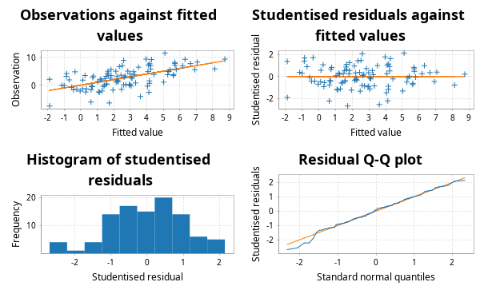

# scala-glm - Quickstart Guide

## PCA

This library contains code for principal components analysis based on a thin SVD of the centred data matrix. This is more numerically stable than a construction from the spectral decomposition of the covariance matrix. It is analogous to the R function `prcomp` rather than the R function `princomp`. First create some synthetic data.

```scala
import breeze.linalg.*
import breeze.numerics.*
import breeze.stats.distributions.*
import breeze.stats.distributions.Rand.VariableSeed.randBasis

val X = DenseMatrix.tabulate(100, 3)((i, j) => 
	Gaussian(j, j+1).sample())
```
Now we can do PCA.
```scala
import scalaglm.Pca
val pca = Pca(X, List("V1", "V2", "V3"))
```
```scala
pca.sdev
// res0: DenseVector[Double] = DenseVector(2.728547759675747, 1.987936154156487, 1.1097023337895622)
pca.loadings
// res1: DenseMatrix[Double] = 0.06193835756279623   -0.08456605327086371    0.9944909363571962    
// 0.010260954092400465  0.9964053503404088      0.084089777227204     
// 0.9980272304318838    -0.0049960431539950445  -0.06258343925725532  
pca.scores
// res2: DenseMatrix[Double] = 0.9047629357598381    -0.5299200464436641    -0.5240807582660614    
// 0.8637073266617016    0.16515348680621914    -1.74011631757785      
// -0.44121606665156804  -0.4869517736206971    0.35433506978365203    
// 1.8144085999968782    -1.3098127412060183    0.16098458084108686    
// 0.8780259813616295    1.027313490196844      -0.9388309770283811    
// -1.0661667685568763   -4.488251124151808     0.41864813974349785    
// 4.441272626343873     1.89957496073913       -1.0856672777067522    
// -8.311963178238658    -0.9060343849234397    -0.7523621022639457    
// 1.6594466915605122    -0.9072676720439277    -1.261911940286863     
// -3.5504190619535283   -2.471506431080369     0.9284488826895289     
// 1.6082304068074746    -1.7255566918045189    -0.2236308210479331    
// -0.5363208290252273   -0.005275270037166707  0.9277491773608549     
// 0.8953017259224131    -2.083411748267078     1.2841349461946265     
// 1.119383812610313     -0.5054368000340514    1.27696155763164       
// -2.576041118180525    1.2069079066065775     -0.4658797357255164    
// -8.230198496072484    -1.0222899343234502    -0.5779856678040343    
// 3.5013637793348074    2.079348935936572      -0.0386316995930519    
// -0.27025023646780116  2.11940527409945       0.5276851399357351     
// 1.8811466939289188    -2.5352841047214905    -0.46601852646434744   
// -3.0577590548982894   4.175960414683598      -0.653704289348318     
// 3.3434019019388574    -2.7966355228912088    1.6450034296661697     
// -3.9229037718254953   -1.472184258878601     -0.48345704275900925   
// -1.716990953657229    4.460781230765585      1.3185743547127724     
// -1.5388420121738158   -3.646120488703724     -0.46119309345297366   
// -0.2906608321345525   -0.9945095007859311    -0.45019022564784983   
// 2.94815303898324      3.2646203799860025     -1.0697451416779722    
// -1.451988061904455    -1.2036486546890444    1.2242264145782484     
// -1.2608847696446934   0.3746231319875526     -1.268104242282745     
// -1.0640017560956658   -2.0084754411812007    0.9085133389701702     
// 0.649637973330807     2.352374345728234      -0.31617940604601247   
// -0.255731856382579    -4.2001007990748525    -0.44440592812369234   
// -1.2351764190358305   -0.8926194048603674    -0.10891603480908163   
// -2.428046396169288    -0.21443036153345293   -0.39509636566042095   
// 1.2990827055885315    2.0406283890935693     1.656897534494497      
// 1.7112294566052515    0.06797696259970899    1.5098875035866741     
// -1.854540535122585    0.4003177095357688     1.0446664677073771     
// 2.490456471760174     -1.0555784155192791    0.7438562375683083     
// -3.8637234993433327   -3.507991739212198     1.6393795638822783     
// -0.2839546761357564   2.059617192354716      1.339022247531786      
// -1.236483376898599    0.6386560955931905     -0.4417390504656854    
// 2.636427698770329     0.8605598082075407     -0.3041066972883545    
// 1.59414273332252      0.612371759536824      -0.4549712295927924    
// -2.7419303610572703   0.6037448376994872     1.924769568427478      
// 2.2972064781380004    -0.49126509553857695   1.8321783933197486     
// 2.7175946347634876    1.3862835847569384     -1.0144925710672226    
// -2.5970279155872897   -0.3192396601662638    0.4585738208850819     
// 2.8565519359499985    1.5875112823119792     1.69459808475378       
// 0.24654369295018244   -0.9868842744523179    -0.6137801844153655    
// -1.734599991665737    1.00497254812563       -0.5919235192096912    
// ...
pca.plots
// res3: Figure = breeze.plot.Figure@10915231
pca.summary
// Standard deviations:
// V1	V2	V3
//  2.729	 1.988	 1.110
// Cumulative proportion of variance explained:
// V1	V2	V3
//  0.590	 0.902	 1.000
// Loadings:
// PC01	PC02	PC03	
//  0.062	-0.085	 0.994	V1
//  0.010	 0.996	 0.084	V2
//  0.998	-0.005	-0.063	V3
```
The final line prints a readable summary of the PCA to the console. `plots` produces some diagnostic plots, including a "scree plot".


Note that there is also a utility function `pairs` for producing a "scatterplot matrix":
```scala
import scalaglm.Utils.pairs
pairs(X, List("V1", "V2", "V3"))
// res6: Figure = breeze.plot.Figure@387de232
```


## Linear regression

This code computes regression coefficients and associated diagnostics via the QR decomposition of the covariate matrix. The diagnostics are analogous to those produced by the R function `lm`. We start by creating a synthetic response variable.

```scala
val y = DenseVector.tabulate(100)(i => 
	Gaussian(2.0 + 1.5*X(i,0) + 0.5*X(i,1), 3.0).sample())
```
So we can now do linear regression and generate all of the usual diagnostics.
```scala
import scalaglm.Lm
val lm = Lm(y,X,List("V1", "V2", "V3"))
```
```scala
lm.coefficients
// res8: DenseVector[Double] = DenseVector(1.5792802682038938, 1.8127878679794611, 0.503811112284449, 0.11142242099004708)
lm.se
// res9: DenseVector[Double] = DenseVector(0.41834603513896607, 0.2743905598184643, 0.1549886980043713, 0.11315397850464481)
lm.fitted
// res10: DenseVector[Double] = DenseVector(1.6554717052080132, -0.3472391210623895, 2.977366341104072, 2.8512334191770483, 1.4291072642931333, 1.5596643908654513, 2.2776136680978345, -1.0025299422210254, 0.34038534757890626, 2.6308599622701694, 1.9523542641180731, 4.177358628993007, 4.436320888497484, 5.02373301373174, 1.5712237830648244, -0.7037701573490855, 4.049941234729452, 4.242494399462532, 1.287301011199877, 2.149474706425229, 5.411129143833158, 0.2982412555452778, 6.180633484568918, 0.12744937584418148, 1.3562155868346815, 2.4407060618496663, 4.095765333750398, 0.10754072540792814, 3.323943137150212, 2.9827503164154114, 0.2588303732673095, 1.8030492395396476, 1.2403476660128787, 6.649612544473472, 5.786853422888146, 4.232064322253925, 4.165754676680281, 3.5052046541527533, 5.709940436953216, 1.724060373321517, 2.9398633682210775, 2.337818350492675, 5.717781061677693, 6.318575680371227, 1.83562302924167, 2.734431642174817, 6.917284320534324, 1.1809938808387686, 1.461626833609729, 5.626608263241267, -0.24413756134941123, 4.0740580431382805, 2.127276012757594, -0.036874787661630215, 3.0569561038006077, -0.8731738121972168, 2.473761655148068, 5.103386763120108, 1.6656829071866293, 2.59309936011982, 1.088218944027998, 1.539491990437942, -0.54911746383784, -1.8902647178238485, 2.5229433496991684, 2.222028243821093, 0.7273044287122752, -0.8540526959086718, 3.1104325375452513, 3.2530179703925057, 1.1305401210687274, 5.272322223009763, 1.6294668090356534, 2.691798509036161, 5.614670490895967, 3.617682047490712, 2.5993882781062845, 4.290398665567245, -0.4387619447309252, -1.1468988126579722, 3.2021918812804886, 0.7116363712855269, 0.7637668747888391, 4.127537275047586, 5.691929486195276, 2.194034105411175, 1.8405629711707876, 2.2313727602205042, 0.629004371892159, 5.331140765178667, -1.8867280873334824, 7.061023238028042, 8.126797372219892, 3.964543432016112, 4.15876276215086, 1.02954857751401, 8.733127126616218, 0.6471755775492716, 3.0662740729677713, 0.621032937092082)
lm.residuals
// res11: DenseVector[Double] = DenseVector(3.3450200612851724, 5.144792996901886, -2.7237147687010395, 2.175353866512631, -1.6069532042562968, -1.3300568198697151, -0.9685155286533862, 0.829840120328134, -1.6487311907176176, 0.2553606582076289, -3.7303337436871207, 3.4532282853836636, -0.6352570523620775, -3.962700530796691, -1.130457660806722, 2.566556667945865, -4.4209842169262945, 1.5343844957153099, -3.3843225151515597, -1.0592144307610747, 0.09389241656548464, -2.764265141278632, 0.7390517938033359, 1.6825142388521561, -1.8210179869758087, 1.1115673520202884, 3.1375018932564913, -1.4459050650363339, -2.5579635746379332, 1.0327817701195041, 3.188313441506085, 0.6820173882167919, 0.6155552547945877, 1.0588283510407237, -0.16509342418268513, 2.716108205713888, -3.508485465605867, 2.906222547160671, 2.0921308411426374, -8.127372311637524, -2.8461253484968827, 4.312882024391994, 1.4161219303901476, 2.9507265385560544, 3.7567075364217026, -2.5844395794988064, -1.3795766157829776, 0.9510606826454522, 0.7970313867170395, -1.8839519129500175, -1.278692723804792, 0.760481632035753, 2.8816430172804695, -2.079748233448844, -3.348645233713416, 4.033632434125538, -3.955094148094644, 6.427906163526229, 1.8729222561101624, -2.476000541641662, -3.4984635811695677, 1.6412124110620059, -0.20537178728060712, 3.9693486226613466, 4.432907311650274, -0.80634653329551, 1.9891324795522318, 5.028808890654734, -0.6562006739767963, 0.5110634809442924, -3.6938615729309254, -1.5149517059350996, 2.6547494959686615, 0.5719101904154247, -2.196309485092824, -7.695390628773531, 6.272889088868265, 4.867766041420812, -1.2662688552829011, 1.1021528769054638, 1.6097807176143446, -1.2550026878004519, 2.5031451615378235, -6.698590107896009, 2.4632061108825543, 1.0123982266129703, 1.653881100620683, -0.419767242740845, -2.316431010282464, -0.43750286037502395, -5.600439860804184, 1.1814401544285893, -2.276720124334897, 5.365134487736995, -2.6539224475879166, 0.21278302762180346, 0.6069936899889008, -1.0785617833191792, -0.3694499475438153, -6.709669949922711)
lm.studentised
// res12: DenseVector[Double] = DenseVector(1.1074227416129598, 1.7224494430857598, -0.9007337745144801, 0.7220127740291677, -0.533877007714103, -0.4520394370921568, -0.32762426605767037, 0.28923529906524176, -0.5499884980978588, 0.08611495653291731, -1.239678794343544, 1.1452052182865025, -0.2126574080847821, -1.3197342736184103, -0.37625081583647946, 0.8929691959718866, -1.4814883931991132, 0.5105218896524327, -1.1313484214818537, -0.3612069425681617, 0.031960037850714634, -0.926623532886654, 0.253168130538559, 0.5671389278777326, -0.6029457363721966, 0.3765671894843748, 1.046592575085059, -0.48153745713100515, -0.8531677045673766, 0.3439228714845027, 1.0791804131319105, 0.22580686029067384, 0.20434104050875743, 0.35625578168010674, -0.05517991426037153, 0.9037817539810024, -1.168506885127565, 0.998062879316707, 0.700339793482024, -2.6915659273590196, -0.9461021828611944, 1.4293161860111512, 0.47799343843362024, 0.9927352593538413, 1.2560688819040209, -0.8586980770524425, -0.4655469262057627, 0.3151166544587161, 0.2646032859190882, -0.6301403152613686, -0.42893434699632976, 0.2579359140421508, 0.9613430165886196, -0.6974658733111004, -1.1348692529570181, 1.399736262988049, -1.342697321587783, 2.1482409029343583, 0.6334012634790327, -0.8186600215054601, -1.1635902484786875, 0.5441019995879712, -0.07093326758766129, 1.38048931946562, 1.4669424511885378, -0.26817680526097026, 0.6616783003179829, 1.696623946498382, -0.21974588092737724, 0.1697565395684572, -1.2322639195826026, -0.5075400905267684, 0.8813772045075212, 0.19154826090939658, -0.7334078489380953, -2.558074804262729, 2.0834115079931763, 1.630853218401606, -0.4297593302865966, 0.38298040994030713, 0.5409183883848705, -0.42188032981777784, 0.8304212275144066, -2.2204472283962122, 0.8268293716454271, 0.33455482141331416, 0.5523380739095956, -0.14077911747960956, -0.7753017609750988, -0.14566355394344047, -1.912808055396636, 0.39857777959863544, -0.7778234516109511, 1.7927216746639754, -0.88772282511335, 0.0715702366834724, 0.21030617681751976, -0.36479173222368305, -0.12299223876273077, -2.228352919941074)
val pred = lm.predict()
// pred: PredictLm = PredictLm(
//   mod = Lm(
//     y = DenseVector(5.000491766493186, 4.797553875839497, 0.2536515724030326, 5.026587285689679, -0.17784593996316356, 0.22960757099573614, 1.3090981394444483, -0.17268982189289134, -1.3083458431387114, 2.8862206204777983, -1.7779794795690478, 7.6305869143766705, 3.8010638361354063, 1.0610324829350493, 0.4407661222581023, 1.8627865105967794, -0.3710429821968422, 5.776878895177842, -2.097021503951683, 1.0902602756641544, 5.505021560398642, -2.466023885733354, 6.919685278372254, 1.8099636146963376, -0.4648024001411273, 3.5522734138699548, 7.233267227006889, -1.3383643396284057, 0.7659795625122787, 4.015532086534916, 3.4471438147733946, 2.4850666277564395, 1.8559029208074664, 7.708440895514196, 5.6217599987054605, 6.948172527967813, 0.6572692110744143, 6.411427201313424, 7.802071278095854, -6.4033119383160075, 0.09373801972419482, 6.650700374884669, 7.13390299206784, 9.269302218927281, 5.592330565663373, 0.14999206267601073, 5.537707704751346, 2.1320545634842207, 2.2586582203267684, 3.7426563502912495, -1.5228302851542033, 4.8345396751740335, 5.008919030038063, -2.1166230211104744, -0.2916891299128084, 3.1604586219283215, -1.481332492946576, 11.531292926646337, 3.5386051632967916, 0.11709881847815762, -2.41024463714157, 3.180704401499948, -0.7544892511184471, 2.079083904837498, 6.955850661349443, 1.415681710525583, 2.716436908264507, 4.174756194746061, 2.454231863568455, 3.764081451336798, -2.563321451862198, 3.757370517074663, 4.284216305004315, 3.263708699451586, 3.418361005803143, -4.077708581282819, 8.872277366974549, 9.158164706988057, -1.7050308000138263, -0.04474593575250835, 4.811972598894833, -0.543366316514925, 3.2669120363266626, -2.571052832848423, 8.15513559707783, 3.2064323320241455, 3.4944440717914707, 1.8116055174796593, -1.687426638390305, 4.893637904803643, -7.4871679481376665, 8.242463392456632, 5.850077247884995, 9.329677919753108, 1.5048403145629434, 1.2423316051358135, 9.340120816605118, -0.4313862057699076, 2.696824125423956, -6.088637012830629),
//     Xmat = -0.31553648449044747   0.6471905807785279     2.8910728986943655    
// -1.5861953689503303    1.2370881391856454     2.9227293530459937    
// 0.4710387088858163     0.7500591602546905     1.4925602477356024    
// 0.48804919164187227    -0.06295784882139488   3.7599466741684853    
// -0.8613469551581119    2.163675808254339      2.8825651793190783    
// 0.834663148046144      -3.2378614396646537    0.8848081606766118    
// -0.8604363905136284    3.0570166828296172     6.443614024512279     
// -1.0816225844591665    0.15865971067766071    -6.291305023417237    
// -0.970648235850089     0.2168991033373131     3.6923290953317087    
// 1.0172367202815271     -1.2109880050495354    -1.6365241027427473   
// 0.12794014690179714    -0.5116651540075692    3.5803228524039437    
// 0.994669728011502      1.2772466045229995     1.3593504015739568    
// 1.6135042947888054     -0.7487614879007183    2.7762273075213377    
// 1.4868065877562768     0.8252372805800071     2.992432636277965     
// -0.6201280663861155    2.3469529862362757     -0.5951840184991903   
// -0.8933111577708884    0.05832431842622143    -6.220033903380013    
// 0.10741181615821853    3.3145450605506492     5.43913415503228      
// 0.43361379624949636    3.363378508816771      1.639318485861662     
// -0.027732791107190843  -1.336063827213195     3.871915627916051     
// -1.0878357529601979    5.284595780219742      -1.0790304446451389   
// 2.1843305545887834     -1.4039562790230415    5.200476851952116     
// -0.49447074876195707   -0.33780694919874854   -1.924904714089287    
// ...
pred.fitted
// res13: DenseVector[Double] = DenseVector(1.6554717052080092, -0.3472391210623922, 2.977366341104071, 2.8512334191770483, 1.4291072642931333, 1.5596643908654508, 2.277613668097835, -1.0025299422210256, 0.3403853475789065, 2.630859962270169, 1.952354264118073, 4.177358628993006, 4.436320888497484, 5.023733013731739, 1.5712237830648241, -0.7037701573490858, 4.049941234729452, 4.242494399462532, 1.2873010111998766, 2.14947470642523, 5.411129143833157, 0.29824125554527736, 6.180633484568918, 0.12744937584418067, 1.356215586834681, 2.440706061849667, 4.095765333750398, 0.10754072540792814, 3.323943137150212, 2.9827503164154114, 0.258830373267309, 1.8030492395396471, 1.2403476660128785, 6.649612544473472, 5.786853422888146, 4.232064322253924, 4.165754676680281, 3.505204654152753, 5.709940436953216, 1.724060373321517, 2.939863368221078, 2.3378183504926753, 5.717781061677692, 6.318575680371227, 1.83562302924167, 2.734431642174817, 6.917284320534323, 1.180993880838768, 1.461626833609729, 5.626608263241267, -0.24413756134941078, 4.0740580431382805, 2.127276012757594, -0.03687478766162977, 3.0569561038006077, -0.8731738121972177, 2.473761655148067, 5.103386763120108, 1.6656829071866297, 2.59309936011982, 1.0882189440279977, 1.5394919904379418, -0.5491174638378391, -1.8902647178238492, 2.522943349699168, 2.2220282438210934, 0.7273044287122752, -0.854052695908671, 3.1104325375452504, 3.253017970392505, 1.1305401210687274, 5.272322223009763, 1.6294668090356537, 2.691798509036161, 5.614670490895967, 3.617682047490712, 2.599388278106284, 4.290398665567244, -0.4387619447309258, -1.1468988126579718, 3.2021918812804886, 0.7116363712855271, 0.7637668747888386, 4.127537275047585, 5.691929486195277, 2.194034105411175, 1.8405629711707874, 2.231372760220504, 0.629004371892159, 5.331140765178667, -1.886728087333482, 7.061023238028042, 8.126797372219892, 3.964543432016112, 4.15876276215086, 1.0295485775140099, 8.733127126616218, 0.6471755775492709, 3.066274072967771, 0.6210329370920813)
pred.se
// res14: DenseVector[Double] = DenseVector(0.36098285910275374, 0.5765395500952828, 0.3318482126435473, 0.420024088277935, 0.44055293033595466, 0.7723954709118539, 0.717644484925566, 1.011119062339259, 0.5171655470731374, 0.6787649114395843, 0.44636080333754513, 0.40185392734870723, 0.5748423624971433, 0.4879456130209306, 0.4762211427802778, 0.9965306279203408, 0.5906319278958592, 0.46993677764212094, 0.5527111895940164, 0.8092270016781467, 0.7894878256100364, 0.5956202105611448, 0.85568281275937, 0.6729538557888599, 0.36383928482938205, 0.7352691329991025, 0.5167612542651514, 0.4877351151518091, 0.5146101023747385, 0.48612330452157887, 0.7249927475334715, 0.362549160056118, 0.42366975609806456, 0.6485463511677751, 0.5499681405164563, 0.47154211119734313, 0.48864077565240616, 0.8803707533709783, 0.5744469186897239, 0.3690467885059458, 0.45204666754281586, 0.3860434305464959, 0.6904859716669771, 0.6475458339231344, 0.5557382975662377, 0.4422598110262731, 0.6874448241800958, 0.38070469410956503, 0.4252081406373542, 0.5616854588311953, 0.6058800910683789, 0.7492110194996285, 0.5185417414352489, 0.6020698937532067, 0.7398914704838077, 0.9745530748061415, 0.7597653500193584, 0.5485497901630456, 0.7145443286095792, 0.3266048073051459, 0.46291291046133254, 0.39435746484129713, 0.9334581167775906, 0.9932443925161901, 0.3497285708301052, 0.4618673248875804, 0.4656235043873754, 0.6845798893272754, 0.5802853004338321, 0.43644538560912366, 0.5179396711218133, 0.5868792221703605, 0.4261140313954504, 0.5826264344646999, 0.5347824176340206, 0.45197976813422114, 0.434325788174219, 0.5873549099818024, 0.7565519430546226, 0.9859456639928137, 0.6303493235709393, 0.6361307571799265, 0.40981517004500223, 0.39123814365751297, 0.6156071565697164, 0.31094144238202875, 0.5366586165720003, 0.6026645009318472, 0.571988772475587, 0.48258635493890545, 0.8256017791905883, 0.6840150897516762, 0.8285157865971651, 0.5454891936218659, 0.5624802336429504, 0.6441111639366153, 0.9610565740006528, 0.715692398354323, 0.48051963074552256, 0.43314022194780544)
val predNew = lm.predict(DenseMatrix((1.1, 1.6, 1.0), (1.4, 2.2, 3.0)))
// predNew: PredictLm = PredictLm(
//   mod = Lm(
//     y = DenseVector(5.000491766493186, 4.797553875839497, 0.2536515724030326, 5.026587285689679, -0.17784593996316356, 0.22960757099573614, 1.3090981394444483, -0.17268982189289134, -1.3083458431387114, 2.8862206204777983, -1.7779794795690478, 7.6305869143766705, 3.8010638361354063, 1.0610324829350493, 0.4407661222581023, 1.8627865105967794, -0.3710429821968422, 5.776878895177842, -2.097021503951683, 1.0902602756641544, 5.505021560398642, -2.466023885733354, 6.919685278372254, 1.8099636146963376, -0.4648024001411273, 3.5522734138699548, 7.233267227006889, -1.3383643396284057, 0.7659795625122787, 4.015532086534916, 3.4471438147733946, 2.4850666277564395, 1.8559029208074664, 7.708440895514196, 5.6217599987054605, 6.948172527967813, 0.6572692110744143, 6.411427201313424, 7.802071278095854, -6.4033119383160075, 0.09373801972419482, 6.650700374884669, 7.13390299206784, 9.269302218927281, 5.592330565663373, 0.14999206267601073, 5.537707704751346, 2.1320545634842207, 2.2586582203267684, 3.7426563502912495, -1.5228302851542033, 4.8345396751740335, 5.008919030038063, -2.1166230211104744, -0.2916891299128084, 3.1604586219283215, -1.481332492946576, 11.531292926646337, 3.5386051632967916, 0.11709881847815762, -2.41024463714157, 3.180704401499948, -0.7544892511184471, 2.079083904837498, 6.955850661349443, 1.415681710525583, 2.716436908264507, 4.174756194746061, 2.454231863568455, 3.764081451336798, -2.563321451862198, 3.757370517074663, 4.284216305004315, 3.263708699451586, 3.418361005803143, -4.077708581282819, 8.872277366974549, 9.158164706988057, -1.7050308000138263, -0.04474593575250835, 4.811972598894833, -0.543366316514925, 3.2669120363266626, -2.571052832848423, 8.15513559707783, 3.2064323320241455, 3.4944440717914707, 1.8116055174796593, -1.687426638390305, 4.893637904803643, -7.4871679481376665, 8.242463392456632, 5.850077247884995, 9.329677919753108, 1.5048403145629434, 1.2423316051358135, 9.340120816605118, -0.4313862057699076, 2.696824125423956, -6.088637012830629),
//     Xmat = -0.31553648449044747   0.6471905807785279     2.8910728986943655    
// -1.5861953689503303    1.2370881391856454     2.9227293530459937    
// 0.4710387088858163     0.7500591602546905     1.4925602477356024    
// 0.48804919164187227    -0.06295784882139488   3.7599466741684853    
// -0.8613469551581119    2.163675808254339      2.8825651793190783    
// 0.834663148046144      -3.2378614396646537    0.8848081606766118    
// -0.8604363905136284    3.0570166828296172     6.443614024512279     
// -1.0816225844591665    0.15865971067766071    -6.291305023417237    
// -0.970648235850089     0.2168991033373131     3.6923290953317087    
// 1.0172367202815271     -1.2109880050495354    -1.6365241027427473   
// 0.12794014690179714    -0.5116651540075692    3.5803228524039437    
// 0.994669728011502      1.2772466045229995     1.3593504015739568    
// 1.6135042947888054     -0.7487614879007183    2.7762273075213377    
// 1.4868065877562768     0.8252372805800071     2.992432636277965     
// -0.6201280663861155    2.3469529862362757     -0.5951840184991903   
// -0.8933111577708884    0.05832431842622143    -6.220033903380013    
// 0.10741181615821853    3.3145450605506492     5.43913415503228      
// 0.43361379624949636    3.363378508816771      1.639318485861662     
// -0.027732791107190843  -1.336063827213195     3.871915627916051     
// -1.0878357529601979    5.284595780219742      -1.0790304446451389   
// 2.1843305545887834     -1.4039562790230415    5.200476851952116     
// -0.49447074876195707   -0.33780694919874854   -1.924904714089287    
// ...
predNew.fitted
// res15: DenseVector[Double] = DenseVector(4.490867123626467, 5.5598349933710685)
predNew.se
// res16: DenseVector[Double] = DenseVector(0.4399149549884285, 0.5060912642856749)
lm.plots
// res17: Figure = breeze.plot.Figure@42ee03ba
lm.summary
// Estimate	 S.E.	 t-stat	p-value		Variable
// ---------------------------------------------------------
//   1.5793	 0.418	 3.775	0.0003 *	(Intercept)
//   1.8128	 0.274	 6.607	0.0000 *	V1
//   0.5038	 0.155	 3.251	0.0016 *	V2
//   0.1114	 0.113	 0.985	0.3272  	V3
// 
// Residual standard error:   3.0420 on 96 degrees of freedom
// Multiple R-squared: 0.3592, Adjusted R-squared: 0.3391
// F-statistic: 17.9343 on 3 and 96 DF, p-value: 0.00000
//
```
The plots include a plot of studentised residuals against fitted values and a normal Q-Q plot for the studentised residuals.




## Generalised linear models

The current implementation supports only simple one-parameter exponential family observation models. This includes the most commonly used cases of **logistic regression** (`LogisticGlm`) and **Poisson regression** (`PoissonGlm`).

### Logistic regression

Again, we start by creating an appropriate response variable.
```scala
val ylb = (0 until 100) map (i => Bernoulli(sigmoid(1.0 + X(i,0))).sample())
val yl = DenseVector(ylb.toArray map {b => if (b) 1.0 else 0.0})
```

Then we can do logistic regression in a typical way.
```scala
import scalaglm.{Glm, LogisticGlm}
val glm = Glm(yl, X, List("V1","V2","V3"), LogisticGlm)
```
```scala
glm.coefficients
// res20: DenseVector[Double] = DenseVector(0.5056329181869673, 0.9710909223373286, 0.08906305299560299, 0.15674828356370712)
glm.fitted
// res21: DenseVector[Double] = DenseVector(0.6704077413824826, 0.38546977005484667, 0.7796818215449939, 0.8268308141937428, 0.5777948219023717, 0.7625090862471243, 0.7215902740300896, 0.17994185128154663, 0.5401953658775045, 0.7556701159031066, 0.7586904735494423, 0.8579514955537578, 0.9198988990628084, 0.9235800811011595, 0.5047910801364148, 0.20888846161343522, 0.8529236257767637, 0.8150591219179962, 0.7244460905587327, 0.43801341479248856, 0.9650054589488241, 0.4240047477193439, 0.8748113304289427, 0.555010776125046, 0.6267968204523753, 0.6572174225607317, 0.8673647068552129, 0.3840184279952476, 0.8393473732678258, 0.7050919299620699, 0.6254985970237854, 0.6553075503936121, 0.527783750198815, 0.9484365588958288, 0.945240807887592, 0.8357134772251201, 0.9066505225544612, 0.8506636241199589, 0.9056424692758666, 0.5818711953158778, 0.7869627493891542, 0.7177283272503255, 0.907439385231895, 0.963847307071916, 0.6554396100366324, 0.7101942163078864, 0.9638907405505939, 0.6172236118432377, 0.5198812075270888, 0.908592793597791, 0.29037752244269055, 0.7456935803811918, 0.76744805044157, 0.5173307121445888, 0.5721467681844457, 0.5648488290155359, 0.6343735428822619, 0.9361035844132839, 0.41023952674668585, 0.7607535946855035, 0.6590228248709451, 0.6772893655397066, 0.1765434819019684, 0.3731189340330755, 0.7416180012680216, 0.5896903278468001, 0.5650636240839731, 0.2142738809814442, 0.8000179452521201, 0.8313217977456128, 0.5969931990563396, 0.9403435166146437, 0.5398039638361359, 0.7704913977341118, 0.9116539471799688, 0.8676753459531258, 0.7879198227699619, 0.8404001279083188, 0.564515850592997, 0.1245416190378778, 0.8467900293921589, 0.6425375729791055, 0.5031597296394748, 0.878592806636603, 0.893351055571683, 0.7013179681646807, 0.7671247312681356, 0.82731141533458, 0.5014587637578676, 0.9144411252703938, 0.12794460530719787, 0.9633810333048981, 0.975851411577049, 0.7548019571098654, 0.8364533897502335, 0.6085086883660169, 0.9862754624572856, 0.5363280363597109, 0.800842720430418, 0.5249009092838681)
glm.predict(response=true).fitted
// res22: DenseVector[Double] = DenseVector(0.6704077413824826, 0.38546977005484667, 0.7796818215449939, 0.8268308141937428, 0.5777948219023717, 0.7625090862471243, 0.7215902740300896, 0.17994185128154663, 0.5401953658775045, 0.7556701159031066, 0.7586904735494423, 0.8579514955537578, 0.9198988990628084, 0.9235800811011595, 0.5047910801364148, 0.20888846161343522, 0.8529236257767637, 0.8150591219179962, 0.7244460905587327, 0.43801341479248856, 0.9650054589488241, 0.4240047477193439, 0.8748113304289427, 0.555010776125046, 0.6267968204523753, 0.6572174225607317, 0.8673647068552129, 0.3840184279952476, 0.8393473732678258, 0.7050919299620699, 0.6254985970237854, 0.6553075503936121, 0.527783750198815, 0.9484365588958288, 0.945240807887592, 0.8357134772251201, 0.9066505225544612, 0.8506636241199589, 0.9056424692758666, 0.5818711953158778, 0.7869627493891542, 0.7177283272503255, 0.907439385231895, 0.963847307071916, 0.6554396100366324, 0.7101942163078864, 0.9638907405505939, 0.6172236118432377, 0.5198812075270888, 0.908592793597791, 0.29037752244269055, 0.7456935803811918, 0.76744805044157, 0.5173307121445888, 0.5721467681844457, 0.5648488290155359, 0.6343735428822619, 0.9361035844132839, 0.41023952674668585, 0.7607535946855035, 0.6590228248709451, 0.6772893655397066, 0.1765434819019684, 0.3731189340330755, 0.7416180012680216, 0.5896903278468001, 0.5650636240839731, 0.2142738809814442, 0.8000179452521201, 0.8313217977456128, 0.5969931990563396, 0.9403435166146437, 0.5398039638361359, 0.7704913977341118, 0.9116539471799688, 0.8676753459531258, 0.7879198227699619, 0.8404001279083188, 0.564515850592997, 0.1245416190378778, 0.8467900293921589, 0.6425375729791055, 0.5031597296394748, 0.878592806636603, 0.893351055571683, 0.7013179681646807, 0.7671247312681356, 0.82731141533458, 0.5014587637578676, 0.9144411252703938, 0.12794460530719787, 0.9633810333048981, 0.975851411577049, 0.7548019571098654, 0.8364533897502335, 0.6085086883660169, 0.9862754624572856, 0.5363280363597109, 0.800842720430418, 0.5249009092838681)
glm.summary
// Estimate	 S.E.	 z-stat	p-value		Variable
// ---------------------------------------------------------
//   0.5056	 0.322	 1.568	0.1168  	(Intercept)
//   0.9711	 0.272	 3.564	0.0004 *	V1
//   0.0891	 0.122	 0.728	0.4666  	V2
//   0.1567	 0.091	 1.731	0.0834  	V3
glm.plots
// res24: Figure = breeze.plot.Figure@499ddf
```


### Poisson regression

We first create an appropriate response, and then do Poisson regression.
```scala
val yp = DenseVector.tabulate(100)(i => Poisson(math.exp(-0.5 + X(i,0))).sample().toDouble)

import scalaglm.PoissonGlm
val pglm = Glm(yp, X, List("V1","V2","V3"), PoissonGlm)
```
```scala
pglm.coefficients
// res26: DenseVector[Double] = DenseVector(-0.6429259352456109, 1.0278794682705714, 0.06402965023825971, 0.012715808160021129)
pglm.summary
// Estimate	 S.E.	 z-stat	p-value		Variable
// ---------------------------------------------------------
//  -0.6429	 0.170	-3.778	0.0002 *	(Intercept)
//   1.0279	 0.097	10.565	0.0000 *	V1
//   0.0640	 0.048	 1.327	0.1844  	V2
//   0.0127	 0.041	 0.313	0.7543  	V3
pglm.plots
// res28: Figure = breeze.plot.Figure@6383c115
```


## Non-linear response

The above covers the main functionality of the library based on a linear reponse to variation in covariate values. For flexible modelling of a nonlinear response, see the documentation on [flexible regression modelling](FlexibleRegression.md).

