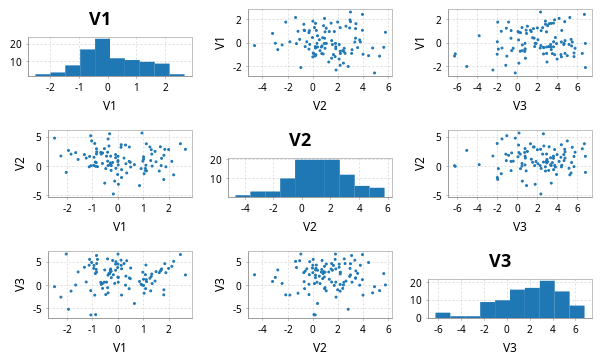

# scala-glm - Quickstart Guide

## PCA

This library contains code for principal components analysis based on a thin SVD of the centred data matrix. This is more numerically stable than a construction from the spectral decomposition of the covariance matrix. It is analogous to the R function `prcomp` rather than the R function `princomp`. First create some synthetic data.

```scala
import breeze.linalg._
import breeze.numerics._
import breeze.stats.distributions._
val X = DenseMatrix.tabulate(100, 3)((i, j) => 
	Gaussian(j, j+1).sample())
```
Now we can do PCA.
```scala
import scalaglm.Pca
val pca = Pca(X, List("V1", "V2", "V3"))
```
```scala
pca.sdev
// res0: DenseVector[Double] = DenseVector(3.1155994496245385, 1.7957519479992146, 1.1073839742348894)
pca.loadings
// res1: DenseMatrix[Double] = 0.029243377698498142  -0.013137153865637624  -0.9994859879203376    
// 0.061686218039028295  -0.9979840363735937    0.01492225343271742    
// -0.9976670964629553   -0.06209088767105364   -0.028374042774976724  
pca.scores
// res2: DenseMatrix[Double] = 3.5337053045379747    1.191561032996241      -1.2386597274244546   
// -1.0626958230263739   -0.5691836063490764    0.46528362732282524   
// -2.5326620159398385   -1.7638420310772343    0.5118007298689806    
// -3.4422931524902824   1.0026085032470078     -1.650182561038768    
// -0.1343284848015788   -5.538310696242503     -1.4629896116289427   
// -2.344768504286687    -0.4147327426921028    0.029403774112723848  
// 0.23185804763858542   0.36013690731248044    -1.6350459145212413   
// 0.030767975954317774  1.603013936242903      0.20581731922286745   
// -3.8976903942092282   -1.1440506244202469    -0.3405708587185007   
// -0.3887452846404398   -0.3162762915011023    0.572179199155708     
// -2.5105511106471607   2.1599170682879674     -1.3314289041656808   
// -2.9622405267832757   1.9991249194211467     -2.5001830227477226   
// -6.942564081618881    -1.6078133410757232    1.9975651951724955    
// -1.0797149679346458   0.050563639199149586   -1.3990936394307212   
// 2.745812702879405     0.7687511226358604     0.36078102575337856   
// 3.700592570332022     -2.3401519519154625    -1.773872876560621    
// -4.822883291342959    4.197132683346091      -0.9997517776278971   
// 4.150569176796176     0.8261495407821562     -1.8398603827217055   
// 8.626353275122158     -2.0798771358555164    -0.4799852972523068   
// -3.51314567641125     -3.4893796882485324    -0.0373647321862446   
// -0.9917442111083972   0.03756369591449237    -0.9864194415766765   
// 1.2828951931598094    2.6386444677812997     1.7168475804173389    
// 1.5722081320023689    -0.45805553426864243   -0.5424565636027144   
// -5.297246713089958    0.8215332841747567     -1.144488418955175    
// 2.054673766134666     0.4689413903301193     0.1488191874958998    
// -2.5126897025628163   0.4987496322442374     -0.5636672312008404   
// -2.7742465728512875   3.278444555356842      -2.055806395630358    
// -3.5015027452286613   0.26767891616184003    -0.28370736077647923  
// -0.5351927367781918   1.4122113656797373     0.20542292793151815   
// 5.773419063034828     0.482022569187615      -1.6236169453532778   
// 4.3317105016585415    -0.36204198152433525   0.3104933023254468    
// -2.6990233212971315   -3.99023814258501      -0.8962639403202486   
// 2.6082878571951778    -0.538260205694925     0.6744156920272689    
// -1.8991935011576746   -5.202489160575659     1.1511897204690342    
// -3.9935166399150943   -0.14665312540953607   -1.0003843879069012   
// 3.15440692198978      0.7232639508662062     -0.6223208735130097   
// -2.773861457214101    0.8046738838237759     -1.7084419730482678   
// -4.301719226696324    -2.1691825788454717    0.9656051892868166    
// -0.9812668628508945   2.6722539393264526     0.8890332583676653    
// 2.3770904977310177    2.5543146673381965     -0.5937642277050329   
// -0.5732198195188131   0.9860237507451333     0.4073775684717533    
// 2.675225121612007     1.5123929306751505     0.018610231067473924  
// 6.943845493673236     0.7346910405355545     -0.2820494055940844   
// 3.759389718685846     0.7501696432260447     -0.00914605878940978  
// -0.31644610461052114  1.375825284034568      0.734174084366284     
// 3.267770404074435     -0.2706343436156942    2.0663948222660933    
// 2.0364307235693673    -0.9690682622793739    2.393328523613744     
// -1.7557916424124662   -3.629424537352098     -0.8432412205693917   
// 1.2396942285996986    0.9921049791066352     -1.2443314104673857   
// ...
pca.plots
// res3: Figure = breeze.plot.Figure@e5ffc36
pca.summary
// Standard deviations:
// V1	V2	V3
//  3.116	 1.796	 1.107
// Cumulative proportion of variance explained:
// V1	V2	V3
//  0.686	 0.913	 1.000
// Loadings:
// PC01	PC02	PC03	
//  0.029	-0.013	-0.999	V1
//  0.062	-0.998	 0.015	V2
// -0.998	-0.062	-0.028	V3
```
The final line prints a readable summary of the PCA to the console. `plots` produces some diagnostic plots, including a "scree plot".


Note that there is also a utility function `pairs` for producing a "scatterplot matrix":
```scala
import scalaglm.Utils.pairs
pairs(X, List("V1", "V2", "V3"))
// res6: Figure = breeze.plot.Figure@19f4931d
```




## Linear regression

This code computes regression coefficients and associated diagnostics via the QR decomposition of the covariate matrix. The diagnostics are analogous to those produced by the R function `lm`. We start by creating a synthetic response variable.

```scala
val y = DenseVector.tabulate(100)(i => 
	Gaussian(2.0 + 1.5*X(i,0) + 0.5*X(i,1), 3.0).sample())
```
So we can now do linear regression and generate all of the usual diagnostics.
```scala
import scalaglm.Lm
val lm = Lm(y,X,List("V1", "V2", "V3"))
```
```scala
lm.coefficients
// res8: DenseVector[Double] = DenseVector(1.8714193965977681, 1.1820044445920836, 0.5970397621889354, -0.024809930775165717)
lm.se
// res9: DenseVector[Double] = DenseVector(0.386013729683184, 0.25361536285146885, 0.1562929840262567, 0.09078006249160012)
lm.fitted
// res10: DenseVector[Double] = DenseVector(3.5306820053720047, 2.165842884473397, 2.6985332977240057, 3.45740435510215, 7.5449140733790525, 2.459144574263725, 4.1847205225328175, 1.2503566470625131, 3.1881215286184683, 1.9511537856055052, 2.467723813344488, 3.891877204819634, 0.4383898724089188, 3.9709168631214578, 1.8385694085759259, 6.327604607740098, 0.614403514281788, 4.517305402472069, 5.126323395653715, 4.300039943390612, 3.5037377448149316, -1.0314080029963222, 3.532265963498091, 2.7969159875407494, 2.203323050880052, 2.5808870773213055, 2.609079315324327, 2.2986757005023613, 1.3127593348223319, 4.629803808386711, 2.739559638089572, 5.690194911232146, 2.2548814941058124, 4.107182806621984, 3.3438301035433344, 3.0575764944422086, 3.710644727865406, 2.2438694386724585, -0.29957683698744064, 1.832759247916762, 1.3323553554725693, 1.7792422861482753, 3.016226478762914, 2.3808277498968007, 0.7363982538659429, 0.523985597756385, 0.44842207601247663, 5.498719882770428, 3.4383988164620716, 3.5380965057735687, 2.8676267907969244, 1.857175033916147, 0.2069289862346384, 1.487545419798546, -2.0958700301932804, 3.621950115219584, 5.002543162434475, 3.65920333475465, 0.1135373656173746, 3.2013566174691293, 2.640255511915064, 2.720169144545099, 2.170535449855145, 1.6072105526538971, 0.10201448718007344, 4.432127519644185, 3.6779029204340588, 2.42332006970647, 5.660508914920589, -0.4664261800817251, 2.9928552949317275, 2.626972414111293, 0.9225607585049214, 0.15697829736967117, 1.8959258259284595, 2.837544313490108, 3.646135833934321, 0.7710280585776883, 3.3821717337411346, 5.063071059162111, 2.64835776771103, 1.4085781589703938, 2.597781880050752, 1.0982161843091685, 2.824124572988312, 0.3033711196333908, 0.07472104888201159, 5.216166171445654, -0.7396903291740167, 3.497842965174807, 1.2478319829883002, 1.7768929045974449, 0.9085997048229062, 0.5561777346151395, 1.6636006586981997, 3.0995068810842383, 3.400791327729601, -0.40731973153014456, 0.5331614884798842, 3.9855586951148694)
lm.residuals
// res11: DenseVector[Double] = DenseVector(-3.1613142831891494, -3.1122759611374913, -1.4555581710077474, -4.143793420345419, 0.8456580362727628, -0.8315877113756807, -1.5901622922121303, -0.865810781617393, -0.36083358965208934, -2.290411771209349, -0.9377094675450386, 2.1624428305387555, -2.026605167959902, 4.076823925069016, -1.5411217331602882, -0.3840086980124964, -1.4238400950107302, 2.6038599592630414, -1.610884144570489, 0.6337616427781523, 7.790520194517824, 3.2431433912745558, -3.9848132824938993, -0.7780544799870381, -3.2544184901748294, -0.5048256737327419, 4.326468799378946, -1.5282960247333297, 1.304635623101436, 0.7794188239253206, 0.04967795394852459, -6.222174191599648, 2.18720148072141, -0.913390014442486, -2.5131344666979096, -0.7732375781137972, -0.35707796899591093, 1.3184519959552885, 0.15242937085352773, 2.6280974875943475, -2.172904025237067, 1.3925148159710772, -2.664350607294823, 2.9651271245228923, -0.011371600020809947, -2.5977409340870694, -1.3423134030284203, 2.207633663102416, -5.229032788088767, -3.62686887807523, 1.7831876949314722, 3.0687534058355563, -1.992235495605113, -1.4990908675015566, -3.0340094202018264, -2.185799610756422, 2.358176452139161, -0.121346943591508, 0.9673463850107538, 0.3874208454077577, 0.2537215803420354, -2.8588873672073207, -3.3600996557811467, 0.3071924447721712, 0.24977554535122437, 3.0200941123935614, 2.8310443649542303, 3.8737101973973647, 4.043685492582789, 4.683218894479765, 6.483560104353677, -1.9589371295505758, -2.246287235319371, -0.6120563031332765, -3.107446896281281, -0.9979331897130619, -0.3347887461721273, -1.2509374504485566, 2.579185236864998, -3.9057880744244775, -1.8481586841882223, 1.5193098915742558, -0.4299053573188245, 1.9629316892141484, -0.5240665722878513, 2.0358851219388727, 4.555289216876924, 0.674385654121064, 0.17955852482419377, 5.384562796603691, -1.8873266997456226, -3.622596412475686, 0.6297173574245523, -2.3975627932286425, 7.127550546403886, 0.9827216566298791, 4.829862310379395, 1.7460083917878948, -0.14052459261268752, -4.660015841030294)
lm.studentised
// res12: DenseVector[Double] = DenseVector(-1.1541786544434336, -1.1211321343563287, -0.5282610284986801, -1.5190847348857466, 0.3231455766089162, -0.2999110834894429, -0.5782759911663027, -0.3125925050959364, -0.13111055036946365, -0.824735837020525, -0.3433726302267018, 0.8078221933579166, -0.7646128368614005, 1.4786505419139189, -0.5570797916398018, -0.14223237117727267, -0.5361530578054979, 0.9596284368195294, -0.6083629578838465, 0.23394553180936176, 2.8136136992904457, 1.195137312606475, -1.4366698525365391, -0.28585945635261245, -1.1731043030917068, -0.18240803406886638, 1.6191967405148897, -0.5532568783592302, 0.470664918011316, 0.28865740909288445, 0.018049467873758482, -2.313003551745935, 0.7910122925604148, -0.34621833136767327, -0.9150694313397483, -0.2801395551190482, -0.13063953133097922, 0.48429365895181287, 0.055645371256721005, 0.9590755380955864, -0.7830533323826948, 0.5043532788999864, -0.9843136793129256, 1.0749586404994063, -0.0041099496098747105, -0.956645335973527, -0.4964103749187847, 0.8146322929589993, -1.8966420364524845, -1.3140097976188059, 0.6440226477349051, 1.1045820677123908, -0.7258719495176933, -0.5411572449711691, -1.1354649636291865, -0.7876668517766742, 0.8667539964622922, -0.04416864305080917, 0.3535469599713439, 0.14007085208388048, 0.09297000433869924, -1.0445573187118466, -1.2202400954844879, 0.11090754671566715, 0.09116222202243983, 1.0984214707562132, 1.031642288432483, 1.396589607943865, 1.4844548417506134, 1.7274867637100653, 2.354559462240266, -0.7110735655972213, -0.8122093457043235, -0.2272982325627721, -1.1230743208757166, -0.3625090792629753, -0.12146753581359203, -0.4555601500935699, 0.9343183849589145, -1.4307714366854865, -0.6672132604122175, 0.5547542925747044, -0.15495648517819657, 0.7139822296565367, -0.18973715227745924, 0.739204311108397, 1.6547145094680413, 0.2463993425902167, 0.06624962377338157, 1.9722416257904287, -0.6831089413230577, -1.305708220511311, 0.22822154116942123, -0.8696888804263397, 2.574007712407438, 0.35736673708721417, 1.741621308693208, 0.6703340528312692, -0.051039115671045285, -1.698295587965293)
val pred = lm.predict()
// pred: PredictLm = PredictLm(
//   Lm(
//     DenseVector(0.3693677221828553, -0.9464330766640945, 1.2429751267162583, -0.6863890652432696, 8.390572109651815, 1.6275568628880441, 2.594558230320687, 0.38454586544512015, 2.827287938966379, -0.3392579856038438, 1.5300143457994495, 6.05432003535839, -1.5882152955509832, 8.047740788190474, 0.29744767541563766, 5.943595909727602, -0.8094365807289421, 7.121165361735111, 3.5154392510832264, 4.933801586168764, 11.294257939332756, 2.2117353882782336, -0.45254731899580847, 2.0188615075537113, -1.0510954392947776, 2.0760614035885636, 6.935548114703273, 0.7703796757690315, 2.617394957923768, 5.409222632312032, 2.7892375920380967, -0.5319792803675023, 4.442082974827223, 3.193792792179498, 0.8306956368454248, 2.2843389163284114, 3.353566758869495, 3.562321434627747, -0.1471474661339129, 4.4608567355111095, -0.8405486697644977, 3.1717571021193525, 0.35187587146809074, 5.345954874419693, 0.725026653845133, -2.0737553363306844, -0.8938913270159436, 7.706353545872844, -1.7906339716266952, -0.08877237230166113, 4.650814485728397, 4.925928439751703, -1.7853065093704745, -0.01154544770301058, -5.129879450395107, 1.436150504463162, 7.360719614573636, 3.537856391163142, 1.0808837506281284, 3.588777462876887, 2.8939770922570993, -0.1387182226622219, -1.189564205926002, 1.9144029974260683, 0.3517900325312978, 7.452221632037746, 6.508947285388289, 6.2970302671038345, 9.704194407503378, 4.21679271439804, 9.476415399285404, 0.6680352845607174, -1.3237264768144494, -0.45507800576360535, -1.2115210703528216, 1.839611123777046, 3.3113470877621936, -0.47990939187086834, 5.961356970606133, 1.1572829847376331, 0.8001990835228079, 2.9278880505446496, 2.1678765227319277, 3.061147873523317, 2.300058000700461, 2.3392562415722633, 4.630010265758935, 5.890551825566718, -0.5601318043498229, 8.882405761778498, -0.6394947167573224, -1.8457035078782416, 1.5383170622474585, -1.8413850586135032, 8.791151205102086, 4.082228537714117, 8.230653638108997, 1.3386886602577501, 0.3926368958671967, -0.674457145915424),
//     1.3943969669324847     -0.03411076309821515  -1.2674230535955955   
// -0.4199536613293859    1.4649763515235552    3.3792335495058476    
// -0.4937392185637794    2.5672438732285707    4.9186279768861905    
// 1.6041888135928632     -0.28200296465278973  5.71570986874152      
// 1.5997572057571667     6.452579150035652     2.8162824220536944    
// -0.023819036044679647  1.2252463305958583    4.661092961247013     
// 1.7049447869713443     0.5860437968282994    2.0895922527823223    
// -0.15718064051642053   -0.6392622955182028   2.1608091305977046    
// 0.31013390522205414    1.8517792004682248    6.266173704928283     
// -0.5104081797118611    1.2557474712952876    2.688118973509652     
// 1.29764254370807       -1.3747462721223687   4.7052388451959235    
// 2.4546993355565734     -1.259581731346783    5.199020520103243     
// -2.1097501876126388    2.1616705049291225    9.266397062081785     
// 1.4348258807827718     0.8176079371275765    3.4106322540985454    
// -0.22170777646534415   0.363111923314283     -0.5004984870705602   
// 1.980612014283542      3.492790474910779     -1.1994476324771117   
// 0.8717522849028971     -3.5455445915384214   6.876273031076402     
// 2.0181282480331055     0.35964480362115314   -1.8431006249178061   
// 0.828016119257385      3.5561996306285266    -6.1665905285852975   
// 0.04913996550305597    4.22062579418219      6.019546472712564     
// 1.0251071467748565     0.8421662852515903    3.311964667238231     
// ...
pred.fitted
// res13: DenseVector[Double] = DenseVector(3.5306820053720003, 2.1658428844733955, 2.698533297724006, 3.457404355102149, 7.5449140733790525, 2.4591445742637243, 4.1847205225328175, 1.2503566470625125, 3.1881215286184674, 1.9511537856055048, 2.467723813344488, 3.891877204819634, 0.4383898724089179, 3.9709168631214573, 1.8385694085759254, 6.327604607740097, 0.6144035142817873, 4.517305402472069, 5.126323395653715, 4.300039943390612, 3.5037377448149316, -1.031408002996323, 3.5322659634980904, 2.796915987540749, 2.2033230508800514, 2.580887077321305, 2.609079315324327, 2.2986757005023613, 1.3127593348223314, 4.629803808386711, 2.739559638089572, 5.690194911232146, 2.2548814941058124, 4.107182806621984, 3.343830103543334, 3.057576494442208, 3.710644727865405, 2.2438694386724576, -0.299576836987441, 1.8327592479167616, 1.332355355472569, 1.779242286148275, 3.016226478762913, 2.3808277498968002, 0.7363982538659423, 0.5239855977563841, 0.44842207601247663, 5.498719882770428, 3.438398816462071, 3.5380965057735683, 2.8676267907969235, 1.8571750339161466, 0.2069289862346384, 1.4875454197985454, -2.0958700301932804, 3.621950115219583, 5.002543162434474, 3.65920333475465, 0.11353736561737371, 3.2013566174691284, 2.640255511915065, 2.720169144545098, 2.1705354498551443, 1.6072105526538965, 0.10201448718007278, 4.432127519644184, 3.6779029204340588, 2.4233200697064694, 5.660508914920589, -0.46642618008172565, 2.992855294931727, 2.6269724141112922, 0.9225607585049208, 0.15697829736967084, 1.895925825928459, 2.837544313490107, 3.646135833934321, 0.7710280585776879, 3.382171733741134, 5.063071059162111, 2.6483577677110297, 1.4085781589703934, 2.597781880050752, 1.0982161843091682, 2.824124572988312, 0.30337111963339036, 0.0747210488820107, 5.2161661714456535, -0.7396903291740173, 3.497842965174807, 1.2478319829882998, 1.7768929045974444, 0.9085997048229062, 0.5561777346151391, 1.6636006586981993, 3.0995068810842383, 3.400791327729601, -0.40731973153014533, 0.5331614884798839, 3.985558695114868)
pred.se
// res14: DenseVector[Double] = DenseVector(0.5596756460477195, 0.3304642379509065, 0.4725955684653908, 0.6119089208792794, 0.9833537062436841, 0.3565586597162195, 0.503852454048771, 0.37920497613057297, 0.4911366252822759, 0.3207931733898643, 0.5981152777172667, 0.806078678558427, 0.8889912987561712, 0.4622890627142301, 0.4028869967224772, 0.7253674032320828, 0.8734523801829143, 0.6729670759979481, 0.8967020126539117, 0.6904293744441827, 0.38578114936047897, 0.672114218937281, 0.3497668039184043, 0.6381303995208817, 0.3453946184388696, 0.39502454436161144, 0.8221593001433816, 0.4298854163003284, 0.3633505317564118, 0.7243120865450401, 0.4900708221909924, 0.7608515190517664, 0.4121356416479069, 0.924876802385962, 0.5223103987875469, 0.443638475501185, 0.5869238646329201, 0.6355021799168179, 0.5582855408527502, 0.5536520490817931, 0.3395756258238967, 0.4386080096229501, 0.6990169199083447, 0.45483653540368657, 0.40000971019305853, 0.6645862250626028, 0.7096595026828919, 0.6866438937647034, 0.46306135641843327, 0.4438466495477978, 0.3860587711080701, 0.31150423907061076, 0.5315666230047676, 0.3763967408356911, 0.8219746853718937, 0.3386044474854128, 0.6428424912327226, 0.5171925277191386, 0.5736751747493439, 0.4065579397905513, 0.6063239837124325, 0.5697584633849668, 0.482622842264736, 0.37897185573170816, 0.5553245364485304, 0.5057432347865864, 0.5336219886353747, 0.3493957302845941, 0.6286173827980478, 0.6825830453209578, 0.4827309344436393, 0.47536237342327925, 0.40819691293420335, 0.7513781959799086, 0.39956260656108544, 0.48709707971429567, 0.46777427732877697, 0.5246924093937405, 0.4416915691942431, 0.6028096349536396, 0.37779733256770204, 0.5611840284520576, 0.34404101051897096, 0.5069010166425107, 0.43178484820413, 0.4796499209861824, 0.48672787884024243, 0.5696370818468294, 0.6852329250158954, 0.6013299646242246, 0.4267486688100965, 0.3434886220954561, 0.4495086773701991, 0.46419077237173245, 0.38447589726095655, 0.503502930495452, 0.35329249044505207, 1.015415653027756, 0.4847044576303471, 0.5350311609018)
val predNew = lm.predict(DenseMatrix((1.1, 1.6, 1.0), (1.4, 2.2, 3.0)))
// predNew: PredictLm = PredictLm(
//   Lm(
//     DenseVector(0.3693677221828553, -0.9464330766640945, 1.2429751267162583, -0.6863890652432696, 8.390572109651815, 1.6275568628880441, 2.594558230320687, 0.38454586544512015, 2.827287938966379, -0.3392579856038438, 1.5300143457994495, 6.05432003535839, -1.5882152955509832, 8.047740788190474, 0.29744767541563766, 5.943595909727602, -0.8094365807289421, 7.121165361735111, 3.5154392510832264, 4.933801586168764, 11.294257939332756, 2.2117353882782336, -0.45254731899580847, 2.0188615075537113, -1.0510954392947776, 2.0760614035885636, 6.935548114703273, 0.7703796757690315, 2.617394957923768, 5.409222632312032, 2.7892375920380967, -0.5319792803675023, 4.442082974827223, 3.193792792179498, 0.8306956368454248, 2.2843389163284114, 3.353566758869495, 3.562321434627747, -0.1471474661339129, 4.4608567355111095, -0.8405486697644977, 3.1717571021193525, 0.35187587146809074, 5.345954874419693, 0.725026653845133, -2.0737553363306844, -0.8938913270159436, 7.706353545872844, -1.7906339716266952, -0.08877237230166113, 4.650814485728397, 4.925928439751703, -1.7853065093704745, -0.01154544770301058, -5.129879450395107, 1.436150504463162, 7.360719614573636, 3.537856391163142, 1.0808837506281284, 3.588777462876887, 2.8939770922570993, -0.1387182226622219, -1.189564205926002, 1.9144029974260683, 0.3517900325312978, 7.452221632037746, 6.508947285388289, 6.2970302671038345, 9.704194407503378, 4.21679271439804, 9.476415399285404, 0.6680352845607174, -1.3237264768144494, -0.45507800576360535, -1.2115210703528216, 1.839611123777046, 3.3113470877621936, -0.47990939187086834, 5.961356970606133, 1.1572829847376331, 0.8001990835228079, 2.9278880505446496, 2.1678765227319277, 3.061147873523317, 2.300058000700461, 2.3392562415722633, 4.630010265758935, 5.890551825566718, -0.5601318043498229, 8.882405761778498, -0.6394947167573224, -1.8457035078782416, 1.5383170622474585, -1.8413850586135032, 8.791151205102086, 4.082228537714117, 8.230653638108997, 1.3386886602577501, 0.3926368958671967, -0.674457145915424),
//     1.3943969669324847     -0.03411076309821515  -1.2674230535955955   
// -0.4199536613293859    1.4649763515235552    3.3792335495058476    
// -0.4937392185637794    2.5672438732285707    4.9186279768861905    
// 1.6041888135928632     -0.28200296465278973  5.71570986874152      
// 1.5997572057571667     6.452579150035652     2.8162824220536944    
// -0.023819036044679647  1.2252463305958583    4.661092961247013     
// 1.7049447869713443     0.5860437968282994    2.0895922527823223    
// -0.15718064051642053   -0.6392622955182028   2.1608091305977046    
// 0.31013390522205414    1.8517792004682248    6.266173704928283     
// -0.5104081797118611    1.2557474712952876    2.688118973509652     
// 1.29764254370807       -1.3747462721223687   4.7052388451959235    
// 2.4546993355565734     -1.259581731346783    5.199020520103243     
// -2.1097501876126388    2.1616705049291225    9.266397062081785     
// 1.4348258807827718     0.8176079371275765    3.4106322540985454    
// -0.22170777646534415   0.363111923314283     -0.5004984870705602   
// 1.980612014283542      3.492790474910779     -1.1994476324771117   
// 0.8717522849028971     -3.5455445915384214   6.876273031076402     
// 2.0181282480331055     0.35964480362115314   -1.8431006249178061   
// 0.828016119257385      3.5561996306285266    -6.1665905285852975   
// 0.04913996550305597    4.22062579418219      6.019546472712564     
// 1.0251071467748565     0.8421662852515903    3.311964667238231     
// ...
predNew.fitted
// res15: DenseVector[Double] = DenseVector(4.102077974376192, 4.765283303516846)
predNew.se
// res16: DenseVector[Double] = DenseVector(0.4047044606762073, 0.4865516464762914)
lm.plots
// res17: Figure = breeze.plot.Figure@6271e058
lm.summary
// Estimate	 S.E.	 t-stat	p-value		Variable
// ---------------------------------------------------------
//   1.8714	 0.386	 4.848	0.0000 *	(Intercept)
//   1.1820	 0.254	 4.661	0.0000 *	V1
//   0.5970	 0.156	 3.820	0.0002 *	V2
//  -0.0248	 0.091	-0.273	0.7852  	V3
// 
// Residual standard error:   2.7956 on 96 degrees of freedom
// Multiple R-squared: 0.2817, Adjusted R-squared: 0.2593
// F-statistic: 12.5522 on 3 and 96 DF, p-value: 0.00000
//
```
The plots include a plot of studentised residuals against fitted values and a normal Q-Q plot for the studentised residuals.


## Generalised linear models

The current implementation supports only simple one-parameter exponential family observation models. This includes the most commonly used cases of **logistic regression** (`LogisticGlm`) and **Poisson regression** (`PoissonGlm`).

### Logistic regression

Again, we start by creating an appropriate response variable.
```scala
val ylb = (0 until 100) map (i => Bernoulli(sigmoid(1.0 + X(i,0))).sample())
val yl = DenseVector(ylb.toArray map {b => if (b) 1.0 else 0.0})
```

Then we can do logistic regression in a typical way.
```scala
import scalaglm.{Glm, LogisticGlm}
val glm = Glm(yl, X, List("V1","V2","V3"), LogisticGlm)
```
```scala
glm.coefficients
// res20: DenseVector[Double] = DenseVector(0.7947355602885652, 0.6552169956435634, -0.17206931950483653, 0.11071047797549448)
glm.fitted
// res21: DenseVector[Double] = DenseVector(0.828341796400073, 0.6551181850483272, 0.6396923207481485, 0.9260226935566578, 0.7397028599354767, 0.7473131722706409, 0.8851717297610515, 0.7390370811060327, 0.7978704262157164, 0.6322391286316156, 0.9170134738346523, 0.9606614726292975, 0.5165742891985706, 0.8778006026617358, 0.6298510822058964, 0.7955438941074018, 0.9391907904228648, 0.8642577407196708, 0.5106600741170993, 0.6828974675417588, 0.8439822126309303, 0.5192425302867796, 0.7419573691693749, 0.9132376534500168, 0.6671196439109862, 0.8369824088282863, 0.9561689168756442, 0.8198999182524137, 0.7444245508472809, 0.8159462543987768, 0.5563865221640709, 0.763737539058482, 0.5334998968183345, 0.3893239236527222, 0.8780938725111874, 0.756255628577712, 0.9217657388804661, 0.5965708443026378, 0.7026263110000053, 0.8143750490883911, 0.7053637628893525, 0.7070278865099914, 0.6278722675820063, 0.6614483710150807, 0.6663739015186578, 0.3077377852607574, 0.26691551611306885, 0.7499803829884156, 0.8557310643483238, 0.7563820812558344, 0.8420371150112417, 0.6347195309430654, 0.4597525803352134, 0.7743198448680991, 0.4532180566677807, 0.7420661642277194, 0.9233717083724311, 0.6051073426225495, 0.4240874252166746, 0.792900951742585, 0.48657079059700753, 0.7569278979681446, 0.5442329549021381, 0.5681536574311103, 0.6259656058674714, 0.8461942955360375, 0.5236582060880508, 0.5839320624804212, 0.862510937088064, 0.7948725044923145, 0.536247526491196, 0.8700102616309674, 0.691208482315521, 0.518424221712647, 0.5314472141628095, 0.7148399472124265, 0.5876760456102283, 0.7223395925441605, 0.6176486270296804, 0.779019884073512, 0.5796654538957025, 0.4343494487432603, 0.6868607188168359, 0.7750353498470095, 0.5451313740852081, 0.5566174053901921, 0.5987685181371308, 0.8572401993928846, 0.5642722618574272, 0.4286761220925647, 0.5241087253231992, 0.7414453503970783, 0.49086016043195674, 0.7550354827363827, 0.6104383326390459, 0.6197529750165043, 0.6627390901506973, 0.8912471692446302, 0.6069219037167802, 0.8959824375455665)
glm.predict(response=true).fitted
// res22: DenseVector[Double] = DenseVector(0.828341796400073, 0.6551181850483272, 0.6396923207481485, 0.9260226935566578, 0.7397028599354767, 0.7473131722706409, 0.8851717297610515, 0.7390370811060327, 0.7978704262157164, 0.6322391286316156, 0.9170134738346523, 0.9606614726292975, 0.5165742891985706, 0.8778006026617358, 0.6298510822058964, 0.7955438941074018, 0.9391907904228648, 0.8642577407196708, 0.5106600741170993, 0.6828974675417588, 0.8439822126309303, 0.5192425302867796, 0.7419573691693749, 0.9132376534500168, 0.6671196439109862, 0.8369824088282863, 0.9561689168756442, 0.8198999182524137, 0.7444245508472809, 0.8159462543987768, 0.5563865221640709, 0.763737539058482, 0.5334998968183345, 0.3893239236527222, 0.8780938725111874, 0.756255628577712, 0.9217657388804661, 0.5965708443026378, 0.7026263110000053, 0.8143750490883911, 0.7053637628893525, 0.7070278865099914, 0.6278722675820063, 0.6614483710150807, 0.6663739015186578, 0.3077377852607574, 0.26691551611306885, 0.7499803829884156, 0.8557310643483238, 0.7563820812558344, 0.8420371150112417, 0.6347195309430654, 0.4597525803352134, 0.7743198448680991, 0.4532180566677807, 0.7420661642277194, 0.9233717083724311, 0.6051073426225495, 0.4240874252166746, 0.792900951742585, 0.48657079059700753, 0.7569278979681446, 0.5442329549021381, 0.5681536574311103, 0.6259656058674714, 0.8461942955360375, 0.5236582060880508, 0.5839320624804212, 0.862510937088064, 0.7948725044923145, 0.536247526491196, 0.8700102616309674, 0.691208482315521, 0.518424221712647, 0.5314472141628095, 0.7148399472124265, 0.5876760456102283, 0.7223395925441605, 0.6176486270296804, 0.779019884073512, 0.5796654538957025, 0.4343494487432603, 0.6868607188168359, 0.7750353498470095, 0.5451313740852081, 0.5566174053901921, 0.5987685181371308, 0.8572401993928846, 0.5642722618574272, 0.4286761220925647, 0.5241087253231992, 0.7414453503970783, 0.49086016043195674, 0.7550354827363827, 0.6104383326390459, 0.6197529750165043, 0.6627390901506973, 0.8912471692446302, 0.6069219037167802, 0.8959824375455665)
glm.summary
// Estimate	 S.E.	 z-stat	p-value		Variable
// ---------------------------------------------------------
//   0.7947	 0.311	 2.558	0.0105 *	(Intercept)
//   0.6552	 0.233	 2.812	0.0049 *	V1
//  -0.1721	 0.132	-1.300	0.1935  	V2
//   0.1107	 0.078	 1.427	0.1537  	V3
glm.plots
// res24: Figure = breeze.plot.Figure@70137569
```


### Poisson regression

We first create an appropriate response, and then do Poisson regression.
```scala
val yp = DenseVector.tabulate(100)(i => Poisson(math.exp(-0.5 + X(i,0))).sample().toDouble)

import scalaglm.PoissonGlm
val pglm = Glm(yp, X, List("V1","V2","V3"), PoissonGlm)
```
```scala
pglm.coefficients
// res26: DenseVector[Double] = DenseVector(-0.43637587395872335, 0.8875013563414915, -0.03437867165404452, -0.014042656094266583)
pglm.summary
// Estimate	 S.E.	 z-stat	p-value		Variable
// ---------------------------------------------------------
//  -0.4364	 0.175	-2.499	0.0125 *	(Intercept)
//   0.8875	 0.102	 8.664	0.0000 *	V1
//  -0.0344	 0.055	-0.624	0.5323  	V2
//  -0.0140	 0.032	-0.439	0.6607  	V3
pglm.plots
// res28: Figure = breeze.plot.Figure@5ad6760c
```


## Non-linear response

The above covers the main functionality of the library based on a linear reponse to variation in covariate values. For flexible modelling of a nonlinear response, see the documentation on [flexible regression modelling](FlexibleRegression.md).

